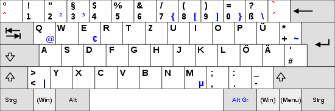
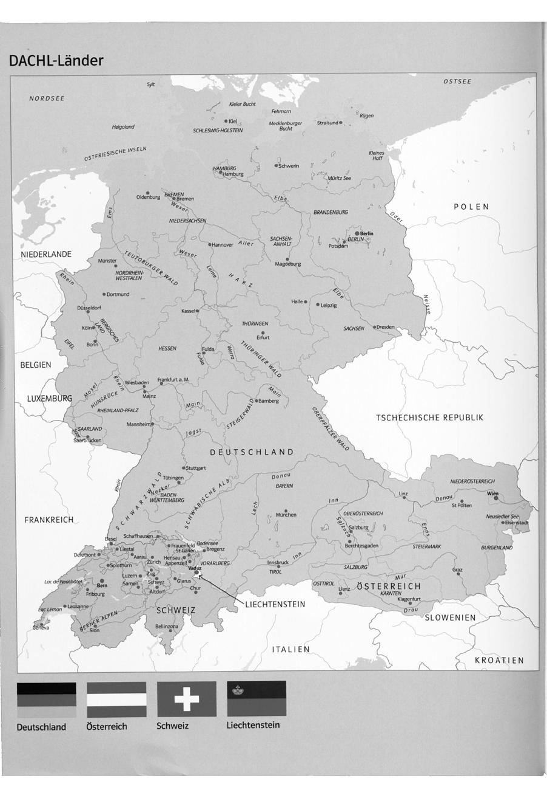
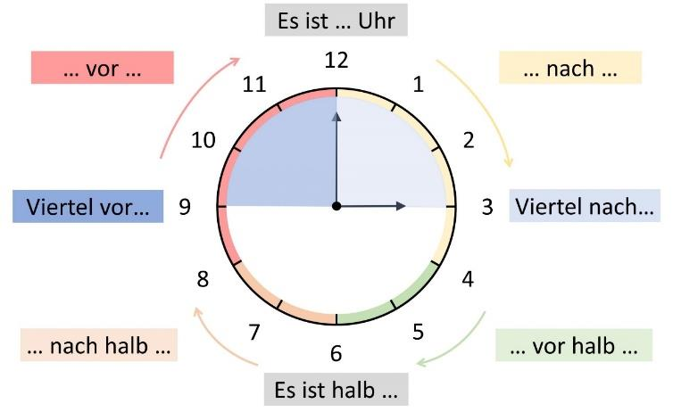

# German keyboard layout

| German label                          | English equivalent      |
| ------------------------------------- | ----------------------- |
| Steuerung (Strg)                      | Ctrl (Control)          |
| Alternative Grafik (Alt Gr)           | Alt Gr                  |
| Einfügen (Einfg)                      | Insert (Ins)            |
| Entfernen (Entf)                      | Delete (Del)            |
| Bild auf/Bild nach oben (Bild↑)       | Page Up (PgUp)          |
| Bild ab/Bild nach unten (Bild↓)       | Page Down (PgDn)        |
| Position eins (Pos1)                  | Home ("Position one")   |
| Ende (Ende)                           | End (end)               |
| Drucken / Systemabfrage (Druck/S-Abf) | Print Screen            |
| Rollen                                | Scroll Lock ("to roll") |
| Pause/Unterbrechen (Pause/Untbr)      | Pause                   |

# Phonetik

1. 元音在下列情况下发长音

   1. 双元音：aa，ee，oo，ie

      Boot, Tee, Aal, Dieb

   2. 元音后只有一个辅音

      Tag, Name

   3. 元音后有辅音h时，h不发音，元音发长音

      Kuh, geht

   4. 除元音e外，其他元音在词尾均发长音

      du, da

2. 元音在两个或两个以上辅音前发短音

   Bett, Takt, nimmt

3. 元音字母e的发音

   元音e除了与其他元音有着相同的长短音发音规则外，还有以下几种发音：

   1. e发[ə]音

      e在词尾时: Name, Frage

      当e与g或b组合，充当单词的前缀时: Gefahr, begabt

   2. er在词尾时发[ər]音

      vater, Lehrer, aber

   3. en在词尾时发[ən]音

      baden, beben, Daten, fallen

   4. el在词尾时发[əl]音

      Gabel, Kabel, Mädel, Nadel

4. 辅音b，d，g的两种发音

   1. b，d，g在元音前发浊音[b\]，[d]，[g\]

      beben, baden, Tage

   2. b，d，g在词尾或其他辅音前发清音[p\]，[t]，[k\]

      Hieb, Tod, Tag, Obst, Adler, siegt

5. 辅音v有[v\]和[f]两种发音

   1. 在外来词中发浊音[v\]

      Vase, Visum, Vulkan

   2. 在德语词中或词尾发清音[f]

      Vater, vier, aktiv

6. 辅音s的发音

   1. s在元音前发[z\]

      Sieg, seit, Saat

   2. s在辅音前或词尾时发[s\]

      Mast, fest, das, was

7. 辅音st，sp的发音

   1. st在词首时发[ʃt\]

      Staat, Stoff, Straße

   2. st在词中或词尾时发[st\]

      Fenster, Weste, fast

   3. sp在词首发[ʃp\]

      Speise, sparen, Sprache

   4. sp在词中或词尾时发[sp\]

      Aspekt, Wespe, Rest

8. ch的发音

   1. ch在德语词中的发音

      1. ch在元音a，o，u，au后面发[x\]

         Dach, doch, Tuch, auch

      2. ch在其他情况下发[ç\]

         China, Pech, euch, Milch, Bücher

   2. ch在外来词中的发音

      1. ch发[k\]

         Chaos, Chlor, Christ

      2. ch发[ʃ\]

         Chef, Chance, Champagner

词重音的一般规则：

- 在双音节或多音节词中，总有一个音节要重读

- 德语单词的重音一般在第一个音节

  Schüler, Spieler, lustig

- 可分动词发音时重音在可分前缀上

  einschlafen, zuhören, anreden

- 不可分动词重音在词干上

  besuchen, gehören, erklären, verstehen, zerbrechen, entschuldigen, empfangen

- 复合词通常第一部分重度，第二部分轻读

  Schauspieler, Haustür

- 以-ieren结尾的词，重音在-ieren

  studieren, telefonieren, diskutieren

| Vokale | 元音              |                                                       |
| ------ | ----------------- | ----------------------------------------------------- |
| [a:]   | a ah aa | Ali, da, Gabi ah, Bahn, Kahn Aal, Aas, Haar |
| [a]    | a                 | Ball, dann, Mann, wann                                |
| [e:]   |                   |                                                       |
| [ɛ:]   |                   |                                                       |
| [ɛ]    |                   |                                                       |
| [ə]    |                   |                                                       |
| [ər]   |                   |                                                       |
| [ən]   |                   |                                                       |
| [əl]   |                   |                                                       |
| [i:]   |                   |                                                       |
| [i]    |                   |                                                       |
| [o:]   |                   |                                                       |
| [ɔ]    |                   |                                                       |
| [u:]   |                   |                                                       |
| [u]    |                   |                                                       |

| Umlaut | 变元音 |      |
| ------ | ------ | ---- |
| [ø]    |        |      |
| [œ]    |        |      |
| [y:]   |        |      |
| [y]    |        |      |

| Diphthonge | 复合元音 |      |
| ---------- | -------- | ---- |
| [ai]       |          |      |
| [ao]       |          |      |
| [ɔy]       |          |      |

| Konsonanten | 辅音 |      |
| ----------- | ---- | ---- |
| [b]         |      |      |
| [p]         |      |      |
| [d]         |      |      |
| [t]         |      |      |
| [g]         |      |      |
| [k]         |      |      |
| [m]         |      |      |
| [n]         |      |      |
| [l]         |      |      |
| [r]         |      |      |
| [v]         |      |      |
| [f]         |      |      |
| [z]         |      |      |
| [s]         |      |      |
| [ʃt]        |      |      |
| [st]        |      |      |
| [ʃp]        |      |      |
| [sp]        |      |      |
| [ʃ]         |      |      |
| [tʃ]        |      |      |
| [h]         |      |      |
| [j]         |      |      |
| [ts]        |      |      |
| [ŋ]         |      |      |
| [uŋ]        |      |      |
| [ŋk]        |      |      |
| [ks]        |      |      |
| [pf]        |      |      |
| [kv]        |      |      |
| [tsion]     |      |      |
| [sion]      |      |      |
| [zion]      |      |      |
| [ismus]     |      |      |

# Grammatik

## Personalpronomen im Nominativ (N) und Konjugation der Verben im Präsens 人称代词第一格和动词现在时变位

|      |   来   |   学习    |   叫   |   等    |  建造   |  打开   |    画     |  系动词  |    知道    |    变成    |
| :--: | :----: | :-------: | :----: | :-----: | :-----: | :-----: | :-------: | :------: | :--------: | :--------: |
|      | kommen | studieren | heißen | warten  | bilden  | öffnen  | zeichnen  | **sein** | **wissen** | **werden** |
| ich  | komme  | studiere  | heiße  |  warte  |  bilde  |  öffne  |  zeichne  |   bin    |  **weiß**  |   werde    |
|  du  | kommst | studierst | heißt  | wartest | bildest | öffnest | zeichnest |   bist   | **weißt**  | **wirst**  |
|  er  |        |           |        |         |         |         |           |          |            |            |
| sie  | kommt  | studiert  | heißt  | wartet  | bildet  | öffnet  | zeichnet  |   ist    |  **weiß**  |  **wird**  |
|  es  |        |           |        |         |         |         |           |          |            |            |
| wir  | kommen | studieren | heißen | warten  | bilden  | öffnen  | zeichnen  |   sind   |   wissen   |   werden   |
| ihr  | kommt  | studiert  | heißt  | wartet  | bildet  | öffnet  | zeichnet  | **seid** |   wisst    |   werdet   |
| sie  | kommen | studieren | heißen | warten  | bilden  | öffnen  | zeichnen  |   sind   |   wissen   |   werden   |
| Sie  | kommen | studieren | heißen | warten  | bilden  | öffnen  | zeichnen  |   sind   |   wissen   |   werden   |

特殊变位：

1. 当规则动词词干以**s、ss、ß、z、tz**结尾时，动词在第二人称单数时变位**词尾省去s，只有t**。
2. 当规则动词词干以**t、d、ffn、chn**等结尾时，动词在第二人称单数、复数、及第三人称单数时变位**词尾前要加上-e**。方便发音
3. **sein、wissen、werden**属于不规则动词，其具有特殊变位形式。

|      |    读     |     睡觉     |  拿&乘坐   |     跑     |    拿住    |     看     |    有    |    开车    |    吃    |      说      | 推撞      | 喜欢      |
| :--: | :-------: | :----------: | :--------: | :--------: | :--------: | :--------: | :------: | :--------: | :------: | :----------: | --------- | --------- |
|      |   lesen   |   schlafen   |   nehmen   |   laufen   |   halten   |   sehen    |  haben   |   fahren   |  essen   |   sprechen   | stoßen    | mögen     |
| ich  |   lese    |   schlafe    |   nehme    |   laufe    |   halte    |    sehe    |   habe   |   fahre    |   esse   |   spreche    | stoße     | **mag**   |
|  du  | **liest** | **schläfst** | **nimmst** | **läufst** | **hältst** | **siehst** | **hast** | **fährst** | **isst** | **sprichst** | **stößt** | **magst** |
|  er  |           |              |            |            |            |            |          |            |          |              |           |           |
| sie  | **liest** | **schläft**  | **nimmt**  | **läuft**  |  **hält**  | **sieht**  | **hat**  | **fährt**  | **isst** | **spricht**  | **stößt** | **mag**   |
|  es  |           |              |            |            |            |            |          |            |          |              |           |           |
| wir  |   lesen   |   schlafen   |   nehmen   |   laufen   |   halten   |   sehen    |  haben   |   fahren   |  essen   |   sprechen   | stoßen    | mögen     |
| ihr  |   lest    |   schlaft    |   nehmt    |   lauft    | **haltet** |    seht    |   habt   |   fahrt    |   esst   |   sprecht    | stoßt     | mögt      |
| sie  |   lesen   |   schlafen   |   nehmen   |   laufen   |   halten   |   sehen    |  haben   |   fahren   |  essen   |   sprechen   | stoßen    | mögen     |
| Sie  |   lesen   |   schlafen   |   nehmen   |   laufen   |   halten   |   sehen    |  haben   |   fahren   |  essen   |   sprechen   | stoßen    | mögen     |

特殊变位：

1. 不规则动词在现在时的第二第三人称单数变位时，词干元音要发生变化，如：

   |   换音   |                   |               |             |
   | :------: | :---------------: | :-----------: | :---------: |
   |   e→ie   |   lesen(liest)    | sehen(sieht)  |             |
   |   e→i    | sprechen(spricht) | nehmen(nimmt) | essen(isst) |
   | **变音** |                   |               |             |
   |   a→ä    | schlafen(schläft) | fahren(fährt) |             |
   |  au→äu   |   laufen(läuft)   |               |             |
   |   o→ö    |   stoßen(stößt)   |               |             |

2. **haben**是具有特殊变位形式的不规则动词

| Beispiele                                                    |                                                     |
| ------------------------------------------------------------ | --------------------------------------------------- |
| Ich schlafe sehr gern. Schläfst du auch gern?                | 我非常喜欢睡觉。你也喜欢睡觉吗？                    |
| Er fährt heute zum Flughafen / Supermarkt. wohin fährt er heute? Er fährt nach Berlin. | 他今天要去机场/超市。他今天要去哪里？他要去柏林了。 |
| Das Kind läuft sehr schnell.                                 | 这个孩子走得非常快。                                |
| Meine Mutter sieht gern Film.                                | 我母亲喜欢看电影。                                  |
| Mein Vater isst gern Kuchen.                                 | 我父亲喜欢吃蛋糕。                                  |
| Sie spricht gut Deutsch.                                     | 她的德语说得很好.                                   |
| Er liest gern Buch.                                          | 他喜欢看书。                                        |
| Mary nimmt zwei Äpfel.                                       | 玛丽拿了两个苹果。                                  |
| Ich habe drei Kinder. Hast du auch Kinder?                   | 我有三个孩子。你也有孩子吗？                        |
| Er mag Ritter so gern.                                       | 他是如此喜欢骑士。                                  |

## Präteritum von haben und sein 动词haben和sein的过去时

|                               |            |                  |
| ----------------------------- | ---------- | ---------------- |
| Wang Dali ist heute zu Hause. | Präsens    | 王大力今天在家。 |
| Er war gestern auf der Post.  | Präteritum | 他昨天去过邮局。 |
| Ich habe heute frei.          | Präsens    | 我今天休息。     |
| Ich hatte gestern keine Zeit. | Präteritum | 我昨天没有时间。 |

|      |  haben  |       | sein  |      |
| :--: | :-----: | :---: | :---: | :--: |
| ich  |  hatte  | habe  |  war  | bin  |
|  du  | hattest | hast  | warst | bist |
|  er  |         |       |       |      |
| sie  |  hatte  |  hat  |  war  | ist  |
|  es  |         |       |       |      |
| wir  | hatten  | haben | waren | sind |
| ihr  | hattet  | habt  | wart  | seid |
| sie  | hatten  | haben | waren | sind |
| Sie  | hatten  | haben | waren | sind |

| Beispiele                                    |                       |
| -------------------------------------------- | --------------------- |
| Warum waren Sie gestern nicht im Unterricht? | Ich hatte keine Zeit. |
| Wie war der Film gestern?                    | 昨天的电影怎么样？    |

## Trennbare und untrennbare Verben 可分动词与不可分动词

|    Beispiele     |        | 动词原形 aufstehen |            |            |
| :--------------: | :----: | :----------------: | :--------: | :--------: |
|                  |   Ⅰ    |         Ⅱ          |    Ⅲ...    |    Ende    |
|      陈述句      |  Ich   |       stehe        |  um 6 Uhr  |    auf.    |
|    特殊疑问句    |  Wann  |       stehst       |     du     |    auf?    |
|    一般疑问句    | Stehst |         du         |  um 6 Uhr  |    auf?    |
|      命令句      | Stehen |        Sie         | bitte früh |    auf!    |
|                  | Rufen  |        Sie         | mich bitte |    an!     |
|                  | Kommen |        Sie         |   bitte    |    mit!    |
|                  | Kommen |        Sie         |   bitte    |   herein   |
| 与情态助动词连用 |  Ich   |        muss        |  um 6 Uhr  | aufstehen. |

说明：

1. 可分动词由动词词干和可分前缀两部分构成，如auf-stehen

2. 在现在时、过去时的句型中，动词词干与可分前缀要分开。在陈述句和特殊疑问句中动词词干位于第二位。

   在一般疑问句和命令句中动词词干位于第一位。

   动词词干要根据主语人称的不同进行相应动词变位，而可分前缀始终位于句子末尾。

3. 但是当可分动词与情态动词连用时，可分动词不再拆开而是合起来放在句子末尾。

4. 常见动词可分前缀：

   | trennbare Verben | 重音在可分前缀 |
   | :--------------: | :------------: |
   |       ab-        |    abfahren    |
   |       an-        |    anrufen     |
   |       auf-       |  aufschreiben  |
   |       aus-       |   ausmachen    |
   |       bei-       |   beibringen   |
   |      durch-      |                |
   |       ein-       |    einladen    |
   |      fest-       |  feststellen   |
   |      frei-       |   freihaben    |
   |       her-       |   herkommen    |
   |       hin-       |    hingehen    |
   |     hinter-      |                |
   |       los-       |   losfahren    |
   |       mit-       |   mitkommen    |
   |      nach-       |   nachfragen   |
   |      statt-      |  stattfinden   |
   |       um-        |                |
   |      unter-      |                |
   |      über-       |                |
   |       vor-       |                |
   |       weg-       |   wegfahren    |
   |     wieder-      |  wiedersehen   |
   |       zu-        |    zuhören     |
   |     zurück-      |  zurückkommen  |
   |    zusammen-     |                |

   常见的动词不可分前缀：

   | untrennbare Verben |   重音在词干   |
   | :----------------: | :------------: |
   |        be-         |   bestellen    |
   |       durch-       |                |
   |        emp-        |   empfehlen    |
   |        ent-        | entschuldigen  |
   |        er-         |    erklären    |
   |        ge-         |    gehören     |
   |       miss-        |                |
   |       unter-       | unterschreiben |
   |        um-         |                |
   |       über-        |                |
   |        ver-        |   verstehen    |
   |      wieder-       |  wiederholen   |
   |        zer-        |                |

5. 部分带有unter-，wieder-，über-，durch-，hinter-，um-等前缀的动词既可以作可分动词也可作不可分动词，但***词意不同***。

   | Beispiele                                          |                                                              |
   | -------------------------------------------------- | ------------------------------------------------------------ |
   | wieder-holen 可分时为“取回来”，不可分时“复习” | Sie holt den Brief wieder. 她取回那封信。 Sie wiederholt zu Hause das Gelernte. 她在家复习已经学过的东西。 |
   | über-setzen 可分时“使渡河”，不可分时“翻译”    | Der Schiffer setzt sie über. 船工渡她过河。 Sie übersetzt den deutschen Roman. 她翻译这本德国小说。 |

| Ein Tag im Leben von Frau Müller                             |                                  |
| ------------------------------------------------------------ | -------------------------------- |
| Um 6 Uhr 30 **weckt** sie die Kinder **auf**.                | aufwecken                        |
| Dann **bereitet** sie das frühstück **vor**.                 | vorbereiten                      |
| Nach dem Frühstück **räumt** sie den Tisch **ab** und macht die Küche. | abräumen                         |
| Dann **bringt** sie ihre Tochter in den Kindergarten und ihren sohn in die Schule. | bringen                          |
| Um 8 Uhr 30 **fängt** sie mit ihrer Arbeit im Büro **an**.   | anfangen                         |
| Sie **bereitet** eine Präsentation **vor**, **schreibt** Briefe und **ruft** ihre Kunden **an**. | vorbereiten, schreiben, anruften |
| Um 13 Uhr **fährt** sie nach Hause und **holt** ihre Tochter vom Kindergarten und ihren Sohn von einer Freundin **ab**. | fahren, abholen                  |
| Sie **kocht** den beiden ein Mittagessen.                    | kochen                           |
| Nach dem Mittagessen **helft** sie ihrem Sohn bei den Hausaufgaben. | helfen                           |
| Am Nachmittag **räumt** sie die Wohnung **auf**.             | aufräumen                        |
| Danach **kauft** sie im Supermarkt **ein**.                  | einkaufen                        |
| Ihre Kinder **sehen** im Wohnzimmer **fern** und sie sagt zu ihnen: "Aber nach diesem Film **macht** ihr den Fernseher **aus**!" | fernsehen, ausmacht              |
| Sie **deckt** den Tisch fürs Abendessen.                     | decken                           |
| Nach dem Abendessen **hängt** sie die Wäsche zum Trocknen **auf**. | aufhängen                        |
| Dabei denkt sie:"**Hört** dieser Tag denn nie **auf**?"      | aufhören                         |
| Doch nach zwei Studen am Schreibtisch **liegt** sie um 23 Uhr endlich im Bett und **schlaft** **ein**. | liegen, einschlafen              |

## Possessivpronomen im Nominativ (N) 物主代词第一格

一格（N ）：名词作主语或表语

| 人称代词（第一格） |      物主代词      |
| :----------------: | :----------------: |
|        ich         |        mein        |
|         du         |        dein        |
|         er         |        sein        |
|        sie         |        ihr         |
|         es         |        sein        |
|        wir         |       unser        |
|        ihr         |        euer        |
|        sie         |        ihr         |
|        Sie         |        Ihr         |
| **对人称代词提问** | **对物主代词提问** |
|      **wer?**      |    **wessen?**     |

说明：

1. 尊称**Sie**的物主代词**Ihr**永远大写。

2. 物主代词要根据其后面名词的性、数、格进行相应的词尾变化。

   | 人称代词 | Sg. m/n------der/das | f/PI.-----die |
   | :------: | :------------------: | :-----------: |
   |   ich    |         mein         |     meine     |
   |    du    |         dein         |     deine     |
   |    er    |         sein         |     seine     |
   |   sie    |         ihr          |     ihre      |
   |    es    |         sein         |     seine     |
   |   wir    |        unser         |    unsere     |
   |   ihr    |         euer         |   **eure**    |
   |   sie    |         ihr          |     ihre      |
   |   Sie    |       **Ihr**        |     Ihre      |

## Possessivpronomen im Dativ (D) 物主代词第三格

|       | m/n  |       |  f   |       | PI.  |                      |
| :---: | :--: | :---: | :--: | :---: | :--: | :------------------: |
| mein  | -em  | mein  | -er  | mein  | -en  | Kindern/Studentinnen |
| dein  | -em  | dein  | -er  | dein  | -en  |                      |
| sein  | -em  | sein  | -er  | sein  | -en  |                      |
|  ihr  | -em  |  ihr  | -er  |  ihr  | -en  |                      |
| sein  | -em  | sein  | -er  | sein  | -en  |                      |
| unser | -em  | unser | -er  | unser | -en  |                      |
|  eur  | -em  |  eur  | -er  |  eur  | -en  |                      |
|  ihr  | -em  |  ihr  | -er  |  ihr  | -en  |                      |
|  Ihr  | -em  |  Ihr  | -er  |  Ihr  | -en  |                      |

| Beispiele            |                                  |
| -------------------- | -------------------------------- |
| Wem gratulieren Sie? | Ich gratuliere meinem Freund.    |
| Wem gehört das Buch? | Das Buch gehört meiner Freundin. |

说明：

1. 物主代词在第一、第四和第三格中的词尾变化和kein的词尾变化相同：

   |      |   m    |   n    |   f    |  PI.   |
   | :--: | :----: | :----: | :----: | :----: |
   |  N   |  mein  |  mein  | meine  | meine  |
   |  A   | meinen |  mein  | meine  | meine  |
   |  D   | meinem | meinem | meiner | meinen |

2. 物主代词euer在有词尾变化的情况下要先去掉词干中的-e，再加上对应词尾：

   |      |   m   |   n   |   f   |  PI.  |
   | :--: | :---: | :---: | :---: | :---: |
   |  N   | euer  | euer  | eure  | eure  |
   |  A   | euren | euer  | eure  | eure  |
   |  D   | eurem | eurem | eurer | euren |

   

## Possessivpronomen im Akkusativ (A) 物主代词第四格

| 人称代词 | Sg. m------der | n-----das | f/PI.-----die |
| :------: | :------------: | :-------: | :-----------: |
|   ich    |     meinen     |   mein    |     meine     |
|    du    |     deinen     |   dein    |     deine     |
|    er    |     seinen     |   sein    |     seine     |
|   sie    |     ihren      |    ihr    |     ihre      |
|    es    |     seinen     |   sein    |     seine     |
|   wir    |    unseren     |   unser   |    unsere     |
|   ihr    |     euren      |   euer    |     eure      |
|   sie    |     ihren      |    ihr    |     ihre      |
|   Sie    |     Ihren      |    Ihr    |     Ihre      |
|   wer?   |                |  wessen?  |               |

说明：

1. 第四格尊称**Sie**的物主代词**Ihr**永远大写。

2. 物主代词第四格在单数名词前的变化规则与不定冠词词尾相同。

   在复数名词前物主代词的第四格加-e。

   |       |   m    |  n   |   f   |  PI.  |
   | :---: | :----: | :--: | :---: | :---: |
   | **N** |  mein  | mein | meine | meine |
   | **A** | meinen | mein | meine | meine |

   但是物主代词euer若有词尾变化时，必须先去掉词干中的e：

   |      |   m   |  n   |  f   | PI.  |
   | :--: | :---: | :--: | :--: | :--: |
   |  N   | euer  | euer | eure | eure |
   |  A   | euren | euer | eure | eure |

## Personalpronomen im Dativ (D) 人称代词第三格

|          | Personalpronomen |          |
| :------: | :--------------: | :------: |
|    N     |        A         |    D     |
|   ich    |       mich       |   mir    |
|    du    |       dich       |   dir    |
|    er    |       ihn        |   ihm    |
|   sie    |       sie        |   ihr    |
|    es    |        es        |   ihm    |
|   wir    |       uns        |   uns    |
|   ihr    |       euch       |   euch   |
|   sie    |       sie        |  ihnen   |
|   Sie    |       Sie        |  Ihnen   |
| **wer?** |     **wen?**     | **wem?** |

|                   Beispiele                    |                                            |
| :--------------------------------------------: | ------------------------------------------ |
|      Josef braucht Hilfe! Wer hilft ihm?       | 约瑟夫需要帮助。谁帮帮他？                 |
|                Er beuscht mich.                |                                            |
|                 Er hilft mir.                  |                                            |
| Wem gehört das Buch? Das Buch gehürt mir. | 这本书是谁？ 这本书是我的。           |
|         Mein Vater kauft mir ein Auto.         | 我父亲给我买了一辆车。 双宾语人三物四 |
|          Er bestellt ihr eine Karte.           | 他给她订购了一张卡片。                     |
|      Der Hausaufgaben sind mir zu schwer.      | 作业对我来说太难了。                       |
|         Der Pullover ist ihm zu teuer.         | 套头衫对他来说太贵了。                     |
|            Wer schenkt ihm Schuhe?             |                                            |
|            Wem schenkt sie Schmuck?            |                                            |
|  Was schenkt er seiner Mutter zum Geburtstag?  |                                            |
|  Er bringt seiner Frau einen Starauß Blumen.   |                                            |
|           Er leiht ihnen 2000 Yuan.            |                                            |
|   Er empfiehlt uns einen Film/ eine Romane.    |                                            |

说明：

1. 德语中某些动词要求支配第三格宾语，例句中的helfen和gehört就是这类动词。

   像这样支配第三格宾语的常用动词还有danken，gratulieren，gefallen，antworten，schmecken，passen等。

   | Beispiele                                                    |                                               |
   | ------------------------------------------------------------ | --------------------------------------------- |
   | Ich danke Ihnen für Ihre Hilfe.                              | 感谢您的帮助。                                |
   | Ich gratuliere die zur Hochzeit.                             | 向你的婚礼表示祝贺。                          |
   | Der Film gefält mir./ Mir gefält der Film. Ich mag den Film. (mögen 喜欢) | 我喜欢这部电影。 gefallen(gefält)        |
   | Das Essen im Hotel schmeckt mir sehr.                        | 我非常喜欢旅馆的饭。 schmecken(schmeckt) |
   | Der Schüler antwortet mir auf meine Frage.                   | 那个学生回答了我的问题。                      |
   | Das Kleid passt ihr sehr gut.                                | 那个裙子非常合她的身。passen(passt)           |
   | Das Kleid steht mir sehr gut.                                | 裙子的款式很适合。                            |

   除此之外，在一些固定搭配中也出现第三格形式的人称代词，例如：

   | Biespiel                                             |                                    |
   | ---------------------------------------------------- | ---------------------------------- |
   | Wie geht es Ihnen / dir? Danke,mir geht es gut. | 您（你）好吗？ 谢谢我挺好的。 |
   | Meine Mutter ist krank. Oh, das tut mir Leid.   | 我母亲生病了。 哦，真遗憾。   |
   | Wie geht es dir/ Ihnen/ euch?                        |                                    |
   | Mir/ Uns geht es gut.                                |                                    |
   | (Es) tut mir/ uns leid.                              |                                    |

2. 只能接三格介词

   | Beispiele                                      |      |
   | ---------------------------------------------- | ---- |
   | **aus bei mit nach seit von zu**               |      |
   | Ich gehe **mit** dir.                          |      |
   | Ich war **beim** Arzt.                         |      |
   | Du sollst **zu** ihm gehen.                    |      |
   | Er kommt **aus** der Schweiz.                  |      |
   | **Nach** der Abreit fahren wir zum Supermarkt. |      |
   | Das Buch **von** mir.                          |      |

3. 对第三格人称代词提问用wem。

## Personalpronomen im Akkusative (A) 人称代词第四格

人称代词第四格在句中一般充当直接宾语，提问时用**wen**

| 人称代词第一格 | 人称代词第四格 |
| :------------: | :------------: |
|      ich       |    **mich**    |
|       du       |    **dich**    |
|       er       |    **ihn**     |
|      sie       |      sie       |
|       es       |       es       |
|      wir       |    **uns**     |
|      ihr       |    **euch**    |
|      sie       |      sie       |
|      Sie       |      Sie       |
|  **提问主语**  |  **提问宾语**  |
|    **wer**     |    **wen**     |

| 阳性名词指代用ihn                              | 阴性名词指代用sie                             | 中性名词指代用es     |
| ---------------------------------------------- | --------------------------------------------- | -------------------- |
| Essen sie einen Apfel?  (der Apfel, die Äpfel) | Essen sie eine Wurst? (die Wurst, die Würste) | Siehst du das Kind？ |
| Ja, ich esse ihn.                              | Ja, ich esse sie.                             | Ja, ich sehe es.     |

| Q     | Wen fragt der Lehrer?Fragt er mich? | Besuchst du heute Ingrid? |
| ----- | ----------------------------------- | ------------------------- |
| **A** | **Ja.**                             | **Ja, ich besuche sie.**  |

## Bestimmter und unbestimmter Artikel im Nominativ (N) und Akkusativ (A) 定冠词和不定冠词的第一、四格

### Nominativ (Subjekt/Prädikativ)  第一格（主语、表语）

| Das ist ein Mann.          | Der Mann ist Chinese.             |
| -------------------------- | --------------------------------- |
| **Das ist ein Kind.**      | **Das Kind ist Japaner.**         |
| **Das ist ein==e== Frau.** | **Die Frau ist Deutsche.**        |
| **Das Sind / Studenten.**  | **Die Studenten sind Ausländer.** |

|                      |    m     |    n     |     f     |    PI.    |
| -------------------- | :------: | :------: | :-------: | :-------: |
| Unbestimmter Artikel | **ein**  | **ein**  | **eine**  |   **/**   |
| 否定冠词             | **kein** | **kein** | **keine** | **keine** |
| Bestimmter Artikel   | **der**  | **das**  |  **die**  |  **die**  |

| Fragepronomen    | wer（Personen）/was（Sachen）                             |                                                              |
| ---------------- | --------------------------------------------------------- | ------------------------------------------------------------ |
| **Wer ist das?** | **Das ist der Zollbeamet./Das sind Herr und Frau Meier.** | der Zollbeamte,-n 海关官员                                   |
| **Was ist das?** | **Das ist ein Kugelschreiber. / Das sind Lehrbücher.**    | der Kugelschreiber,- 圆珠笔 das Lehrbuch, die Lehrbücher 教科书 |

说明：

1. 德语名词有三种性：阴（m）、阳（f）、中（n）性。绝大部分名词都有复数形式（PI.）。名词无论在何处，第一个字母必须大写。

2. 德语名词前的不定冠词或定冠词要根据该名词的性、数、格进行相应的词尾变化。

   不定冠词没有复数形式。

3. 德语中名词第一格在句中通常作主语或表语。

   对表示“人”的名词提问时，第一格用wer

   对表示“物”的名词提问时，第一格用was

4. 在提到未知的人或事物或者非特指的人或事物时，用不定冠词。

   在提到一直的或特指的人或事物时，用定冠词

   一般在叙述中先用不定冠词引出第一次提到的人或事物，当该人或事物再次被提及时用定冠词。

### Akkusativ (Objekt) 第四格（宾语）

| Der Mann kauft einen Koffer.    | Er öffnet den Koffer.      |
| ------------------------------- | -------------------------- |
| **Das Kind sieht ein Buch.**    | **Es öffnet das Buch.**    |
| **Die frau holt eine zeitung.** | **Sie liest die Zeitung.** |
| **Wir kaufen / Bücher.**        | **Wir lesen die Bücher.**  |

|                      |       m       |    n     |     f     |    PI.    |
| -------------------- | :-----------: | :------: | :-------: | :-------: |
| Unbestimmter Artikel | ==**einen**== | **ein**  | **eine**  |   **/**   |
| 否定冠词             |  **keinen**   | **kein** | **keine** | **keine** |
| Bestimmter Artikel   |  ==**den**==  | **das**  |  **die**  |  **die**  |

| Fragepronomen        | wen（Personen）/was（Sachen）                          |                       |
| -------------------- | ------------------------------------------------------ | --------------------- |
| **Wen ruft er?**     | **Er ruft den Mann. / Er ruft die Kinder.**            |                       |
| **Was braucht sie?** | **Sie braucht einen Bleistift. / Sie braucht Bücher.** | der Bleistift,-e 铅笔 |

说明：

1. 德语中名词的第四格通常在句中做直接宾语。

   不定冠词没有复数形式。

2. 对表示“人”的名词提问时，第四格用wen

   对表示“物”的名词提问时，第四格与第一格相同，均用was

| Verben mit Akkusativ-Objekt 后接四格的动词 |
| :----------------------------------------: |

|    kaufen     |         buy         | Was kaufen Sie?                                | Ich kaufe einen Apfel.                              |
| :-----------: | :-----------------: | ---------------------------------------------- | --------------------------------------------------- |
|  **suchen**   |     **search**      | **Was suchen Sie?**                            | **Ich suche ein Heft.**                             |
| **brauchen**  |      **need**       | **Was brauchen Sie?**                          | **Ich brauche eine Tasse Kaffee/ ein Glas Wasser.** |
| **besuchen**  |      **visit**      | **Wen besuchen Sie?**                          | **Ich besuche meinen Freund.**                      |
|   **haben**   |      **have**       | **Heben Sie Geschwister?**                     | **Ich habe keine Geschwister.**                     |
|  **nehmen**   |      **take**       | **Was nehmen Sie?**                            | **Ich nehme ein Taxi nach Hause.**                  |
|  **lernen**   |      **learn**      | **Was lernen Sie?**                            | **Ich lerne Deutsch.**                              |
|  **trinken**  |      **drink**      | **Was möchten du trinkst?**                    | **Ich  möchte Cola trinken.**                       |
|   **essen**   |       **eat**       | **Was essen Sie gern?**                        | **Ich esse gern Käse. (der Käse)**                  |
|   **sehen**   |       **see**       |                                                |                                                     |
|  **öffnen**   |      **open**       | **Was öffnen Sie?**                            | **Ich öffne eine Tür/ mein Buch/ das Fenster.**     |
|  **bilden**   |      **form**       | **Was bilden Sie?**                            | **Ich bilde einen Satz. (der Satz, die Sätze)**     |
|   **lesen**   |      **read**       | **Was lesen Sie gern?**                        | **Ich gern Zeitung.**                               |
| **erklären**  |     **explain**     | **Was erklärt der Lehrer?**                    | **Er erklärt eine Frage.**                          |
|  **lehren**   |      **teach**      | **Was lehren Sie?**                            | **Ich lehre Deutsch / Chinesisch.**                 |
| **studieren** |      **study**      | **Was studieren Sie?**                         | **Ich studiere Informatik.**                        |
|  **machen**   |     **make,do**     | **Was machen Sie beruflich?/ Was machen Sie?** | **Ich arbeite als Koch./ Ich esse einen Apfel.**    |
|    **usw**    | **etc., and so on** |                                                |                                                     |

## Bestimmter und unbestimmter Artikel im Dativ (D) 定冠词和不定冠词的第三格

| Beispiele | unbestimmter                                                 | bestimmter                                                  |
| :-------: | ------------------------------------------------------------ | ----------------------------------------------------------- |
|     m     | wir helfen einem (keinem) Mann. 我们帮助的是（不是）一位男士。 | Wir helfen dem Mann. 我们帮助这位男士。                |
|     n     | Ich antworte einem (keinem) Kind. 我（不）回答一个孩子（的问题）。 | Ich antworte dem Kind. 我回答这个孩子的问题。          |
|     f     | Sie dankt einer (keiner) Frau. 她（不）感谢一位女士。   | Sie dankt der Frau. 她感谢这位女士。                   |
|    PI.    | Das Auto gefällt / (keinen) Kindern. 孩子们（不）喜欢这辆小汽车。 | Das Auto gefällt den Kindern. 这些孩子喜欢这辆小汽车。 |

说明：

1. 定冠词和不定冠词在第一、第四和第三格中的变化规则可总结为：

   | unbestimmter |   m   |   n   |   f   | PI.  |
   | :----------: | :---: | :---: | :---: | :--: |
   |      N       |  ein  |  ein  | eine  |  -   |
   |      A       | einen |  ein  | eine  |  -   |
   |      D       | einem | einem | einer |  -   |

   | bestimmter |  m   |  n   |  f   | PI.  |
   | :--------: | :--: | :--: | :--: | :--: |
   |     N      | der  | das  | die  | die  |
   |     A      | den  | das  | die  | die  |
   |     D      | dem  | dem  | der  | den  |

   |      |   m    |   n    |   f    |  PI.   |
   | :--: | :----: | :----: | :----: | :----: |
   |  N   |  kein  |  kein  | keine  | keine  |
   |  A   | keinen |  kein  | keine  | keine  |
   |  D   | keinem | keinem | keiner | keinen |

2. 名词复数第三格要在复数形式之后再添加-n：

   |            Beispiele             |
   | :------------------------------: |
   | die Kinder (N) → den Kindern (D) |
   | die Männer (N) → den Männern (D) |

   但当复数形式词尾已有-n或-s，则不再添加-n：

   |            Beispiele            |
   | :-----------------------------: |
   |  die Autos (N) → den Autos (D)  |
   | die Frauen (N) → den frauen (D) |

## Nullartikel 零冠词

1. 泛指的复数名词

   | Sie kaufen eine Tasche.(Sg.)       | →    | Sie kaufen Taschen.(PI.)      |
   | ---------------------------------- | ---- | ----------------------------- |
   | **Sie braucht einen Koffer.(Sg.)** | →    | **Sie braucht Koffer. (PI.)** |

2. 表示职业、身份

   | Herr Müller ist Arzt.  |
   | ---------------------- |
   | **Sie ist Studentin.** |

   但是如果该名词前有形容词定语，则必须要加上冠词：

   | Herr Müller ist ein *guter* Arzt.      |
   | -------------------------------------- |
   | **Sie ist eine *fleißige* Studentin.** |

3. 表示国籍

   | Herr Lin ist Chinese.       |
   | --------------------------- |
   | **Frau Ono ist Japanerin.** |

   但是如果该名词前有形容词定于，则必须加上冠词：

   | Herr Lin ist *großer* Chinese.     |
   | ---------------------------------- |
   | **Frau Ono ist *eine* Japanerin.** |

4. 一些中性的城市名、国家名和联邦州名

   | Deutschland ist ein Land in Europa. |
   | ----------------------------------- |
   | **China ist ein Land in Asien.**    |
   | **Berlin hat 3,4 Mio. Einwohner.**  |
   | **Paris ist die Hauptstadt.**       |

   但是如果该名词前有形容词定语，则必须加上冠词：

   | das schöne Berlin, das große China      |
   | --------------------------------------- |
   | **Das schöne Berlin gefällt mit sehr.** |

   有几个国家必须用定冠词，如：

   | die Schweiz, die USA                             |
   | ------------------------------------------------ |
   | **Er fliegt in die Schweiz / in die USA(PI.).**  |
   | **Er lebt in der Schweiz / in den USA(PI.).**    |
   | **Er kommt aus der Schweiz / aus den USA(PI.).** |

   有些国家的全称有定冠词，如：

   | Die Bundesrepublik Deutschland (die BRD)   |
   | ------------------------------------------ |
   | **Die Volksrepublik China (die VR China)** |

5. 泛指的物质名词

   | Wir kaufen Bier, Milch, Zucker, Wasser, Tee, Kaffee. |
   | ---------------------------------------------------- |

   但这些名词前可以加上相应的量词：

   | Wir kaufen eine Flasche Bier, eine Dose Cola. | 冠词根据量词变化 |
   | --------------------------------------------- | ---------------- |

   | die Flasche.-n | die Dose,-n | das Glas |      |
   | -------------- | ----------- | -------- | ---- |

6. 泛指的抽象名词

   | Ich habe Zeit / Geld / Geduld / Hunger / Durst/ Lust.        |
   | ------------------------------------------------------------ |
   | 我有时间/金钱/耐心/饥饿/饥渴/兴趣。                          |
   | die Zeit, das Geld, die Geduld, der Hunger, der Durst, die Lust |
   | **Ich habe Unterricht.**                                     |
   | 我有课。                                                     |
   | **Ich habe eine Stunde /zwei Stunden Unterricht.**           |
   | 我有一/两节的课程。                                          |

7. 表示学科的名词

   | Er studiert Chemie.       |
   | ------------------------- |
   | **Sie studiert Medizin.** |

## Ja-Nein-Doch

| Bispiel                                                 |                                                              |
| ------------------------------------------------------- | ------------------------------------------------------------ |
| Kommst du heute Abend? 你今天晚上来吗？            | Ja, ich komme. 是的，我来。 Nein, ich komme nicht. 不，我不来。 |
| Kommst du heute Abend nicht? 你今天晚上不来吗？    | Doch, ich komme. Vielleicht ein bisschen später.不，我来，可能晚点到。 Nein, ich komme nicht. Ich habe keine Zeit.是，我不来，我没时间。 |
| Haben wir heute Unterrricht? 我们今天有课吗？      | Ja, natürlich haben wir unterricht. 是的，我们当然有课。 Nein. Heute haben wir keinen Unterricht. Heute ist Sonntag. 不，没课。今天周日。 |
| Haben wir heute keinen Unterricht? 今天我们没课吗？ | Doch, aber nur am Nachmittag. 不，有。但只有下午有课。 Nein. Heute ist Sonntag.没有。今天是周日。 |

说明：

1. 针对一般疑问句做肯定回答时用ja，作否定回答时用nein

2. 针对有nicht，kein等否定词的一般疑问句作回答时用nein或doch。

   用nein 回答时，答句中有否定词

   用doch回答时，答句中无否定词

## Genitiv 第二格

### Genitiv bei Artikeln und Possessivepronomen 冠词和物主代词的第二格

|      |              定冠词               |              不定冠词               |              物主代词               |
| :--: | :-------------------------------: | :---------------------------------: | :---------------------------------: |
|  m   | das Büro ==**des**== Lehrer==s==  | das Büro ==**eines**== Lehrer==s==  | das Büro ==**meines**== Lehrer==s== |
|  n   | die Schule ==**des**== Kind==es== | die Schule ==**eines**== Kinde==s== | die Schule ==**ihres**== Kind==es== |
|  f   |     die Uhr ==**der**== Frau      |     die Uhr ==**einer**== Frau      |     die Uhr ==**seiner**== Frau     |
| PI.  |  die Taschen ==**der**== Frauen   |                                     | die Taschen ==**unserer**== Frauens |

说明：

1. 名词第二格一般用作前一个名词的定语，说明所属关系。提问用wessen（谁的）或welch-e（哪个，哪些）
2. 第二格名词除了冠词要变化外，阳性以及中性单数名词词尾须加-s或-es

| Beispiele |                                                              |                          |
| :-------: | ------------------------------------------------------------ | ------------------------ |
|     Q     | Wessen Einkommen ist hoch?                                   | 谁的收入高？             |
|     A     | Das Einkommen des Fußballspielers ist hoch.                  | 足球运动员的收入高。     |
|     Q     | Welche Studenten spielen gut Volleyball?                     | 哪些大学生排球打得好？   |
|     A     | Die Studenten der Qinghua-Universität spielen gut Volleyball. | 清华大学学生排球打得好。 |

注意：

1. 加词尾-es

   1. 以-s，-ß，-x，-z结尾的阳性和中性单数名词

      das Haus → des Haus==es==

      der Fleiß → des Fleiß==es==

   2. 阳性和中性单音节单数名词

      das Kind → des Kind==es==

      der Arzt → des Arzt==es==

      das Buch → des Buch==es==

      der Marsch → des Marsch==es==

2. 弱变化阳性单数名词第二格与第三、四格变法相同，均加词尾-n或-en

   der Herr → des Herr==n==

   der Student → des Student==en==

   der Bauer → des Bauer==n==

3. 以-ismus结尾的外来阳性名词不加任何词尾

   der Sozialismus → des Sozialismus

   der Kapitalismus → des Kapitalismus

### Genitiv bei Namen 人名的第二格

人名或带有称呼的名词第二格经常放在被修饰的名词前面，此时在第二格的人名后也要加-s，并去掉被修饰名词的冠词:

| Beispiele                                           |                                                  |
| --------------------------------------------------- | ------------------------------------------------ |
| Julian - die Schwester → Julian**s** Schwester      | Julians Schwester ist eine bekannte Schwimmerin. |
| Frau Huber - der Freund → Frau huber**s** Freund    | Frau Hubers Freund ist Fußballspieler.           |
| Herr Müller - der Sohn → Herr**n** Müller**s** Sohn | Herrn Müllers Sohn spielt Tennis nur aus Spaß.   |

以上的几种形式同样也可以通过介词von来表达：

| Beispiele                 |
| ------------------------- |
| die Schwester von Julian  |
| der Freund von Frau Huber |
| der Sohn von Herrn Müller |

注意：

当人名的最后一个字母为-s，-ß，-x，-z时，不加-s，只需要在人名后加**==’==**即可

| Beispiele                                             |
| ----------------------------------------------------- |
| Nils' Arbeit gefällt ihm nicht.                       |
| Hans Groß' Frau ist kein.                             |
| Max' Vater ist Sportler.                              |
| Franz' Schwester möchte eine Reise nach China machen. |

### Adjektiv - Deklinationen im Genitiv 形容词变格

| m                               | n                                | f                                     | PI.                                        |
| ------------------------------- | -------------------------------- | ------------------------------------- | ------------------------------------------ |
| das Spiel des neuen Spielers    | die Übungen des alten Buches     | der Sieg der bekannten Mannschaft     | die Meinungen der berufsätigen Frauen      |
| das Spiel eines neuen Spielers  | die Übungen eines alten Buches   | der Sieg einer bekannten Mannschaft   |                                            |
| das Spiel meines neuen Spielers | die Übungen unseres alten Buches | der Sieg unserer bekannten Mannschaft | die Meinungen unserer berufstätigen Frauen |
| der Preis schwarzen Tees        | der Preis frischen Wassers       | der Preis frischer Milch              | die Meinungen berufstätiger Frauen         |

说明：第二格形容词词尾在零冠词的阴性及复数名词前的变化是-er，其他均是-en

### Präpositionen: trotz, wegen, während, statt / anstatt 介词

|             Beispiele             |                                                              |
| :-------------------------------: | ------------------------------------------------------------ |
|          trotz 尽管          | Es regnet sehr stark. Aber er geht spazieren. →  Trotz des starken Regens geht er spazieren. |
|          wegen 由于          | Die Sportlerin war schwer krank. Sie durfte nicht Tennis spielen. →  Wegen ihrer schweren Krankheit durfte sie nicht Tennis spielen. |
|      während 在...期间       | Die Touristen machen Urlaub. Sie haben vieles gesehen und erlebt. →  Die Touristen haben während des Urlaubs vieles gesehen und erlebt. |
| statt / anstatt 不...而是... | Er möchte ein Radio kaufen, findet aber kein gutes Radio. Er kauft einen billigen Fernseher. →  Statt eines Radios kauft er einen billigen Fernseher. |

## Verbstellung im Satz 变位动词在句中的位置

### Aussagesatz陈述句

|     Ⅰ     |   Ⅱ    |      Ⅲ      |    Ⅳ     |
| :-------: | :----: | :---------: | :------: |
|    Ich    |  bin   |  Chinese.   |          |
|    Wir    | kommen | aus Japan.  |          |
|    Du     | lernst | in Shanghai | Deutsch. |
|    Er     | heißt  | Horst Grün. |          |
| Im Koffer |  sind  |   Bücher.   |          |

|                        Ⅲ ⅡⅠ                        |                        ⅠⅡ Ⅲ                        |
| :------------------------------------------------: | :------------------------------------------------: |
|              Jetzt lerne ich Deutsch.              |              Ich lerne jetzt Deutsch.              |
|             Heute habe ich Unterricht.             |             Ich habe heute Unterricht.             |
|                Das weiß ich nicht.                 |                Ich weiß das nicht.                 |
|   In Deutschland benutzt / spricht man Deutsch.    |   Man benutzt / spricht Deutsch in Deutschland.    |
| Deutsch spricht man in Österreich und Deutschland. | Man spricht Deutsch in Österreich und Deutschland. |

### W-Fragen特殊疑问句

|   Ⅰ   |    Ⅱ    |     Ⅲ      |    Ⅳ    |
| :---: | :-----: | :--------: | :-----: |
|  Wie  | heißen  |    Sie?    |         |
| Woher |  kommt  |    er?     |         |
| Wohin | fliegst |     du     | morgen? |
|  Wer  |   ist   |    das?    |         |
|  Was  |   ist   | im Koffer? |         |

### Ja / Nein - Fragen 一般疑问句

|    Ⅰ    |  Ⅱ   |     Ⅲ      |      Ⅳ       |
| :-----: | :--: | :--------: | :----------: |
| Kommen  | Sie  | aus China? |              |
|  Heißt  |  du  |  Carsten?  |              |
|  Sind   | Sie  | Deutscher? |              |
| Fliegst |  du  |   heute    | nach Berlin? |
|  Lernt  |  er  |    hier    |   Deutsch?   |

| Q                                             | A                                       |
| --------------------------------------------- | --------------------------------------- |
| Lernst du jetzt Deutsch?                      | Ja, ich lerne jetzt Deutsch.            |
| Haben Sie heute Unterricht?                   | Nein, ich habe heute keinen Unterricht. |
| Weißt du das nicht?                           | Nein, ich weiß das nicht.               |
| Spricht / Benutzt man in Deutschland Deutsch? | Ja, man spricht Deutsch in Deutschland. |

说明：

1. 陈述句中变位动词始终位于第二位；主语可以位于第一位，也可以在第三位，这两种语序可以表示为：

   1. 主语+变位动词+其他成分

      Ich bin Chinese.

   2. 除主语和动词外的任何一个其他成分+变位动词+主语+剩余成分

      Im Koffer sind Bücher.

   任何陈述句都可以用正语序或者反语序两种方式来表示，意义基本不变，占第一位的通常是上文提到过的某个成分，以此来加强句子间的衔接。

2. 常用的特殊疑问词有：**wer、was、wann、wie、wo、woher、wohin**等

   特殊疑问句中变位动词位于第二位，语序一般为：

   1. 特殊疑问词+变位动词+主语+其他成分

      Wie heißen Sie?

   2. 但当特殊疑问词就是主语时，语序就简化为：

      特殊疑问词+变位动词+其他成分

      Was ist im Koffer?

      疑问词wer和was在疑问句中作主语时，动词按第三人称单数来变位，如：

      Was ist im Koffer？

      Wer kommt aus Berlin？

3. 一般疑问句中变位动词位于第一位，语序一般为：

   变位动词+主语+其他成分

   Kommen Sie aus China？

## Stellung von Dativ-und Akkusativobjekt (Nomen und Personalpronomen) 第三格、第四格宾语在句中的位置（名词和人称代词）

| Beispiele |                   Ein Ehepaar 一对已婚夫妇                   |                                                          |
| :-------: | :----------------------------------------------------------: | :------------------------------------------------------: |
|    Sie    |                       Liebst du mich?                        |                        你爱我吗？                        |
|    Er     |                  Natürlich liebe ich dich.                   |                       我当然爱你。                       |
|    Sie    |                Dann zeig **mir** deine Liebe!                |                  那给我看看你对我的爱！                  |
|    Er     |               Wie soll ich sie **dir** zeigen?               |                      怎么给你看呢？                      |
|    Sie    |        Kauf **mir** Kleider und Schmuck und ein Auto!        |                  给我买衣服、首饰和车！                  |
|    Er     | Ich kann **dir** aber kein Auto, keine Kleider und keinen Schmuck kaufen. Ich habe ken Geld. |                    我不能买。我没钱！                    |
|    Sie    |                  Also liebst du mich nicht.                  |                       那你不爱我。                       |
|    Er     | Doch, ich liebe dich sehr, und ich schenke **dir** jeden Tag mein Herz, aber ich kann **dir** kein Auto schenken. | 不，我很爱你，我每天都把我的真心送给你，但我没法送你车。 |

说明：

1. 德语中相当一部分及物动词在支配一个第四格宾语的同时还可以支配一个第三格宾语

   第四格宾语是其直接宾语，第三格宾语是其间接宾语

   常用可以接双宾语的动词有：

   bringen, schenken, kaufen, zeigen, geben, leihen, schreiben, empfehlen, sagen等

2. 在句中，如果第三格宾语和第四格宾语都是名词，则第三格宾语放在第四格宾语前

   如果两个都是代词，则第四格宾语在第三格宾语前

   如果其中有一个是代词，则代词放在名词前

   | Beispiele人三物四 | 双名词，先三后四 | 一代一名，先代后名 | 双代词，先四后三 |
   | :---------------: | :--------------: | :----------------: | :--------------: |
   |         Ⅰ         |        Ⅱ         |         Ⅲ          |        Ⅳ         |
   |        Er         |      zeigt       |    seiner Frau     |   seine Liebe.   |
   |        Er         |      zeigt       |        ihr         |   seine Liebe.   |
   |        Er         |      zeigt       |        sie         |   seiner Frau.   |
   |        Er         |      zeigt       |        sie         |       ihr.       |

## Woher？Wohin？Wo？

1. woher表示方向，询问“从哪里来”。	

   | Woher kommst du？ |
   | :---------------: |

   回答中若是来的地点时国家或城市的时候要加上介词**aus** （aus + Dat.）

   | Aus London. |
   | :---------: |

2. wohin也表示方向，询问“到哪里去” 。 Wohin fliegst/gehst/fährst du？

   回答中若是去的地点是（阳性、中性）国家或者城市时，要加上介词**nach**

   | Nach China. |
   | :---------: |

   回答中若是去的地点是（阴性、复数）国家时，加上介词**in** （in + Akk.）

   | In die Schweiz |
   | :------------: |

   | Sie fahren zum Flughafen. (zum = zu + dem) | 开车去机场 |
   | ------------------------------------------ | ---------- |

3. wo表示地点，询问“在哪里”。             Wo bist/wohnst/studierst/lebst du？

   回答中若是去的地点是国家或城市时，要加上介词**in** （in + Dat.）

   | In England. |
   | :---------: |

4. 一般情况下，国家和城市的名称跟在介词aus,nach,in后面时不用加冠词，但是**带有词性的国家名**需要用**in**这个介词并加上冠词

   | in静三动四 | Wohin询问的回答，in + Akk. | Wo询问的回答，in + Dat. |
   | ---------- | -------------------------- | ----------------------- |

   | 阳性国家 |  Wohin?   |    阴性、复数国家     |       Wohin?       |        Wo?         |
   | :------: | :-------: | :-------------------: | :----------------: | :----------------: |
   | der Irak | Nach Irak |    die USA  (PI.)     |     In die USA     |     In den USA     |
   | der Iran | Nach Iran |    die Schweiz (f)    |   In die Schwerz   |   In der Schweiz   |
   |          |           | die Niederlande (PI.) | In die Niederlande | In den Niederlande |
   |          |           |    die Türkei (f)     |   In die Türkei    |   In der Türkei    |
   |          |           |    die Ukraine (f)    |   In die Ukraine   |   In der Ukraine   |

## Modalverben 情态助动词

### Konjugation der Modalverben 情态助动词的变位形式

|      | möchten 客气地想 | wollen 想 | müssen 必须（义务） | dürfen 可以（被允许） | können 可以（有能力） | sollen 应该 |
| :--: | :-------------------: | :------------: | :----------------------: | :------------------------: | :------------------------: | :--------------: |
| ich  |      **möchte**       |  ==**will**==  |       ==**muss**==       |        ==**darf**==        |        ==**kann**==        |     ==soll==     |
|  du  |   ==**möchtest**==    |   ==willst==   |      ==**musst**==       |       ==**darst**==        |       ==**kannst**==       |      sollst      |
|  er  |                       |                |                          |                            |                            |                  |
| sie  |      **möchte**       |    **will**    |         **muss**         |          **darf**          |          **kann**          |       soll       |
|  es  |                       |                |                          |                            |                            |                  |
| wir  |        möchten        |     wollen     |          müssen          |           dürfen           |           können           |      sollen      |
| ihr  |      **möchtet**      |     wollt      |          müsst           |           dürft            |           könnt            |      sollt       |
| sie  |        möchten        |     wollen     |          müssen          |           dürfen           |           können           |      sollen      |
| Sie  |        möchten        |     wollen     |          müssen          |           dürfen           |           können           |      sollen      |

说明：

1. 表示说话者对某一动作或状态的态度
2. 不单独做谓语，句子中还有实义动词，本身仅作为助动词
3. 情态动词变位，实义动词以原型放在句尾
4. 情态动词与实义动词共同构成句子框架结构
5. 情态助动词属于特殊变位动词，其**第一人称单数与第三人称单数的变位形式相同**
6. 情态助动词现在时复数及尊称Sie的情况下，变位形式与规则动词相同

### Verbstellung der Modalverben 情态动词再句中的位置

#### im Aussagesatz 在陈述句中

|     Ⅰ      |   Ⅱ    |     Ⅲ      |  Ende   |        |
| :--------: | :----: | :--------: | :-----: | ------ |
|   Stefan   | möchte |    Bier    | kaufen. |        |
|    Ich     |  wil   | Schokolade | essen.  |        |
|    Ich     | möchte | **liber**  |  Reis   | essen. |
| Die Kinder | müssen | zur Schule | gehen.  |        |
|            |        |            |         |        |

#### im Fragesatz 在疑问句中

|   Ⅰ    |     Ⅱ      |      Ⅲ      |   Ende    | Antwort                          |
| :----: | :--------: | :---------: | :-------: | -------------------------------- |
|  Was   |   möchte   |   Monika    | trinken?  | Sie möchte Kaffee trinken.       |
| Möchte |   Monika   |     Tee     | trinken?  | Nein. Sie möchte Kaffee trinken. |
|  Was   |    will    | die Tochter |  essen?   | Sie will schokolade essen.       |
|  Will  | die Tocher | Schokolade  |  essen?   | Ja. / Nein,                      |
| Welche |  Sprachen  |   kannst    |    du     | sprechen?                        |
| Kannst |     du     |   Deutsch   | sprechen? |                                  |
|  Darf  |    ich     |    hier     | rauchen?  |                                  |

说明：

1. 情态助动词一般与实义动词连用。
2. ==在陈述句与疑问句中情态助动词放在句子第二位，并随主语进行变位。==
3. ==在一般疑问句中，情态助动词位于句子第一位，并进行相应变位。==
4. 与情态动词连用的实义动词永远以动词原形位于句末。

### Gebrauch der Modalverben 情态助动词的用法

| möchten (Wunsch, Plan, Absicht - höflicher Ausdruck)         | 客气地表达某种愿望、打算或意图                               |
| ------------------------------------------------------------ | ------------------------------------------------------------ |
| Ich möchte bitte ein Kilo Kartoffeln.                        | 我想要一千克土豆。                                           |
| Ich möchte ihn morgen besuchen.                              | 我想明天去拜访他。                                           |
| **wollen (starker Wunsch, Plan, Absicht)**                   | **表达某种强烈的愿望、打算或意图**                           |
| Ich will jetzt keine Hausaufgaben machen.                    | 我现在不想做作业。                                           |
| Ich will in Deutschland Physik studieren.                    | 我要在德国学物理。                                           |
| **müssen (Pflicht, Befehl, Notwendigkeit)**                  | **表达某种义务、命令或必要性**                               |
| Mit 6 Jahren müssen alle Kinder yur Schule gehen.            | 孩子们六岁都得上学。                                         |
| Herr Müller sagt: "Sie müssen die Modalverben lernen."       | 米勒先生说：“你必须学情态助动词。”                           |
| Hans ist krank. Er muss zu Hause bleiben.                    | 汉斯生病了。他不得不待在家里。                               |
| **dürfen (Erlaubnis, Verbot, höfliche Frage)**               | **表示某种许可、禁令（否定句）或在一般疑问句中客气地征得对方许可** |
| Man darf hier parken.                                        | 这里可以停车。                                               |
| Hier dürfen Sie nicht rauchen.                               | 您不准在这抽烟。                                             |
| Darf ich im Bus rauchen?  Nein, Sie dürfen nicht rauchen. | 我可以在车里抽烟吗？ 不可以，您不准在这抽烟。            |
| **können (Fähigkeit, Möglichkeit, Erlaubnis)**               | **表示某种能力、可能性或许可。**                             |
| Meine Tochter ist 3 Jahre alt. Sie kann laufen. Aber sie kann nicht schreiben. | 我女儿三岁了。她会走路了、但她不会写字。                     |
| Können Sie mich morgen besuchen?  Nein, ich kann Sie morgen nicht besuchen.Ich habe keine Zeit. | 您明天能来看我吗？ 不能，明天我不能来看您。我没时间。    |
| Kann ich hier schwimmen? Ja, Sie ==**können**== hier schwimmen.  Nein, Sie dürfen hier nicht schwimmen. | 我能在这游泳吗？ 可以，您可以在这里游泳。 不行，您不允许在这里游泳。 口语中经常用**können**来代替**dürfen** |
| **sollen (Weitergabe einer Information; Auftrag; Bitte um einen Rat; moralische Verpflichtung)** | **转述他人的话；表达别人委托的任务；征求对方意见；表述道德方面的义务** |
| Arzthelferin: Sie sollen viel Obst essen und viel Wasser trinken. Das hat der Arzt gesagt. | 医生助理：医生说过，您该多吃水果多喝水。                     |
| Die sekretärin soll Kaffee machen.                           | 女秘书得煮咖啡。（老板给的任务）                             |
| Kannst du mich morgen besuchen?  Ja. Wann soll ich kommen? Um drei. | 你明天能来看我吗？ 可以。要我什么时间来呢？ 三点。   |
| Man soll Rücksicht auf andere Menschen nehmen.               | 每个人都应该顾及他人。                                       |

### Modalverben im Präteritum 情态助动词的过去时

| Beispiele                                                    |            |                            |
| ------------------------------------------------------------ | :--------: | -------------------------- |
| Er kann heute die Büucher nicht nach China schicken.         |  Präsens   | 他今天没能把书寄往中国。   |
| Er konnte gestern die Bücher auch nicht nach China schicken. | Präteritum | 他昨天也没能把书寄往中国。 |

|      | wollen (möchten)wollten | müssen mussten | dürfen durften | können konnten | sollen sollten |
| :--: | :--------------------------: | :-----------------: | :-----------------: | :-----------------: | :-----------------: |
| ich  |            wollte            |       musste        |       durfte        |       konnte        |       sollte        |
|  du  |           wolltest           |      musstest       |      durftest       |      konntest       |      solltest       |
|  er  |                              |                     |                     |                     |                     |
| sie  |            wollte            |       musste        |       durfte        |       konnte        |       sollte        |
|  es  |                              |                     |                     |                     |                     |
| wir  |           wollten            |       mussten       |       durften       |       konnten       |       sollten       |
| ihr  |           wolltet            |       musstet       |       durftet       |       konntet       |       solltet       |
| sie  |           wollten            |       mussten       |       durften       |       konnten       |       sollten       |
| Sie  |           wollten            |       mussten       |       durften       |       konnten       |       sollten       |

说明：

- möchten没有过去式，以wollen的过去式代替

## Imperativ in Befehl, Aufforderung, Bitte und Vorschlag 命令式：用于向对方发号施令、提要求、请求以及建议

### Imperativ (foemell) 尊称命令式

|      | 尊称陈述句 |                |                |          | 尊称命令句 |                         |                    |
| :--: | :--------: | :------------: | -------------- | :------: | :--------: | :---------------------: | ------------------ |
|  Ⅰ   |     Ⅱ      |       Ⅲ        |                |    Ⅰ     |     Ⅱ      |            Ⅲ            |                    |
| Sie  |   kommen   |     nicht.     | 您不来。       |  Kommen  |    Sie!    |                         | 您来！             |
| Sie  |  arbeiten  | nicht fleißig. | 您不努力工作。 | Arbeiten |    Sie     |        fleißig!         | 您要努力工作！     |
| Sie  |   sehen    |     nicht.     | 您不看。       |  Sehen   |    Sie     |          mal!           | 您看一看！         |
| Sie  |   fahren   |  zu schnell.   | 您开车太快。   |  Fahren  |    Sie     | bitte nicht zu schnell! | 请您不要开得太快！ |
| Sie  |   haben    | keine Geduld.  | 您没有耐心。   |  Haben   |    Sie     |      doch Geduld!       | 您耐心点吧！       |
| Sie  |   werden   | nicht Lehrer.  | 您不要当老师。 |  Werden  |    Sie     |      doch Lehrer!       | 您当老师吧！       |
| Sie  |    sind    |  nicht ruhig.  | 您不安静。     |  Seien   |    Sie     |      bitte ruhig!       | 请您安静！         |
|      |            |                |                |  Lesen   |    Sie     |     den Text laut!      | 大声读课文。       |

说明：

1. 与尊称陈述句相比，在尊称命令句中动词变位形式除系动词seien与陈述句中的sind不一致外，其他动词的变位形式与陈述句完全一致

2. 两类句子的区别时：在陈述句中变位动词在第二位，在命令句中变位动词在第一位，主语Sie则退到动词后第二位，句末用感叹号。

3. 尊称命令式一般用在和陌生人、生意上一般的合作伙伴、上司、师长以及客人等的语言交际中。

4. 尊称Sie的命令式

   1. 动词原形 + Sie + ... !

      Kommen Sie um 5 zu mir!

      Fahren Sie mit dem Auto zum Supermarkt!

   2. 句中可以加副词“bitte”，可以放在句首，句中或句末

      **Bitte** kaufen Sie am Wochenende im Supermarkt!

      Kaufen Sie **bitte** am Wochenende im Supermarkt!

      Kaufen Sie an Wochenende im Supermart **bitte**!

### Imperativ (informell) 非尊称命令式

|      | 非尊称陈述句 |                |                  |           |      非尊称命令句       |                    |
| :--: | :----------: | :------------: | ---------------- | :-------: | :---------------------: | ------------------ |
|  Ⅰ   |      Ⅱ       |       Ⅲ        |                  |     Ⅰ     |            Ⅱ            |                    |
|      |              |                |                  | du-Form:  |                         |                    |
|  Du  |    kommst    |     nicht.     | 你不来。         |   Kommt   |         bitte!          | 请你来！           |
|  Du  |  arbeitest   | nicht fleißig. | 你工作不努力。   |  Arbeite  |        fleißig!         | 你努力工作吧！     |
|  Du  |    siehst    |     nicht.     | 你不看。         |   Sieh    |          mal!           | 你看一看！         |
|  Du  |    fährst    |   zu schell.   | 你开车太快。     |   Fahr    | bitte nicht zu schnell! | 请您不要开太快！   |
|  Du  |     hast     | keine Geduld.  | 你没耐心。       |    Hab    |      doch Geduld!       | 你要有耐心！       |
|  Du  |    wirst     | nicht Lehrer.  | 你不当老师。     |   Werde   |      doch Lehrer!       | 你当老师！         |
|  Du  |     bist     |  nicht ruhig.  | 你不安静。       |    Sei    |      bitte ruhig!       | 请你安静！         |
|      |              |                |                  |           |                         |                    |
|      |              |                |                  | ihr-Form: |                         |                    |
| Ihr  |    kommt     |     nicht.     | 你们不来。       |   Kommt   |         bitte!          | 请你们来！         |
| Ihr  |   arbeitet   | nicht fleißig. | 你们工作不努力。 | Arbeitet  |        fleißig!         | 你们努力工作吧！   |
| Ihr  |     seht     |     nicht.     | 你们没看。       |   Seht    |          mal!           | 你们看一看！       |
| Ihr  |    fahrt     |  zu schnell.   | 你们开车太快。   |   Fahrt   | bitte nicht zu schnell! | 请你们不要开太快！ |
| Ihr  |     habt     | keine Geduld.  | 你们没耐心。     |   Habt    |      doch Geduld!       | 你们耐心点！       |
| Ihr  |    werdet    | nicht Lehrer.  | 你们不当老师。   |  Werdet   |      doch Lehrer!       | 你们当老师吧！     |
| Ihr  |     seid     |  nicht ruhig.  | 你们不安静。     |   Seid    |      bitte ruhig!       | 请你们安静！       |

说明：

1. 与陈述句相比，在单数命令句du-Form中：

   1. 弱变动词和不要求现在时变音、换音的强变动词。

      动词词干+。。。

      动词变位的-e可要可不要

      lernen, machen, an/rufen 给..打电话, bringen 带来

      | du-Form                  |
      | ------------------------ |
      | Lerne fleißig!           |
      | Mache deine Hausaufabei! |
      | Rufe mich morgen an!     |
      | Bringe mir ein Buch!     |

   2. 动词词干以-d，-t，-ffn，-chn，-tm，-dm，-gn，-ig结尾，则不能省略-e

      arbeiten, bilden, öffnen, zelchnen, trocknen 使...变干, atmen 呼吸, widmen 奉献, regnen 下雨, entschuldigen

      | du-Form           |
      | ----------------- |
      | Arbeite fleißig!  |
      | Bilde einen Satz! |
      | Öffne die Tür!    |
      | Zeichne ein Bild! |

   3. 要求变音的强变动词

      要求变音的强变动词不变音，动词中-e可要可不要

      laufen, fahren

      | Du                      | du-Form             |
      | ----------------------- | ------------------- |
      | Du läufst schnell.      | Laufe langsam!      |
      | Du fährst nach Beijing. | Fahre nach Beijing! |

   4. 要求换音的强变动词

      要求换音的强变动词命令式仍要求换音，但没有词尾

      lesen, sehen, sprechen, nehmen

      | Du                        | du-Form                        |
      | ------------------------- | ------------------------------ |
      | Du liest ein Buch.        | Lies ein Buch!                 |
      | Du seihst Herrn Wang.     | Sieh mel bitte Herrn Wang!     |
      | Du sprichst sehr schnell. | Sprich bitte nicht so schnell! |
      | Du nimmst Paltz.          | Nimm bitte Platz!              |

2. 第二人称为复数时，陈述句中的主语去掉，变位动词的第一个字母改成大写，即成为复数形式ihr-Form的命令句。

3. 非尊称命令式用在与家人、亲戚、同学、同事、好朋友等之间以及小孩说话。

## n-Deklination 阳性名词弱变化

|            N             |               A                |               D                |
| :----------------------: | :----------------------------: | :----------------------------: |
|    der / ein Polizist    |     den / einen Polizisten     |     dem / einem Polizisten     |
|   der / ein Pessimist    |    den / einen Pessimisten     |    dem / einem Pessimisten     |
|    der / ein Optimist    |     den / einen Optimisten     |     dem / einem Optimisten     |
|                          |                                |                                |
| der / ein / mein Student | den / einen / meinen Studenten | dem / einem / meinem studenten |
|   der / ein Assistent    |   den / einen / Assistenten    |    dem / einem Assistenten     |
|     der / ein Dozent     |      den / einen Dozenten      |      dem / einem Dozeten       |
|                          |                                |                                |
|  der / ein / mein Junge  |  den / einen / meinen Jungen   |  dem / einem / meinem Jungen   |
| der / ein / mein Kollege | den / einen / meinen Kollegen  | dem / einem / meinem Kollegen  |
|    der / ein Chinese     |      den / einen Chinesen      |      dem / einem Chinesen      |
|                          |                                |                                |
|  der / ein / mein Herr   |   den / einen / meinen Herrn   |   dem / einem / meinem Herrn   |
| der / ein / mein Nachbar | den / einen / meinen Nachbarn  | dem / einem / meinem Nachbarn  |
|     der / ein Mensch     |      den / einen Menschen      |      dem / einem Menschen      |

说明：

1. 几乎所有弱变化名词都是阳性名词
2. 弱变化名词单数在第三格、第四格中都要加上词尾-n或-en
3. 弱变化名词包括：
   1. 所有以-e结尾的阳性名词表示人或动物或某国男人，如Chinese，Kollege等
   2. 所有以-ent，-ist，-and，-ant，-loge，-graph，-at，-nom结尾的阳性名词，如Assistent，Optimist，Biologe，Elefant，Doktorand，Astronom，Student等
   3. 特殊形式：如Herr，Nachbar，Mensch，der Bär等

## Perfekt 现在完成时

| Beispiele                             |      | 现在完成时的构成：haben / sein + Partizip Perfekt (P. Ⅱ) |
| ------------------------------------- | :--: | -------------------------------------------------------- |
| Er feiert heute seinen 20. Geburstag. |  →   | Er hat gestern seinen 20. Geburtstag gefeiert.           |
| Ich stehe um 6 Uhr auf.               |  →   | Ich bin aufgestanden.                                    |
| Er schläft drei Studen.               |  →   | Er hat drei Studen geschlafen.                           |
| Er fährt täglich nach Hause.          |  →   | Er ist nach Hause gefahren.                              |

### 动词在句中的位置

|    Ⅰ     |   Ⅱ   |           Ⅲ...            |    Ende     |
| :------: | :---: | :-----------------------: | :---------: |
|   Ich    | habe  | gestern meinen Geburtstag |  gefeiert.  |
| Um 6 Uhr |  bin  |            ich            | aufgewacht. |
|   Wer    |  hat  |    dir noch Geschenke     |  gemacht?   |
|   Hat    | Maria |         dir etwas         | geschenkt?  |

说明：

1. 现在完成时有助动词haben或sein加上第二分词（P. Ⅱ）两部分构成，多用在口语和日常书信中，表示已经发生的行为、事情和状态

2. 助动词haben或sein

   在陈述句和特殊疑问句中位于句子第二位

   在一般疑问句中位于第一位

   第二分词（P. Ⅱ）**始终位于句末**

3. 第二分词构成：

   1. 规则动词的第二分词构成可分为以下四种：

      |                     ge[    ]t                     |
      | :-----------------------------------------------: |
      |                  kaufen→gekauft                   |
      |                  lernen→gelernt                   |
      |                  machen→gemacht                   |
      |                  **ge[    ]et**                   |
      |                arbeiten→gearbeitet                |
      |                  öffnen→geöffnet                  |
      |                  bilden→gebildet                  |
      |                zeichnen→gezeichnet                |
      |    动词词干以-t，-d，-chn，-ffn，-gn结尾的动词    |
      |                    **[    ]t**                    |
      |                studieren→studiert                 |
      |              diskutieren→diskutiert               |
      |            funktionieren→funktioniert             |
      |                以-ieren结尾的动词                 |
      |                 besuchen→besucht                  |
      |                 erzählen→erzählt                  |
      | 带不可分前缀的动词，如ge-，be-，er-，ver-，zer-等 |
      |                **[    ]ge[    ]t**                |
      |               einkaufen→eingekauft                |
      |                zumachen→zugemacht                 |
      |              vorbereiten→vorbereitet              |
      |       zusammenarbreiten→zusammengearbeitet        |
      |              nachfragen→nachgefragt               |
      |                     可分动词                      |

   2. 不规则动词的第二分词构成无规则可循，必须熟记（不规则动词表

4. 助动词haben和sein

   1. 大多数动词在现在完成时中助动词都是haben
   2. 少部分不及物动词在完成时中要求sein做助动词
      1. 表示地点变化的不及物动词，如fahren，fliegen，gehen等
      2. 少部分不及物动词在完成时中要求sein作助动词
         1. 表示地点变化的不及物动词，如fahren,filegen,gehen等
         2. 表示状态变化的不及物动词，如werden,einschlafen,aufstehen,aufwachen等
         3. sein和bleiben这两个动词是例外，虽然它们不表示地点和状态变化，但也用sein作助动词

5. 时间助动词haben，sein和情态助动词一般多用它们的过去时表示已经发生的状态、行为

   |             Beispiele             |                  |
   | :-------------------------------: | :--------------: |
   |        Gestern war Montag.        |   昨天是周一。   |
   |    Früher hatte ich viel Geld.    | 我以前有很多钱。 |
   | Damals konnte er nicht schwimmen. | 当时他不会游泳。 |

### Partizip Perfekt von einigen unregelmäßigen Verben:

|   Infinitiv   |        Perfekt         |
| :-----------: | :--------------------: |
|   beginnen    |        begonnen        |
|    bitten     |        gebeten         |
|    bleiben    |     sein geblieben     |
|    denken     |        gebracht        |
|     essen     |        gegessen        |
|    fahren     |     sein gefahren      |
|    fallen     |     sein gefallen      |
|    fangen     |        gefangen        |
|    finden     |        gefunden        |
|    fliegen    |     sein geflogen      |
|    gebären    |        geboren         |
|     geben     |        gegeben         |
|     gehen     |     sein gegangen      |
|    halten     |        gehalten        |
|    heißen     |        geheißen        |
|    helfen     |        geholfen        |
|    kennen     |        gekannt         |
|    kommen     |     sein gekommen      |
|     aden      |        geladen         |
|    laufen     |     sein gelaufen      |
|    leihen     |        geliehen        |
|     lesen     |        gelesen         |
|    liegen     |        gelegen         |
|     mögen     |        gemocht         |
|    nehmen     |        genommen        |
|     rufen     |        gerufen         |
|   schlafen    |       geschlafen       |
|   schlagen    |       geschlagen       |
|   schreiben   |      geschrieben       |
|   schwimmen   | sein/haben geschwommen |
|     sehen     |        gesehen         |
|     sein      |      sein gewesen      |
|    singen     |        gesungen        |
|    sitzen     |        gesessen        |
|   sprechen    |       gesprochen       |
|    stehen     |       gestanden        |
|    steigen    |     sein gestiegen     |
|    tragen     |        getragen        |
|    treffen    |       getroffen        |
|    trinken    |       getrunken        |
|      tun      |         geten          |
|   verlieren   |        verloren        |
|    waschen    |       gewaschen        |
|    werden     |     sein geworden      |
|    wissen     |        gewusst         |
|   abfahren    |    sein abgefahren     |
|   bekommen    |        bekommen        |
|   vergessen   |       vergessen        |
|   gefallen    |        gefallen        |
|   anfangen    |       angefangen       |
|   einladen    |       eingeladen       |
|  einschlafen  |   sein eingeschlafen   |
|   aufstehen   |   sein aufgestanden    |
|   verstehen   |       verstanden       |
| zurückbringen |     zurückgebracht     |
|  vorbereiten  |      vorbereitet       |

## Präteritum 过去时

### Regelmäßige Verben 规则动词的过去时

| Beispiele                                                    |                                          |
| ------------------------------------------------------------ | ---------------------------------------- |
| Go Tai lebt in Kaifeng und reist nach München. (Präsens)     | 高泰生活在开封，他去慕尼黑旅行。         |
| Gao Tai lebte in Kaifeng. 1987 reiste er nach München. (Präteritum) | 高台曾生活在开封，1987年他去慕尼黑旅行。 |

|      |  reisen  |  arbeiten   |
| :--: | :------: | :---------: |
| ich  |  reiste  |  arbeitete  |
|  du  | resitest | arbeitetest |
|  er  |          |             |
| sie  |  reiste  |  arbeitete  |
|  es  |          |             |
| wir  | reisten  | arbeiteten  |
| ihr  | reistet  | arbeitetet  |
| sie  | reisten  | arbeiteten  |
| Sie  | reisten  | arbeiteten  |

说明：

1. 规则动词过去时的构成：动词词干后加上相应的过去式人称词尾，单数第一人称与单数第三人称的过去时形式相同。

2. 规则动词过去式人称词尾：

   |         |       |
   | :-----: | :---: |
   |   ich   |  -te  |
   |   du    | -test |
   |   er    |       |
   |   sie   |  -te  |
   |   es    |       |
   |   wir   | -ten  |
   |   ihr   | -tet  |
   | sie/Sie | -ten  |

3. 动词词干以-t，-d，-ffn，-chn，-gn结尾的动词过去时人称词尾：

   |         |        |
   | :-----: | :----: |
   |   ich   |  -ete  |
   |   du    | -etest |
   |   er    |        |
   |   sie   |  -ete  |
   |   es    |        |
   |   wir   | -eten  |
   |   ihr   | -etet  |
   | sie/Sie | -eten  |

   与arbeiten词尾变位形式相同的动词还有：

   |   Verben    |
   | :---------: |
   |  heiraten   |
   |   mieten    |
   | übernachten |
   |    baden    |
   |   bilden    |
   |    reden    |
   |   schaden   |
   |   öffnen    |
   |   rechnen   |
   |   regnen    |

### Inregelmäßige Verben 不规则动词的过去时

| Beispiele                                     |      |                                                   |                      |
| --------------------------------------------- | :--: | ------------------------------------------------- | -------------------- |
| Gao Tai gefällt die kleidung nicht. (Präsens) |  →   | Gaotai gefiel die Kleidung nicht. (Präteritum)    | 高泰不喜欢这种衣服。 |
| Er bringt ein Silberschiffchen mit. (Präsens) |  →   | Er brachte ein Silberschiffchen mit. (Präteritum) | 他带去一个银元宝。   |

|         | tragen | geben |  leihen  |  bringen  |  kennen  |
| :-----: | :----: | :---: | :------: | :-------: | :------: |
|   ich   |  trug  |  gab  | **lied** |  brachte  |  kannte  |
|   du    | trugst | gabst |  liehst  | brachtest | kanntest |
|   er    |        |       |          |           |          |
|   sie   |  trug  |  gab  | **lieh** |  brachte  |  kannte  |
|   es    |        |       |          |           |          |
|   wir   | trugen | gaben |  liehen  | brachten  | kannten  |
|   ihr   | trugt  | gabt  |  lieht   | brachtet  | kanntet  |
| sie/Sie | trugen | gaben |  liehen  | brachten  | kannten  |

说明：

1. 不规则动词过去时的构成：动词词干须换元音字母，动词词干后加上相应人称词尾，第一和第三人称单数没有词尾，例如sprechen的过去时变位形式为：

   |         | sprechen |
   | :-----: | :------: |
   |   ich   |  sprach  |
   |   du    | sprachst |
   |   er    |          |
   |   sie   |  sprach  |
   |   es    |          |
   |   wir   | sprachen |
   |   ihr   | spracht  |
   | sie/Sie | sprachen |

2. 混合变化动词过去时既要换词干元音字母，动词词干后还要加上相应的人称词尾形式，其人称词尾形式与规则动词过去时人称词尾形式相同，例如bringen的过去时变位形式为：

   |         |  bringen  |
   | :-----: | :-------: |
   |   ich   |  brachte  |
   |   du    | brachtest |
   |   er    |           |
   |   sie   |  brachte  |
   |   es    |           |
   |   wir   | brachten  |
   |   ihr   | brachtet  |
   | sie/Sie | brachten  |

3. 过去时通常用来叙述过去发生的事情，时间意义上与现在完成时相同。区别在于过去时用于叙述体语篇，如长篇小说、童话、寓言，即文学语言或书面语言。而现在完成时往往用于交际语言中，如日常口语或书信往来。

## Adjektivdelination 形容词变格

### Bei bestimmten und unbestimmten Artikeln und Possessivpronomen 形容词在定冠词、不定冠词和物主代词后的变格

| Beispiele                                                    |                                                              |
| ------------------------------------------------------------ | ------------------------------------------------------------ |
| Ein Mann ist alt. Ein Pullover ist grau.                     | Ein alter Mann möchte einen grauen Pullover kaufen.          |
| Der Vater ist jung. Sein Kind ist klein. Die Geschichte ist lang. | Der junge Vater erzählt seinem kleinen Kind eine lange Geschichte. |

|      |                           der                            |                          das                           |                          die                          |                       PI.                        |
| :--: | :------------------------------------------------------: | :----------------------------------------------------: | :---------------------------------------------------: | :----------------------------------------------: |
|  N.  |      der neu**e** Hut ein/kein/mein neu**er**       |    das neu**e** Kleid ein/kein/mein neu**es**     |   die neu**e** Hose eine/keine/meine neu**e**    |  die neu**en** Hüte keine/meine neu**en**   |
|  A.  | d**en** neu**en** Hut einen/keinen/meinen neu**en** |    das neu**e** Kleid ein/kein/mein neu**es**     |   die neu**e** Hose eine/keine/meine neu**e**    |  die neu**en** Hüte keine/meine neu**en**   |
|  D.  |   dem neu**en** Hut einem/keinem/meinem neu**en**   | dem neu**en** Kleid einem/keinem/meinem neu**en** | der neu**en** Hose einer/keiner/meiner neu**en** | den neu**en** Hüten keinen/meinen neu**en** |

说明：

1. 德语句子中的形容词可用作名词的定语放在该名词前，并必须加上相应词尾
2. 作定语用的形容词加什么词尾，取决于它后面的名词的性、数、格以及它前面的冠词种类，即：是用定冠词还是不定冠词，用物主代词还是否定词kein

注意：

1. 下列形容词作定语时，词尾变化很特殊，它们不仅有词尾变化，而且形容词本身也有变化

   | dunkel    | eine dunkle Hose    | die dunkle Hose     |                       |
   | --------- | ------------------- | ------------------- | --------------------- |
   | **teuer** | **ein teures Buch** | **das teure Sakko** | **ein teurer Mantel** |
   | **hoch**  | **ein hoher Preis** | **der hohe Preis**  |                       |

2. 下列**以元音a结尾**的形容词作定语时，它们不加任何词尾

   | rosa      | ein rosa Kleid      | das rosa Kleid     |
   | --------- | ------------------- | ------------------ |
   | **lila**  | **eine lila Bluse** | **die lila Bluse** |
   | **prima** | **eine prima Idee** | **die prima Idee** |

### Nullartikel 形容词在零冠词后的词尾变化

| Beispiele                                                    |                                                |
| ------------------------------------------------------------ | ---------------------------------------------- |
| Ich möchte Tee trinken. Trinken Sie schwarzen Tee oder grünen Tee? Grünen Tee, bitte. | 我想喝茶。 您喝红茶还是绿茶？ 绿茶。 |
| Sie möchte zwei moderne Kleider kaufen.                      | 她想买两件时尚的连衣裙。                       |

|      |        m         |          n          |         f          |         PI.         |
| :--: | :--------------: | :-----------------: | :----------------: | :-----------------: |
|  N   | (der) grüner Tee | (das) warmes Wasser | (die) kalte Milch  |  (die) hohe Preise  |
|  A   | (den) grünen Tee | (das) warmes Wasser | (die) kalte Milch  |  (die) hohe Preise  |
|  D   | (dem) grünem Tee | (dem) warmem Wasser | (der) kalter Milch | (den) hohen Preisen |

说明：

1. 当形容词前没有任何冠词即零冠词时，形容词就根据被修饰名词的性、数、格添加词尾，它们的词尾就是定冠词的词尾。
2. 当形容词前出现1以上的数词时，它的词尾变化仍与零冠词的词尾变化形式相同。

### Feagepronomen für Adjektive: Welch ... / Was für (ein...) 对形容词提问的疑问代词

|      |                  m                  |                  n                  |                  f                  |              PI.              |
| :--: | :---------------------------------: | :---------------------------------: | :---------------------------------: | :---------------------------: |
|  N   |  Was für ein welcher der  |  Was für ein welches das  |  Was für eine welche die  | Was für welche die  |
|  A   | Was für einen welchen den | Was für eines welches das |  Was für eine welche die  | Was für welche die  |
|  D   | Was für einem welchem dem | Was für einem welchem dem | Was für einer welcher der | Was für welchen den |

说明：

1. 对名词的定语提问时，我们有两种提问方式：

   Was für (ein...)... 意为“怎么的” 泛指对象提问

   Welch ... 意为“哪个（些）” 特指对象提问

2. Was für (ein...)... 注意ein词尾变化，和不定冠词词尾变化相同

3. Welch ... 的词尾与定冠词词尾一致

| Beispiele                                                    |                                                              |
| ------------------------------------------------------------ | ------------------------------------------------------------ |
| Welcher Regenschirm gehört dir?                              | Dieser hier.                                                 |
| Welches Sofa gefällt Ihnen?                                  | Dieses hier.                                                 |
| Welche Bluse steht mir?                                      | Diese hier.                                                  |
| Welche Socken passen euch?                                   | Diese hier.                                                  |
| Welcher Finger tut dir weh?                                  | Dieser hier.                                                 |
| Welcher Mantel gefällt dir am besten? (gut besser am besten/ gern lieber am liebsten) | Dieser hier. Der ist schön warm.                             |
| Welche Schuhe passen dir am besten?                          | Na, diese hier. Die anderen (Schuhe) sind viel zu groß.(此处anderen是省略Schuhe) die Anderen sind da. (Anderen表示其他人) |

### Bei "alle, einige, veile, manche ..." 形容词在alle, einige, veile, manche等之后的词尾变化

| Beispiele                                                    |      |
| ------------------------------------------------------------ | ---- |
| Ich habe alle warmen Kleidungsstücke mitgebracht, aber nur einige leichte Kleidungsstücke. |      |

| bei alle (wie bei dem bestimmten Artikel: die) |              |       |          |
| :--------------------------------------------: | :----------: | ----- | -------- |
|                   Nominativ                    | alle(= die)  | neuen | Kleider  |
|                   Akkusativ                    | alle(= die)  | neuen | Kleider  |
|                     Dativ                      | allen(= den) | neuen | Kleidern |

说明：

1. alle后面的形容词都加词尾-en
2. 和alle变化情况相同的还有solche, beide, mache, wekche等

| bei einige (wie bei Nullartikel) |         |       |          |        |
| :------------------------------: | :-----: | :---: | :------: | ------ |
|            Nominativ             | einige  | neue  | Kleider  | viele  |
|            Akkusativ             | einige  | neue  | Kleider  | viele  |
|              Dativ               | einigen | neuen | Kleidern | vielen |

说明：

1. einige后面的形容词词尾变化同复数零冠词的词尾变化一致
2. 和einige变化相同的还有viele, wenige

注意：

viel和wenig在不可数名词前无词尾变化， 而它们后面的形容词词尾变化同零冠词词尾一致

| Achtung      |            |
| ------------ | ---------- |
| viel Wasser  | viel Geld  |
| wenig Kaffee | wenig Zeit |

| Beispiel                                                     |      |
| ------------------------------------------------------------ | ---- |
| Er trinkt viel schwarzen Kaffee. Zu viel schwarzer Kaffee ist nicht |      |

## Komparation der Adjektive 形容词变级

### Der Positiv 原级

| Beispiele                                                    |                                                              |
| ------------------------------------------------------------ | ------------------------------------------------------------ |
| Herr Fisch ist 20 Jahre alt. Ich bin auch 20 Jahre alt.      | Er ist **so** alt **wie** ich.                               |
| Frau Schön hat eine schöne Figur. Frau Hübsch hat auch eine schöne Figur. | Frau Schön hat eine **genauso** schöne Figur **wie** Frau Hübsch. |
| Frau Schön liest gern Zeitungen. Frau Schön liest auch gern Zeitschriften. | Frau Schön liest **ebenso** gern Zeitungen **wie** Zeitschrifen. |
| Es ist in Shanghai kalt. Es ist in Hainan nicht kalt.        | Es ist in Hainan **nicht** so kalt **wie** in Shanghai.      |

说明：

用形容词原级进行比较有肯定和否定两种形式：

1. 肯定形式的结构是so(genauso/ebenso) + 形容词原级 + wie，表示“与……一样”
2. 否定形式的结构是nicht so + 形容词原级 + wie，表示“与……不一样”
3. 被比较的两个对象在原句中所充当的成分是一致的

### Regelmäßige Komparation der Adjektive 形容词的规则变级

#### 1. als Prädikativ oder Adverbialbestimmung 作表语或状语

| als Prädikativ                              |      |
| ------------------------------------------- | ---- |
| Der Hase <u>ist</u> klein.                  |      |
| Der Hase <u>ist</u> kleiner als das Schaf.  |      |
| Der Schaf <u>ist</u> kleiner als das Pferd. |      |
| Der Hase <u>ist</u> am kleinsten.           |      |

| als Adverbialbestimmung                        |      |
| ---------------------------------------------- | ---- |
| Das Schaf <u>läuft</u> schnell.                |      |
| Der Hase <u>läuft</u> schneller als das Schaf. |      |
| Der Pferd <u>läuft</u> am schnellsten.         |      |

说明：

1. 在上面的例句中，Klein和schnell是原级形式
2. kleiner和schneller是比较级形式
3. 用比较级对人或物进行比较时，其结构是：比较级 + als + 被比较的对象
4. 形容词最高级用在对三个或三个以上的人或事物进行比较，排名第一或最后的都可以用最高级表达
5. 被比较的两个对象在原句中所充当的成分也是一致
6. 用比较级或最高级作表语/状语： Er wird größer.
7. immer + 比较级 = 比较级 + und + 比较级 （越来越）
8. 比较级可以用viel， etwas， ein bisschen等程度来修饰

形容词按规则变级的4种类型：

|    原级    |   比较级    |       最高级       |
| :--------: | :---------: | :----------------: |
|   billig   |  billiger   |   am billigsten    |
|  schnell   |  schneller  |   am schnellsten   |
|  fleißig   |  fleißiger  |   am fleißigsten   |
|    voll    |   voller    |    am vollsten     |
|     -      |      -      |         -          |
|    lang    | l**ä**nger  |  am l**ä**ngsten   |
|    jung    | j**ü**nger  |  am j**ü**ngsten   |
|    laut    |   lauter    |    am lautesten    |
|  schlank   |  schlanker  |   sm schlanksten   |
|     -      |      -      |         -          |
|    alt     |  **ä**lter  |  am ält**e**sten   |
|    heiß    |   heißer    |  am heiß**e**sten  |
|    kurz    | k**ü**rzer  |  am kürz**e**sten  |
|   hübsch   |  hübscher   | am hünsch**e**sten |
|     -      |      -      |         -          |
| dunk**el** | dunk**ler** |   am dunkelsten    |
| teu**er**  | teu**rer**  |    am teuersten    |

说明：

1. 形容词比较级的构成是：形容词原级 + 词尾-er

2. 形容词最高级的构成是：形容词原级 + 词尾-st

3. 最高级作表语或状语时，必须在其前面使用am，在最高级的词尾添加-en

4. **单音节**形容词，若词干元音为a/o/u时，须线变音为ä/ö/ü，然后再加相应的词尾，但是形容词voll和schlank的变化是例外，它们在变级时不需要变音：voll→voller→am vollsten；schlank→schlanker→am schlanksten

   **数音节就是数元音的个数**

5. 形容词原级以-t，-ß，-z，-sch，-s等结尾时，因为发音关系，其最高级的形式必须在最高级词尾-st前面加上-e，但是groß的变化时例外：groß→größer→am größten

6. 形容词原级以-el结尾时，因为发音关系，变成比较级时先去掉原级词尾中的-e，然后加上比较级词尾

   形容词teuer变成比较级时先去掉原级词尾中的-e，再加上比较级词尾→teurer

#### 2. als Attribut 作定语

| Beispiele                                 |      |
| ----------------------------------------- | ---- |
| Tianjin ist eine große Stadt.             |      |
| Beijing ist eine größe Stadt als Tianjin. |      |
| Shanghai ist die größte Stadt.            |      |
|                                           |      |
| China hat eine große Fläche.              |      |
| Kanada hat eine größere Fläche als China. |      |
| Russland hat die größte Fläche.           |      |

说明：

1. 形容词的比较级作定语时，只需要再比较级形式后再加相应形容词词尾
2. 最高级作定语时，最高级前须用定冠词（在一定的上下文也可以用物主代词），最高级形容词后需加上相应的形容词词尾

### Unregelmäßige Komparation der Adjektive und einiger Adverbien 形容词及一些副词的不规则变级

| Beispiele                                                    |      |
| ------------------------------------------------------------ | ---- |
| Der Berliner Fernsehturm ist **hoch**.                       |      |
| Der Shanghaier Fernsehturm ist **höher** als der Berliner Fernsehturm. |      |
| Der **höchste** Fernsehturm ist aber in Toronto.             |      |

形容词及一些副词的不规则变级形式：

|    原级    |     比较级     |                 最高级                  |
| :--------: | :------------: | :-------------------------------------: |
|    gut     |     besser     |     am besten / der, die, das beste     |
|    hoch    |     höher      |   am höchsten / der, die, das höchste   |
|   nah(e)   |     näher      |   am nächsten / der, die, das nächste   |
|    viel    |      mehr      |    am meisten / der, die, das meiste    |
|    gern    |     lieber     |   am liebsten / der, die, das liebste   |
| oft/häufig | öfter/häufiger | am häufigsten / der, die, das häufigste |

说明：

==mehr和weniger作定语时无需另加词尾==，viel和wenig作定语时，在可数名词前需根据名词的格添加相应的词尾，在不可数名词前则不需加词尾：

| Beispiele                                                    |      |
| ------------------------------------------------------------ | ---- |
| Hans hat **viel** Geld, aber Maria hat **mehr** Geld.        |      |
| Susanne hat **wenig** Geld, aber ich habe noch **weniger** Geld. |      |
| Hans hat **viele** Bücher gelesen, aber Maria hat **mehr** Bücher gelesen. |      |
| Susanne hat **wenige** Bücher gelesen, aber ich habe noch **weniger** Bücher gelesen. |      |

## Lokale Präpositionen 方位介词

### aus, von, nach, zu, bei, gegenüber + D

#### 1. aus/von + D 回答woher的问题

| aus                                                |                            |
| -------------------------------------------------- | -------------------------- |
| 从……里出来，从……出去，强调从一个相对封闭的空间出来 |                            |
| Hans kommt jetzt **aus** dem Klassenzimmer.        | 汉斯现在正从教室里走出来。 |
| Er trinkt Bier **aus** einer Flasche.              | 他从瓶子里喝啤酒。         |
| 表示出生地，国籍                                   |                            |
| Wang Dali kommt **aus** China.                     | 王大力来自中国。           |
| 表示原材料                                         |                            |
| Die Tasche ist aus Leder.                          | 这个包由皮革制成。         |
| 表示来源                                           |                            |
| Die Tasche ist **aus** Italien.                    | 这个包来自意大利。         |

| von                                                          | Achtung: vom = von dem |
| ------------------------------------------------------------ | ---------------------- |
| 从某人那里来                                                 |                        |
| Er kommt von seinem Freund.                                  | 他从朋友那里过来。     |
| 从……出发点来，强调从……方向来，不强调从一个相对封闭的空间出来 |                        |
| Mein Vater kommt vom Bahnhof.                                | 我父亲从火车站过来。   |
| 离开/脱离一个平面的物体；把……从一个平面上取下                |                        |
| Sie isst Salat vom Teller.                                   | 她从盘子里吃沙拉。     |
| Das Bild fällt von der Wand.                                 | 这幅画从墙上掉下来。   |
| 固定搭配                                                     |                        |
| Mein Vater kommt sehr spät von der Arbeit. von der Schule/von der Uni/ vom Unterreicht | 我父亲下班回来很晚。   |

#### 2. nach/zu + D，回答wohin的问题

| nach                                                         | 向……，到……，往……去         |
| ------------------------------------------------------------ | -------------------------- |
| 与不带冠词的国名、地名连用                                   |                            |
| Wang Dali fliegt nach Deutschland/Irak. in die USA/in die Niederlande/in die Schweitz/in die Türkei/ in die Ukraine | 王大力飞去德国。           |
| 与某些副词及表示东南西北方向的名词连用                       |                            |
| Gehen Sie an der nächsten Kreuzung nach rechts/links/vorne/hinten/oben/unten. | 您在下一个十字路口向右拐。 |
| Das Zimmer geht nach Süden/Osten/Norden/Westen.              | 这个房间朝南/东/北/西。    |

| zu                                                           | 向……，到……，往……去 Achtung: zum = zu dem; zur = zu der |
| ------------------------------------------------------------ | ------------------------------------------------------ |
| 去某人处                                                     |                                                        |
| Klaus geht zu Hans.                                          | Klaus去Hans那。                                        |
| 去某地方                                                     |                                                        |
| Herr Zhang geht zur Universität. zur Post/zur Schule/zum Supermartk/zur Bank/zum Flughafen | 张先生去大学。                                         |
| 去办某事                                                     |                                                        |
| Herr Pöppelmann geht jeden Tag sehr früh zur Arbeit.         | 佩普珥先生每天都很早去上班。                           |

说明：

1. 与带冠词的国名连用时，用介词in表示方向，支配第四格，回答wohin的问题

   Wang Dali fährt morgen in die Schweiz. 王大力明天去瑞士。

2. **==zu Hause，nach Hause，von zu Hause==** 都属于固定用法，分别表示在家、回家、从家里来

   | Beispiele                                                 |                                |
   | --------------------------------------------------------- | ------------------------------ |
   | Er will den ganzen Tag zu Hause Schweiz.                  | 他向整天待在家里。             |
   | Jetzt ist er wieder nach Hause gefahren.                  | 现在他又坐车回家了。           |
   | Vor einer Stunde ist Hans von zu Hause ins Büro gekommen. | 汉斯一小时前从家里来到办公室。 |
   | Ich hole Sie von zu Haus ab.                              | 我从家里接你。                 |

#### 3. bei/gegenüber + D, 回答wo的问题

| bei                                          | 在……那里 Achtung: beim = bei dem |
| -------------------------------------------- | -------------------------------- |
| 在某人处                                     |                                  |
| Monika und ihr Sohn sind bei dem/ beim Arzt. | Monika和她的儿子在医生那里看病   |
| Der Student wohnt bei seinen Eltern.         | 这个大学生住在父母那             |
| 在公司、银行等单位工作                       |                                  |
| Monika arbeitet bei Siemens.                 | Monika在西门子工作               |

| gegenüber                                                    | 在……对面             |
| ------------------------------------------------------------ | -------------------- |
| **支配名词时，可前置或后置**                                 |                      |
| Das Kaufhaus liegt gegenüber der Post. oder: Das Kaufhaus liegt der Post gegenüber. | 百货大楼位于邮局对面 |
| 支配人称代词时，必须后置                                     |                      |
| Er wohnt mir gegenüber.                                      | 他住在我对面         |

### durch, gegen, um, entlang, bis

#### 1. durch, gegen, um + A

| durch                   | 穿过，周游，支配第四格 |
| ----------------------- | ---------------------- |
| Er geht durch den Wald. | 他穿过森林             |
| Er reist durch China.   | 他周游中国             |

| gegen                    | 朝，向，对；逆，支配第四格 |
| ------------------------ | -------------------------- |
| Er läuft gegen die Wand. | 他朝墙撞去                 |

| um                          | 支配第四格     |
| --------------------------- | -------------- |
| 转过拐角；在拐角处          |                |
| Das Auti fährt um die Ecke. | 小汽车转过拐角 |
| 围绕，环绕                  |                |
| Wir sitzen um den Tisch.    | 我们围桌而坐   |

#### 2. entlang, bis

| entlang                                                      | 沿着，顺着，后置时支配第四格，前置时支配第三格 |
| ------------------------------------------------------------ | ---------------------------------------------- |
| Die Passantin geht die Bahnhofsstaße entlang. oder: Die Passantin geht entlang der Bahnhofsstraße. | 行人沿着火车站走                               |

| bis                                                          | 到……为止，直到，支配第四格 |
| ------------------------------------------------------------ | -------------------------- |
| 与无冠词的地名连用时，单独使用，通常无格数形式               |                            |
| Der Zug fährt bis Berlin.                                    | 这列火车行驶至柏林         |
| 有冠词的名词时，与另一个介词联合使用，支配格取决于另一个介词 |                            |
| Wir gehen zu Fuß bis zum Bahnhof.                            | 我们步行直至火车站         |
| Das Hochwasser reicht bis an den Bauch.                      | 洪水已经涨到半身高         |

### an, auf, in, vor, hinter, über, neben, zwischen

以上九个变位介词（静三动四）

在表示目的地时，支配第四格，回答wohin的问题。

而在表示地点范围时，支配第三格，回答wo的问题

| Beispiele |                               |                      |
| :-------: | ----------------------------- | -------------------- |
|     Q     | Wohin fliegt der Vogel?       | 这只鸟飞向哪里？     |
|     A     | Der Vogel fligt in den Käfig. | 这只鸟飞进鸟笼。     |
|     Q     | Wo fliegt der Vogel?          | 这只鸟在哪里飞翔？   |
|     A     | Der Vogel fliegt im Käfig.    | 这只鸟在鸟类里飞翔。 |

说明：

1. 这九个介词通常与以下动词连用：

   |   stellen - stehen   |
   | :------------------: |
   | **stellen - stehen** |
   |  **legen - liegen**  |
   | **setzen - sitzen**  |
   |      **hängen**      |
   |     **stecken**      |

   以上动词中hängen, stecken既可以用作及物动词也可以当不及物动词使用，其中stecken用作及物和不及物时的变位形式一致，而hämgen的现在时变位形式一致，过去式和第二分词的形式如下：及物时为hängte, gehängt；不及物时为hing, gehangen

   变位介词与及物动词stellen, legen, setzen, hängen和stecken连用时，支配第四格，与不及物动词stellen, legen, setzen, hängen和stecken连用时，支配第三格
   
2. | Wohin? A                                                     | Wo? D                                                        |
   | ------------------------------------------------------------ | ------------------------------------------------------------ |
   | Der Mann setzt das kleine Mädchen **an** den Tisch.          | Der Mann sitzt **an** dem Tisch.                             |
   | Er legt das Buch **auf** den Tisch.                          | Das Buch liegt **auf** dem Tisch.                            |
   | Er legt das Buch **in** die Schublade.                       | Das Buch liegt **in** der Schublade.                         |
   | Er legt das Buch **vor** den Fernseher.                      | Das Buch liegt **vor** dem fernseher.                        |
   | Er setllt den staubsauger **hinter** die Tür.                | Der Staubsauger steht **hinter** der Tür.                    |
   | Er hängt die Lampe **über** den Tisch.                       | Die Lampe hängt **über** dem Tisch.                          |
   | Er stellt die Tasche **unter** den Tisch.                    | Die Tasche steht **unter** dem Tisch.                        |
   | Er stellt den Stuhl **neben** einen anderen Stuhl.           | Der Stuhel steht **neben** einem anderen Stuhl.              |
   | Er stellt den Stuhl **zwischen** einen Tisch und einen Schrank. | Der Stuhl steht **zwischen** einem Tisch und eeinem Scharank. |

| Achtung |            |
| :-----: | :--------: |
|   am    |   an dem   |
|   im    |   in dem   |
| hinters | hinter das |
|  übers  |  über das  |
|   ans   |   an das   |
|   ins   |   in das   |
| nebens  | neben das  |
|  aufs   |  auf das   |
|  vors   |  vor das   |
| unters  | unter das  |

#### an

|  an  |                                          |                                  |
| :--: | ---------------------------------------- | -------------------------------- |
|      | 紧靠在……上，紧挨着……旁边                 |                                  |
|  Q   | Wo sitzt der Mann?                       | 这位男士坐哪里？                 |
|  A   | Der Mann sitzt an dem Tisch.             | 这位男士坐在桌旁。               |
|      | 到……旁边去                               |                                  |
|  Q   | Wohin setzt der Mann das kleine Mädchen? | 这位男士把这个小女孩安坐到哪里？ |
|  A   | Der Mann setzt es an den Tisch.          | 这位男士把她安坐到桌旁。         |

#### auf

| auf  |                                 |                  |
| :--: | ------------------------------- | ---------------- |
|      | 在……上面，在一个平面上          |                  |
|  Q   | Wo liegt das Buch?              | 书在哪里？       |
|  A   | Das Buch liegt auf dem Tisch.   | 书在桌上。       |
|      | 放到……上面，放到一个平面上      |                  |
|  Q   | Wohin legt er das Buch?         | 他把书放到哪里？ |
|  A   | Er legt das Buch auf den Tisch. | 他把书放到桌上。 |

#### in

|  in  |                                    |                    |
| :--: | ---------------------------------- | ------------------ |
|      | 在……里                             |                    |
|  Q   | Wo liegt das Buch?                 | 书在哪里？         |
|  A   | Das Buch liegt vor dem Fernseher.  | 书在抽屉里。       |
|      | 放到……里面                         |                    |
|  Q   | Wohin legt er das Buch?            | 他把书放到哪里？   |
|  A   | Er legt das Buch in die Schublade. | 他把书放到抽屉里。 |

#### vor

| vor  |                                     |                        |
| :--: | ----------------------------------- | ---------------------- |
|      | 在……前面                            |                        |
|  Q   | Wo liegt das Buch?                  | 书在哪里？             |
|  A   | Das Buch liegt vor dem Fernseher.   | 书在电视剧前面。       |
|      | 放到……前面                          |                        |
|  Q   | Wohin legt er das Buch?             | 他把书放到哪里？       |
|  A   | Er legt das Buch vor den Fernseher. | 他把书放到电视剧前面。 |

#### hinter

| hinter |                                           |                        |
| :----: | ----------------------------------------- | ---------------------- |
|        | 在……后面，在……背后                        |                        |
|   Q    | Wo steht der Staubsauger?                 | 吸尘器在哪里？         |
|   A    | Der Staubsauger stehet hinter der Tür.    | 吸尘器在门后面。       |
|        | 到……后面；把……放到……后面                  |                        |
|   Q    | Wohin stellt er den Staubsauger?          | 他把吸尘器放到哪里？   |
|   A    | Er stellt den Staubsauger hinter die Tür. | 他把吸尘器放到门后面。 |

#### über

| über |                                    |                      |
| :--: | ---------------------------------- | -------------------- |
|      | 在……上方                           |                      |
|  Q   | Wo hängt die Lampe?                | 灯挂在那里？         |
|  A   | Die Lampe hängt über dem Tisch.    | 灯挂在桌子上方。     |
|      | 到……上方                           |                      |
|  Q   | Wohin hängt er die Lampe?          | 他把灯挂到哪里？     |
|  A   | Er hängt die Lampe über den Tisch. | 他把灯挂到桌子上方。 |

#### unter

| unter |                                       |                      |
| :---: | ------------------------------------- | -------------------- |
|       | 在……下方，在……底下                    |                      |
|   Q   | Wo steht die Tasche?                  | 包在哪里？           |
|   A   | Die Tasche steht unter dem Tisch.     | 包在桌子下方。       |
|       | 到……下面；到……底下                    |                      |
|   Q   | Wohin stellt er die Tasche_           | 他把包放到哪里？     |
|   A   | Er stellt die Tasche unter den Tisch. | 他把包放到桌子底下。 |

#### neben

| neben |                                              |                              |
| :---: | -------------------------------------------- | ---------------------------- |
|       | 在……旁边                                     |                              |
|   Q   | Wo steht der Stuhl?                          | 椅子在哪里？                 |
|   A   | Der Stuhl steht neben dem snderen Stuhl.     | 椅子在另一把椅子旁边。       |
|       | 到……旁边；把……放到……旁边                     |                              |
|   Q   | Wohin stellt er den Stuhl?                   | 他把椅子放到哪里？           |
|   A   | Er stellt den Stuhl neben den anderen Stuhl. | 他把椅子放到另一把椅子旁边。 |

#### zwischen

| zwischen |                                                             |                                            |
| :------: | ----------------------------------------------------------- | ------------------------------------------ |
|          | 在……（两者）之间，在……中间                                  |                                            |
|    Q     | Wo steht der Stuhl?                                         | 椅子在哪里？                               |
|    A     | Der Stuhl steht zwischen einem Tisch und einem Schrank.     | 椅子在（一张）桌子和（一个）橱柜之间。     |
|          | 到……之间去；到……中间去                                      |                                            |
|    Q     | Wohin stellt er den Stuhl?                                  | 他把椅子放到哪里？                         |
|    A     | Er stellt den Stuhl zwischen einen Tisch und einen Schrank. | 他把椅子放到（一张）桌子和（一个）橱柜中间 |

## Temporale Präpositionen 表示时间含义的介词

### an

| an               | 在……时候，支配第三格，回答wann的提问             |                         |
| ---------------- | ------------------------------------------------ | ----------------------- |
| 与Tag连用        | Am Dienstag haben wir Videounterricht.           | 星期二我们有录像课。    |
| 与Datum连用      | Er ist am 20.8.1961 geboren.                     | 他出生于1961年8月20日。 |
| 与Tagezeit连用   | Am Nachmittag haben wir keinen Deutachuntrricht. | 下午我们没有德语课。    |
| 与Wochenende连用 | Am Wochenende machen wir oft einen Ausflug.      | 周末我们经常郊游。      |

### zu

| zu                                                           | 在……时；在……（一段时间内），支配第三格，回答wann的提问     |
| ------------------------------------------------------------ | ---------------------------------------------------------- |
| a）与节日连用，当与kirchliche Feiertage（宗教节日）连用时，zu后面不加冠词 |                                                            |
| Zu Weihnachten/Zu Ostern bekommen die Kinder viele Geschenke. | 孩子们在圣诞节/复活节的时候得到许多礼物。                  |
| Zum Frühlingsfest/Drachenbootfest/ Mondfest/Nationalfeiertag/Geburstag bekommen die Kinder viele Geschenke. | 孩子们在春节/端午节/中秋节/国庆节/生日的时候得到许多礼物。 |
| b）也可与Anfang/Ende连用，表示持续一段时间，zu后面不加冠词。 |                                                            |
| Zu Anfang/Ende des Jahres bekommt die Firma Bosch meistens sehr viele Aufträge. | 博世公司通常在年初/年末时候有很多订单。                    |
| c）与Zeit连用，表示一个时间段，zu后面加冠词                  |                                                            |
| Zur Zeit des Otto von Bismarck war Destschland militärisch am stärksten. | 奥托·冯·俾斯曼时代的德国在军事上时最强大的。               |

### vor

| vor                                                       | 在……之前，支配第三格，回答wann的提问 |
| --------------------------------------------------------- | ------------------------------------ |
| Vor dem Fahren dürfen die Autofahrer keinen Wein trinken. | 驾驶员开车前不准喝酒。               |

### bei

| bei                                                    | 当……时，在……期间，支配第三格，回答wann的提问 |
| ------------------------------------------------------ | -------------------------------------------- |
| Beim Fahren dürfen die Autofahrer keinen Wein trinken. | 驾驶员开车时不准喝酒。                       |

### nach

| nach                                                     | 当……之后，支配第三格，回答wann的提问 |
| -------------------------------------------------------- | ------------------------------------ |
| Erst nach dem Fahren können die Autofahrer Wein trinken. | 驾驶员开完车后才可以喝酒。           |

### in

| in                                                           |                                         |
| ------------------------------------------------------------ | --------------------------------------- |
| 1. 在……（时间）内；在……期间，支配第三格，回答wann的提问      |                                         |
| a）与Jahr, Monat, Jahrezeit, Woche, Jahrhundert连用          |                                         |
| Im letzten Jahr machte sie eine Urlaubsreise nach Österreich. | 她去年度假时旅行去了奥地利。            |
| Im Oktober fliege ich nach Deutschland und beginne mit meinem Studium an der TU München. | 我10月份飞往德国，并在TUM开始我的学业。 |
| Im Herbst mache ich Urlaub in Spanien.                       | 我秋天去西班牙度假。                    |
| In der übernächsten/nächste Woche machen wir einen Test in Deutsch. | 我们下下周/下一周做一次德语测验。       |
| Im 20. Jahrhundert hat sich China sehr stark verändert.      | 中国在21世纪发生了巨大变化。            |
| b）与Nacht连用                                               |                                         |
| In der Nacht läuft ein Student um den Sportplatz.            | 深夜里有一位学生绕着操场跑步。          |
| 2. 在……之后，支配第三格，回答wann的提问                      |                                         |
| In einer Stunde beginnt das Fußballspiel im Fernsehen.       | 电视里的足球比赛一小时后开始。          |

说明：

​	in和nach都可以表达在……之后的意思

1. in是从说话开始计算的，只能与时间单位搭配，例如：

   | Beispiele                                       |                   |
   | ----------------------------------------------- | ----------------- |
   | Der Unterricht ist in ein paar Minuten zu Ende. | 几分钟后下课。    |
   | Der Chef kommt in 5 Minuten zurück.             | 上司5分钟后回来。 |

2. nach表示时间顺序，可指过去、现在或将来的某时某刻，例如：

   | Beispiele                                                    |                                                              |
   | ------------------------------------------------------------ | ------------------------------------------------------------ |
   | Gestern Abend war ich im Kino, aber nach etwas 10 Minuten ging ich wieder nach Haus zurück, denn der Film war sehr langweilig. | 昨天晚上我去看电影了，但大约过了10分钟后我就回家了，因为那部电影太无聊了。 |
   | Im Deutschunterricht hören die Kursteilnehmer einen Text. Nach dem Hören müssen sie 2 Fragen beantworten. | 学员们在德语课上听一篇文章，听完之后必须回答两个问题。       |
   | Nach dem Unterricht gehen die Studenten in die Mensa essen.  | 课后学生们去食堂吃饭。                                       |

### zweischen

| zwishen                                           |                                |
| ------------------------------------------------- | ------------------------------ |
| Sein Freund kommt zwischen 14. 00 und 14. 15 Uhr. | 他的朋友14点和14点15分之间来。 |

### gegen

| gegen                                      | 将近，大约，支配第四格，gegen后面不加冠词，回答wann的提问 |
| ------------------------------------------ | --------------------------------------------------------- |
| Frau Müller geht gegen 10.00 Uhr zum Arzt. | 穆勒女士大约10点去看医生。                                |

### um

| um                                                           |                                            |
| ------------------------------------------------------------ | ------------------------------------------ |
| a）与钟点连用，在……时刻，支配第四格，um后面不加冠词，回答wann的提问 |                                            |
| Der Unterricht endet um 11.30 Uhr.                           | 课11点30分结束。                           |
| b）表示不确定的时间，在……时刻，支配第四格，um后面不加冠词，回答wann的提问 |                                            |
| Jürgen ist ein fleißiger Schüler, erst um Mitternacht geht er schlafen. | 约根是一位勤奋的学生，他子夜时才上床睡觉。 |

### seit

| seit                                                | 自从；从……（时间）起，从……以来（直到现在），句子一般用现在时，支配第三格，回答seit wann的提问 |
| --------------------------------------------------- | ------------------------------------------------------------ |
| Seit September lerne ich in der Grundstufe Deutsch. | 9月份以来我在初级班学习德语。                                |

### bis

| bis                                               | 直到……，支配第四格，回答bis wann的提问 |
| ------------------------------------------------- | -------------------------------------- |
| a）单独使用，bis后面不加冠词                      |                                        |
| Bis Januar lerne ich in der Grundstufe Deutsch.   | 我在初级班学习德语直到一月为止。       |
| b）与其他介词连用，支配格取决于跟它连用的那个介词 |                                        |
| Er lernt jeden Tag bis in die tiefe Nacht.        | 他每天学习到深夜。                     |
| Bis vor zwei Wochen hörte er mit dem Rauchen auf. | 直到两周前他才戒烟。                   |

### von ... bis ...

| von ... bis ...                                              | 从……时间起，到……时间为止，回答von wann bis wann的提问 |
| ------------------------------------------------------------ | ----------------------------------------------------- |
| a）与Monat，Wochentage以及副词连用，不加冠词                 |                                                       |
| Von September bis Januar lerne ich in der Mittelstufe Deutsch. | 9月至1月我在中级班学习德语。                          |
| Von Montag bis Freitag lernen wir Deutsch.                   | 我们周一至周五学习德语。                              |
| Von morgens bis abends lernen wir Deutsch.                   | 我们从早到晚学习德语。                                |
| b）与Datum，Tageszeit连用，加冠词，须另配其他介词联合使用    |                                                       |
| Das neue Semester dauert vom 20. Februar bis zum 30. Juni.   | 新学期2月20日开学，6月30日结束。                      |
| Vom Morgen bis zum Abend sitzt er über den Büchern.          | 他从早到晚看书学习。                                  |

### ab

| ab                                                       | 从现在、将来的时间开始                 |
| -------------------------------------------------------- | -------------------------------------- |
| Ab dem 20. Februar lerne ich in der Mittelstufe Deutsch. | 从2月20日其我将在中级班学习德语。      |
| Ab sofort/heute/jetzt lerne ich noch fleißiger Deutsch.  | 我马上/今天/现在会更加努力地学习德语。 |
| ab sofort / ab nächsten Monat/Jahr                       |                                        |

## Andere Präpositionen 其他介词

### mit D

| mit  | 支配第三格                                                   |                                                    |
| :--: | ------------------------------------------------------------ | -------------------------------------------------- |
|      | 1. 表示使用的工具，手段等                                    |                                                    |
|      | Heute reisen viele Leute gern mit dem flugzeug.              | 当今许多人喜欢乘坐飞机旅行。                       |
|      | 2.和……一起；跟……，同……                                       |                                                    |
|  Q   | Ich möchte Herrn Hoffmann sprechen.                          | 我想跟豪夫曼先生谈话。                             |
|  A   | Rufen Sie bitte später an! Er hat jetzt eine wichtige Besprechung mit seinem Kollegen. | 请您过后再打电话来！他现在正和同事有一个重要谈话。 |
|      | 3. 添加……，带有……                                            |                                                    |
|  Q   | Sie wünschen?                                                | 你想要点什么？                                     |
|  A   | Ich möchte ein Eis mit schlagsahne, bitte.                   | 我想要一份奶油冰淇淋。                             |

### ohne A

| ohne                                                         | 不添加……，不带有……，没有……，支配第四格           |
| ------------------------------------------------------------ | ------------------------------------------------ |
| Sie wünschen? Ich möchte ein Eis ohne Schlagsahne, bitte. | 你想要点什么？ 我想要一份不放奶油的冰淇淋。 |
| Deutsche können ohne Visum in Europa reisen.                 | 德国人没有签证可以在欧洲（各国）旅游。           |

### für A

| für                                                          | 支配第四格 用wofür提问                             |
| ------------------------------------------------------------ | -------------------------------------------------- |
| 表示目的，为了……                                             |                                                    |
| Wie lernen für das Studium in Deutschland Deutsch.           | 我们学习德语是为了在德国上大学。                   |
| 表示对象，对…而言，适合于……                                  |                                                    |
| Es ist für ihn sehr schwer, Deutsch zu lernen.               | 德语对他而言很难学。                               |
| Für einen neuen Anzug braucht man eine neue Krawatte und ein paar neue Lederschuhe. | 一套新西装需要配上一条新领带和一双新皮鞋。         |
| 表示代表……，代替……做某事                                     |                                                    |
| Da ich keine Zeit habe, muss Herr Li für mich eine Geschäftsreise nach Beijing machen. | 因为我没有时间，所以李先生不得不代替我去北京出差。 |
| 表示报仇，等值交换，花……钱买下某物                           |                                                    |
| Er hat das moderne Kleider für 600 Euro gekauft.             | 马克思花600欧买下了这件时髦的连衣裙。              |

### außer D

| außer                                             | 除了，除……之外，支配第三格   |
| ------------------------------------------------- | ---------------------------- |
| Wir arbeiten täglich außer samstags und sonntags. | 除了周六和周日我们每天上班。 |
| Außer dir liebe ich niemand.                      | 除了你我不爱任何人。         |
| Außer Deutsch lerne ich noch English.             | 除了德语我还学习英语。       |

### zu D

| zu                                                           | 表示目的，用途，为了……，用来……，支配第三格 用wozu，zu welchem Zweck提问 |
| ------------------------------------------------------------ | ------------------------------------------------------------ |
| Zum Essen komme ich immer, aber zur Arbeit komme ich selten. | 我总是来吃饭，但是很少来工作。                               |
| Das Wasser zum Trinken wird immer knapper                    | 饮用水将越来越短缺。                                         |

说明：

​	zu和für都有表达目的的意思，zu回答**wozu，zu welchem Zweck**的提问；für回答**wofür**的提问。

1. 用zu的句中，介词通常与动名词连用，强调动作，例如

   Ich kaufe Buntstifte zum Zeichnen. 我买彩笔为了画画。

2. für

   | Beispiele                                              |                                    |
   | ------------------------------------------------------ | ---------------------------------- |
   | Wir lernen für das Studium in Deutschland Deutsch.     | 我们学德语是为了在德国的学业。     |
   | Wir brauchen eine Klimaanlage für unser Klassenzimmer. | 我们需要为我们的教室安上一台空调。 |

## Reflexive Verben 反身动词

### Reflexiv gebrauchte Verben

| Beispiele            |                |
| -------------------- | -------------- |
| Sie wäscht das Kind. | 她给孩子洗澡。 |
| Sie wäscht sich.     | 她给自己洗澡。 |

| Reflexivpronomen |  A   |  D   |
| :--------------: | :--: | :--: |
|       ich        | mich | mir  |
|        du        | dich | dir  |
|    er/sie/es     | sich | sich |
|       wir        | uns  | uns  |
|       ihr        | euch | euch |
|       sie        | sich | sich |
|       Sie        | sich | sich |

说明：

1. 所谓的假反身动词是指动词既可以用反身代词，也可以用其他名词或代词，作第四格宾语。这类动词用反身动词作宾语时，称之为假反身动词。
2. 当宾语与句子中的主语是同一个人或同一个物时，我们使用反身代词。反身代词只有第三格和第四格两种形式。

| Verben wie (sich) waschen |      |
| ------------------------- | ---- |
| (sich) anmelden           |      |
| (sich) erinnern           |      |
| (sich) ärgern             |      |
| (sich) entschuldigen      |      |
| (sich) freuen             |      |
| (sich) langweilen         |      |
| (sich) informieren        |      |
| (sich) interessieren      |      |
| (sich) kämmen             |      |
| (sich) rasieren           |      |
| (sich) setzen             |      |

#### Reflexivpronomen im Dativ  + Akkusativobjekt 作第三和第四格宾语的反身代词

| Beispiele                             |                      |
| ------------------------------------- | -------------------- |
| Die Mutter wäscht dem Kind die Hände. | 这位妈妈给孩子洗手。 |
| Die Mutter wäscht sich die Hände.     | 这位妈妈洗自己的手。 |

说明：

当句子中出现双宾语时，一般我们可套用“人三物四”的口诀：反身代词时间接宾语，用第三格，物时直接宾语，用第四格

| Verben wie (sich) wtwas waschen: |      |
| -------------------------------- | ---- |
| (sich) etwas bestellen           |      |
| (sich) etwas kochen              |      |
| (sich) etwas kämmen              |      |
| (sich) etwas holen               |      |
| (sich) etwas kaufen              |      |
| (sich) etwas leihen              |      |
| (sich) etwas putzen              |      |
| (sich) etwas wünschen            |      |

### Reflexive Verben 反身动词（真反身动词）

| Beispiel                                     |                          |
| -------------------------------------------- | ------------------------ |
| Er hat sich verspätet und muss sich beeilen. | 他迟到了，必须加快赶路。 |

说明：

真反身动词时由动词和反身代词构成，他们是不可分的整体。这类动词我们称之为真反身动词。

| Verben wie sich verspäten: |
| -------------------------- |
| sich auskennen             |
| sich erkundigen            |
| sich verlieben             |
| sich bedanken              |
| sich umsehen               |
| sich bewerben              |
| sich verabreden            |
| sich erholen               |
| sich verlaufen             |

### Reziproke Verben 交互反身动词

| Beispiel                                                     |      |                                                              |
| ------------------------------------------------------------ | :--: | ------------------------------------------------------------ |
| Die Mutter wäscht das Kind und das Kind wäscht die Mutter. 母亲帮孩子洗，孩子帮母亲洗。 |  →   | Die Mutter und das Kind waschen sich. (rezprok, immer im Plural) 母亲和孩子相互洗。 |

说明：

使用交互反身动词时，主语为复数

| Verben wie sich waschen (reziprok): |      |
| ----------------------------------- | ---- |
| sich anrufen                        |      |
| sich lieben                         |      |
| sich unterhalten                    |      |
| sich begrüßen                       |      |
| sich streiten                       |      |
| sich verabreden                     |      |
| sich kennen                         |      |
| sich treffen                        |      |
| sich verstehen                      |      |

## Verben mit Präpositionen 与介词搭配的动词

| Beispiele                                                    |                                                    |
| ------------------------------------------------------------ | -------------------------------------------------- |
| Herr Gu hat Herrn Schmidt zum Essen eingeladen.              | 顾先生邀请了施密特先生吃饭。                       |
| Am Abend wartet Herr Gu vor dem Restaurant auf ihn.          | 晚上顾先生在饭店门口等他。                         |
| Sie unterhalten sich über Leben und Studium in Deutschland.  | 他们讨论关于德国的生活和学习。                     |
| Herr Schmidt spricht viel von seinen Töchtern.               | 施密特谈起他女儿们的许多事。                       |
| Am späten Abend verabschieden sie sich. Herr Schmidt bedankt sich bei Herrn Gu für das gute Essen. | 深夜他们相互道别。施密特先生感谢顾先生的可口饭菜。 |

说明： 德语中许多动词可支配不同的介词，而有相当一部分动词必须和固定的介词连用

### Verben mit Dativpräpositionen 接三格

| Verben mit Dativpräpositionen              |              | Beispiele                                                    |
| ------------------------------------------ | :----------: | ------------------------------------------------------------ |
| helfen jm. (D) bei D                       |     帮助     | Er hilft mir oft bei meinen Hausaufgaben.                    |
| anfangen mit etw.                          |     开始     | Wann können wir mit der Diskussion anfangen?                 |
| aufhören mit etw.                          |     停止     | Herr Lambertz möchte mit dem Rauchen aufhören.               |
| beginnen mit etw.                          |     开始     | Um Viertel vor acht beginnen wir mit dem Unterricht.         |
| sich beschäftigen mit etw.                 | 从事于，忙于 | Sie beschäftigt sich mit klassischer Musik.                  |
|                                            |              |                                                              |
| sich erkundigen bei jm. (D) nach etw.      |     打听     | Vor dem Bahnhof erkundigt sich eine Frau bei einem Passanten nach dem Weg. |
| fragen jn. (A) nach etw.                   |     提问     | Der Mann fragt eine Dame nach dem Weg.                       |
| sich sehnen nach etw.                      |     思念     | Er sehnt sich nach seiner Heimat.                            |
| suchen nach etw. / jm.                     |      找      | Ich suche nach meinem Buch. Hilf mir doch!                   |
|                                            |              |                                                              |
| erzählen jm. (D) von etw. / jm. & über jn. |     讲述     | Eva erzählt uns viel von Adam.                               |
| reden von etw. / jm. & über jn.            |     谈论     | Alle reden von ihrer Reise nach Aachen.                      |
| sich verabschieden von jm.                 |     分别     | Die Kinder veravschieden sich von ihren Eltern.              |
| sprechen von etw. / jm. & über jn.         |     聊天     | Auf der Partz haben wir von Hans gesprochen.                 |
|                                            |              |                                                              |
| einladen jn. (A) zu etw.                   |     邀请     | Darf ich Sie zum Essen einladen? ins Kino/Theater/Konzert  zur Party auf eine Party |
| gratulieren jm. (D) zu etw.                |     祝贺     | Wir gratulieren ihm zum Geburtstag. zum Geburstag/ zur Hochzeit |
| sich treffen mit jm. (D)                   |              |                                                              |
| sich verabreden mit jm. (D)                |              |                                                              |
| sich entspannen mit jm. (D)                |              |                                                              |

### Verben mit Akkusativpräpositionen 接四格

| Verben mit Akkusativpräpositionen       |                | Beispiele                                                    |
| --------------------------------------- | -------------- | ------------------------------------------------------------ |
| achten auf etw. / jn.                   | 注意           | Achten Sie bitte auf den Verkehr!                            |
| antworten jm. (D) auf etw.              | 回答           | Leider kann ich nicht auf deine Frage antworten.             |
| sich freuen auf etw.                    | 期待未发生的事 | Die Studenten Freuen sich schon auf die Sommerferien.        |
| sich vorbereiten auf etw.               | 准备           | Auf die Reise müssen wir uns gut vorbereiten.                |
| warten auf etw. / jn.                   | 等待           | Wir dürfen noch nicht gehen. Wir müssen auf sie warten.      |
| sich entscheiden für etwas (A)          |                |                                                              |
|                                         |                |                                                              |
| denken an etw. / jn.                    | 想             | Er denkt oft an seinen kranken Vater.                        |
| sich erinnern an etw. / jn.             | 回忆           | Sie erinnern sich gern an ihre Kindheit.                     |
|                                         |                |                                                              |
| sich bedanken bei jm. (D) für etw.      | 感谢           | Eva bedankt sich bei Adam für die Blumen.                    |
| sich interessieren für etw. / jn.       | 感兴趣         | Die Männer interessieren sich sehr für Fußball.              |
| sich entschuldigen bei jm. (D) für etw. | 道歉           | Er entschuldigt sich bei ihr für seine Verspätung.           |
|                                         |                |                                                              |
| diskutieren mit jm. (D) über etw.       | 讨论           | Im Unterricht diskutieren die Studenten über Deutschland.    |
| erzählen jm. (D) über etw.              | 讲述           | Er erzählt viel über die Reise durch Deutschland.            |
| sich freuen über etw.                   | 期待已发生的事 | Wir freuen uns über deinen langen Brief.                     |
| sich informieren bei jm. über etw.      | 了解           | Man kann sich beim DAAD über das Stipendium informieren.     |
| sprechen über                           | 谈起           | Er spricht gern über sein Leben an der Universität.          |
| sich unterhalten mit jm. (D) über etw.  | 聊天           | Wang Dali unterhält sich mit Sabine über seine erste Reise nach Deutschland. |
|                                         |                |                                                              |
| sich kümmern um etw. / jn.              | 关心           | Die Mutter kümmert sich um ihr Kind.                         |
| bitten jn. (A) um etw.                  | 请求           | Sie bittet mich um Hilfe.                                    |
| es geht um etw.                         | 关于           | Worum geht es? 这篇课文讲的是什么？Es geht um (+A)           |

## Konjunktionen 连词

|  Ⅰ   |  Ⅱ   |           |     0     |  Ⅰ   |  Ⅱ   |      |
| :--: | :--: | :-------: | :-------: | :--: | :--: | :--: |
|  N   |  V   | entweder  |  , oder   |  N   |  V   |      |
|  N   |  V   |   zwar    |  , aber   |  N   |  V   |      |
|  N   |  V   | nicht nur | , sondern |  N   |  V   | auch |

| Ⅰ    | Ⅱ    |       | 0      | Ⅰ    | Ⅱ    |      |
| ---- | ---- | ----- | ------ | ---- | ---- | ---- |
| N    | V    | weder | , noch | V    | N    |      |

| Ⅰ         | Ⅱ    | Ⅲ    | 0         | Ⅰ    | Ⅱ    |      |
| --------- | ---- | ---- | --------- | ---- | ---- | ---- |
| Entweder  | V    | N    | , oder    | N    | V    |      |
| Zwar      | V    | N    | , aber    | N    | V    |      |
| Nicht nur | V    | N    | , sondern | N    | V    | auch |

| Ⅰ     | Ⅱ    | Ⅲ    | Ⅰ      | Ⅱ    | Ⅲ    |
| ----- | ---- | ---- | ------ | ---- | ---- |
| Weder | V    | N    | , noch | V    | N    |

## Wortbildung 构词法

### Suffixe "-ung" und "-tion" bei Fremdwörtern

| Substantiv (Verbstamm + Endung) |        Verb         |        |
| :-----------------------------: | :-----------------: | :----: |
|   die Beschäftig**ung**, -en    | (sich) beschäftigen | 原生词 |
|    die Ausstell**ung**, -en     |     ausstellen      | 原生词 |
|    die Informa**tion**, -en     |     informieren     | 外来词 |

### Suffixe "-heit" und "-keit"

| Substantiv (Adjektiv + Endung) |  Verb   |
| :----------------------------: | :-----: |
|         die Gesundheit         | gesund  |
|        die Berühmtheit         | berünmt |
|        die Wichtigkeit         | wichtig |

## Nabensatz

### Nabensatz mit "weil" und "da" (Kausalsatz) 

| Kausalsatz                          | Ⅰ    | Ⅱ    | ...        | Ende |
| ----------------------------------- | ---- | ---- | ---------- | ---- |
| Ich kann Herrn Weber nicht anrufen, | weil | er   | im Ausland | ist. |
| Er muss im Bett bleiben,            | weil | er   | Fieber     | hat. |

说明：

1. 在例句中，主句前置，从句后置，主句和从句之间用逗号分开
2. 从句语序：连词weil置于首位，第二位紧跟主语，变为动词置于句末，其他句子成分置于主语和变位动词之间。

| Ⅰ       | Ⅱ    | ...              | Ende  | Ⅰ     | ...  |            |
| ------- | ---- | ---------------- | ----- | ----- | ---- | ---------- |
| Weil/Da | sie  | zu Hause bleiben | will, | kommt | sie  | nicht mit. |
|         |      |                  |       |       |      |            |
|         |      |                  |       |       |      |            |

### Hauptsatz mit "deshalb"

# Notizen

## Zahlen 数字

### die Zahl, -en

| Wie bitte?/Wiederholen Sie bitte! | 没听清，请重复一遍 |
| :-------------------------------: | :----------------: |

|      |  0-12  |      |    13-19     |      |      20-29       |      |    30-90    |
| :--: | :----: | :--: | :----------: | :--: | :--------------: | ---- | :---------: |
|  0   |  null  |  13  |   dreizehn   |  20  |     zwanzig      | 30   |   dreißig   |
|  1   |  eins  |  14  |   vierzehn   |  21  |  einundzwanzig   | 40   |   vierzig   |
|  2   |  zwei  |  15  |   fünfzehn   |  22  |  zweiundzwanzig  | 50   |   fünfzig   |
|  3   |  drei  |  16  | **sechzehn** |  23  |  dreiundzwanzig  | 60   | **sechzig** |
|  4   |  vier  |  17  | **sibzehn**  |  24  |  vierundzwanzig  | 70   | **siebzig** |
|  5   |  fünf  |  18  |   achtzehn   |  25  |  fünfundzwanzig  | 80   |   achtzig   |
|  6   | sechs  |  19  |   neunzehn   |  26  | sechsundzwanzig  | 90   |   neunzig   |
|  7   | sieben |      |              |  27  | siebenundzwanzig |      |             |
|  8   |  acht  |      |              |  28  |  achtundzwanzig  |      |             |
|  9   |  neun  |      |              |  29  |  neunundzwanzig  |      |             |
|  10  |  zehn  |      |              |      |                  |      |             |
|  11  |  elf   |      |              |      |                  |      |             |
|  12  | zwölf  |      |              |      |                  |      |             |

|      |    100-900    |      |          101-999          |
| :--: | :-----------: | :--: | :-----------------------: |
| 100  | (ein)hundert  | 101  |     (ein)hunderteins      |
| 200  |  zweihundert  | 299  | zweihundertneunundneunzig |
| 300  |  dreihundert  | 307  |     dreihundertsieben     |
| 400  |  vierhundert  | 412  |     vierhundertzwölf      |
| 500  |  fünfhundert  | 534  | funfhundertvierunddreißig |
| 600  | sechshundert  | 619  |   sechshundertneunzehn    |
| 700  | siebenhundert | 705  |     siebenhundertfunf     |
| 800  |  achthundert  | 825  | achthundertfünfundzwanzig |
| 900  |  neunhundert  | 901  |      neunhunderteins      |

|                          |             1 000-1 000 000 000             |
| :----------------------: | :-----------------------------------------: |
|          1 000           |                (ein) tausend                |
|          1 001           |              (ein) tausendeins              |
|          3 022           |          dreitausendzweiundzwanzig          |
|          5 121           |     füfntausendeinhunderterinundzwanzig     |
|          7 415           |       sibentausendvierhundertfünfzehn       |
|          10 000          |                 zehntausend                 |
|          20 084          |        zwanzigtausendvierundachtzig         |
|          43 005          |           dreiundviertausendfünf            |
|          95 712          |   fünfundneunzigtausendsiebenhundertzwölf   |
|         100 000          |            (ein) hunderttausend             |
|         100 007          |         (ein) hunderttausendsieben          |
|         200 433          | zweihunderttausendvierhundertdreiunddreißig |
|         307 000          |          dreihundertsiebentausend           |
|         434 010          |    vierhundertvierunddreißigtausendzehn     |
|    1 Mio. (1 000 000)    |                eine Million                 |
|   1,5 Mio. (1 500 000)   |          eins Komma fünf Millionen          |
|  1 Mrd. (1 000 000 000)  |               eine Milliarde                |
| 4,9 Mrd. (4 900 000 000) |         vier Komma neun Milliarden          |

说明：

1. Million和Milliarde是阴性名词，要大写，当与1以上的数词连用时要用其复数形式Millionen和Milliarden
2. 在朗读时要注意数词"1"，在末尾时读"eins"，如2 001 = zweitausendeins；当不在末尾时读"ein"，如2 041 = zweitausendeinundvierzig。

|      |   加减乘除   |
| :--: | :----------: |
|  +   |     plus     |
|  -   |    minus     |
|  ×   |     mal      |
| ÷,:  |    durch     |
|  =   | ist (gleich) |
|  .   |    Punkt     |
|  ,   |    Komma     |

### Ordinalzahlen 序数词

|        der / die / das        |       |
| :---------------------------: | :---: |
|           **erste**           |  1.   |
|            zweite             |  2.   |
|          **dritte**           |  3.   |
|            vierte             |  4.   |
|            fünfte             |  5.   |
|            sechste            |  6.   |
|            siebte             |  7.   |
|           **achte**           |  8.   |
|            neunte             |  9.   |
|            zehnte             |  10.  |
|             elfte             |  11.  |
|            zwölfte            |  12.  |
|              ...              |  ...  |
|          neunzehnte           |  19.  |
|          zwanzigste           |  20.  |
|        einundzwnzigste        |  21.  |
|              ...              |  ...  |
|       neunundneunzigste       |  99.  |
|          hundertste           | 100.  |
|              ...              |  ...  |
|         hunderterste          | 101.  |
|       zweihundertelfte        | 211.  |
|       dreihundertdeitte       | 303.  |
|              ...              |  ...  |
| achthundertachtuhndachtzigste | 888.  |
|          tausendste           | 1000. |
|         tausenderste          | 1001. |
|         tausenddritte         | 1003. |

说明：

1. 从1到19的序数词（也包括101到119……，1001到1019……等），是在其基数词上加-te的形式构成。

   其中

   der/die/das erste

   der/die/das dritte

   der/die/das siebte

   der/die/das achte

   是特殊形式。

   从20开始的序数词是在其基数词上加-ste的形式构成。

2. 与基数词不同，序数词前要加上定冠词der/die/das或物主代词

3. 序数词词尾有变格要求，其变格规则与形容词词尾变格规则相同。

   表中所列序数词都有词尾-e，该词尾就是序数词在第一格定冠词情况下的变格词尾。

4. 序数词写成阿拉伯数字时后面要加点，如：der 50. Geburtstag von Professor Li

## Redewendungen 习语

| Redewendungen                                                |                                                              |
| ------------------------------------------------------------ | ------------------------------------------------------------ |
| Komm gut nach Hause! Kommen Sie gut nach Hause! Kommt gut nach Hause! | 路上注意安全！ 请您路上注意安全！ 请你们路上注意安全！ |
| Gute Reise!                                                  | 一路顺风                                                     |
| Gute Besserung!                                              | 祝你早日康复!                                                |
| Herzlichen Glückwunsch!                                      | 衷心祝贺你!                                                  |
| Viel Erfolg!                                                 | 祝成功！                                                     |
| Viel Spaß!                                                   | 祝愉快！                                                     |
| Gesundheit!                                                  | 祝健康!                                                      |
| Guten Appetit!                                               | 祝胃口好！                                                   |
| Entschuldigung!                                              | 抱歉！                                                       |
| Ich gratuliere!                                              | 恭喜你!                                                      |
| Hcoh soll er leben, noch soll er leben, dreimal hoch!        | 长命百岁！                                                   |

| Herzlichen Glückwunsch Alles Gute Alle guten Wünsche Ich gratuliere dir | zu + Dative(zum/zur) der-dem das-dem die-der die-den (zu den)无缩写 三格形容词＋en |      |
| ------------------------------------------------------------ | ------------------------------------------------------------ | ---- |
| der Geburstatg                                               | Alles Gute zum Geburtstag.                                   |      |
| die Hochzeit                                                 | Ich gratuliere die zur Hochzeit.                             |      |
| die bestandene Deutsch-Prüfung                               | Alle guten Wünsche zur bestandenen Deutsch-Prüfung.          |      |
| die Beförderung                                              | Herzlichen Glückunsch zur Beförderung.                       |      |

| Beispiele                      |              |
| ------------------------------ | ------------ |
| Ich mache mnorgen die Prüfung. | Viel Erfolg. |
|                                |              |
|                                |              |
|                                |              |
|                                |              |
|                                |              |
|                                |              |

## Person, Familie und Freunde 个人、家庭和朋友

### das Land, die Länder und die Sprache, -n und  die Leute

| in Asien | in Europa | in Amerika | in Afrika | in Ozeanien |
| :------: | :-------: | :--------: | :-------: | :---------: |
|   亚洲   |   欧洲    |    美洲    |   非洲    |   大洋洲    |

|         Deutsch         |            Sprachen            |           der Mann            |         die Frau          |         die Leute         |               Chinese               |
| :---------------------: | :----------------------------: | :---------------------------: | :-----------------------: | :-----------------------: | :---------------------------------: |
|          China          |           Chinesisch           |          der Chinese          |       die Chinesin        |       die Chinesen        |                中国                 |
|       Deutschland       |            Deutsch             |         der Deutsche          |       die Deutsche        |       die Deutschen       |                德国                 |
|      ==**Aber**==       | **Ich bin ==Deutscher==.(m.)** | **Ich bin ==Deutsche==.(f.)** | **Er ist ==Deutscher==.** | **Sie ist ==Deutsche==.** | **Sie/Wir sind ==Deutsche==.(PI.)** |
|        Russland         |            Russisch            |           der Russe           |        die Russin         |        die Russen         |               俄罗斯                |
|       Frankreich        |          Französisch           |         der Franzose          |       die Französin       |       die Franzosen       |                法国                 |
|     Großbritannien      |            Englisch            |         der Engländer         |      die Engländerin      |       die Engländer       |                英国                 |
| Amerika / die USA (PI.) |            Englisch            |        der Amerikaner         |     die Amerikanerin      |      die Amerikaner       |                美国                 |
|          Japan          |           Japanisch            |          der Japaner          |       die Japanerin       |        die Japaner        |                日本                 |
|         Italien         |          Italienisch           |         der Italiener         |      die Italienerin      |       die Italiener       |               意大利                |
|       Australien        |            Englisch            |        der Australier         |     die Australierin      |      die Australier       |              澳大利亚               |
|         Spanien         |            Spanisch            |          der Spanier          |       die Spanierin       |        die Spanier        |               西班牙                |
|       Österreich        |            Deutsch             |       der Österreicher        |    die Österreicherin     |     die Österreicher      |               奥地利                |
|          Korea          |           Koreanisch           |         der Koreaner          |      die Koreanerin       |       die Koreaner        |                韩国                 |
|         Indien          |            Indisch             |           der Inder           |        die Inderin        |         die Inder         |                印度                 |
|    die Schweiz (f.)     |            Deutsch             |         der Schweizer         |      die Schweizerin      |       die Schweizer       |                瑞士                 |
|      der Irak (m.)      |                                |                               |                           |                           |               伊拉克                |
|      der Iran (m.)      |                                |                               |                           |                           |                伊朗                 |
|         Irland          |                                |                               |                           |                           |               爱尔兰                |
|  die Niederlande (PI.)  |                                |                               |                           |                           |                荷兰                 |
|         Belgien         |                                |                               |                           |                           |               比利时                |
|        Luxemburg        |                                |                               |                           |                           |               卢森堡                |
|        Portugal         |                                |                               |                           |                           |               葡萄牙                |
|          Polen          |                                |                               |                           |                           |                波兰                 |
|        Kroatien         |                                |                               |                           |                           |              克罗地亚               |
|        Rumänien         |                                |                               |                           |                           |              罗马尼亚               |
|        Bulgarien        |                                |                               |                           |                           |              保加利亚               |
|        Albanien         |                                |                               |                           |                           |             阿尔巴尼亚              |
|      Griechenland       |                                |                               |                           |                           |                希腊                 |
|     die Türkei (f.)     |                                |                               |                           |                           |               土耳其                |
|        Dänemark         |                                |                               |                           |                           |                丹麦                 |
|        Finnland         |                                |                               |                           |                           |                芬兰                 |
|        Schwenden        |                                |                               |                           |                           |                瑞典                 |
|        Norwegen         |                                |                               |                           |                           |                挪威                 |
|         Estland         |                                |                               |                           |                           |              爱沙尼亚               |
|        Lettland         |                                |                               |                           |                           |              拉脱维亚               |
|         Litauen         |                                |                               |                           |                           |               立陶宛                |
|         Island          |                                |                               |                           |                           |                冰岛                 |
|    die Ukraine (f.)     |                                |                               |                           |                           |               乌克兰                |
|      Tschechische       |                                |                               |                           |                           |                捷克                 |
|         Ungarn          |                                |                               |                           |                           |               匈牙利                |

|   Q   | Wo benutzt / spricht man Deutsch?                  |
| :---: | -------------------------------------------------- |
| **A** | **In Deutschland, in Österreich, in der Schweiz.** |
| **Q** | **Welche Sprache benutzt man in Indien?**          |
| **A** | **In Indien benutzt man Indisch und Englisch.**    |
| **Q** | **Sind Sie Chinese?**                              |
| **A** | **Ja, ich bin Chinese.**                           |
| **Q** | **Welche Sprachen kannst du sprechen?**            |

### Du oder Sie?

|                          关系                           | 绝对？ |      |                        |
| :-----------------------------------------------------: | :----: | :--: | :--------------------: |
|                  Kollegen zu Kollegen                   |  oft   |  du  |       同事对同事       |
|     Mitarbeiter zu Chefs und Chefs zu Mitarbeitern      |  oft   | Sie  | 员工对老板，老板对员工 |
|              Kinder zu fremden Erwachsenen              | immer  | Sie  |     孩子对陌生大人     |
|       junge Leute (bis 25 Jahre) zu jungen Leute        |  oft   |  du  |     年轻人对年轻人     |
|    fremde Person (über 25 Jahre) zu fremden Personen    |        | Sie  |     陌生人对陌生人     |
|                   Freunde zu Freuden                    | immer  |  du  |       朋友对朋友       |
| Erwachsene zu Kindern und Jugendlichen bis ca. 15 Jahre |        |  du  |     大人对15岁以下     |
|                 Studenten zu Studenten                  |  oft   |  du  |     大学生对大学生     |

| Darf ich Sie duzten? | 我可以用du来称呼您吗？ |
| -------------------- | ---------------------- |

### Selbestvorstellung

| Stellen Sie sich bitte vor! | 请介绍一下自己 |
| :-------------------------: | :------------: |

|   Q   | Wie ist dein Vorname?          |
| :---: | :----------------------------- |
| **A** | **Mein Vorname ist Wenbo.**    |
| **Q** | **Wie alt bist du?**           |
| **A** | **Ich bin 23 Jahre alt.**      |
| **Q** | **Was machst du?**             |
| **A** | **Ich studiere in Shanghai.**  |
| **Q** | **Wo studierst du?**           |
| **A** | **Ich studiere Informatik.**   |
| **Q** | **An welcher Universität?**    |
| **A** | **An der Tongji Universität.** |

| Selbestvorstellung                                           |                   |
| ------------------------------------------------------------ | :---------------: |
| **Hallo. ich heiße Wang Dali. Dali ist mein Vorname, Wang ist mein Nachname.** |     **Name**      |
| **Ich bin 23 Jahre alt.**                                    |     **Alter**     |
| **Ich komme aus Jiangsu. Ich wohne in China, in Shanghai.**  |    **Wohnort**    |
| **Ich studiere Informatik an der Tongji Universität.**       |     **Beruf**     |
| **Ich bin ledig.**                                           | **Familienstand** |

### der Vorname,-  der Familienname/Nachname,-n

| Q     | Wie heißen Sie?Wie heißt du? | Wie ist der Familienname von Tom? |
| ----- | ---------------------------- | --------------------------------- |
| **A** | **Ich bin heiße ... .**      | **Ihr Familienname ist ... .**    |

| Können Sie den Nachnamen bitte buchstabieren? | 能请您拼写您的姓吗？ |
| --------------------------------------------- | -------------------- |

| Deutsche Familienamen |
| :-------------------: |
|         Weber         |
|        Wagner         |
|       Biermann        |
|        Krause         |
|       Schneider       |
|        Müller         |
|         Bauer         |
|         Meier         |
|        Strauß         |
|         Klein         |
|         Mayer         |
|       Kaufmann        |
|         Huber         |
|        Schmidt        |
|        Martin         |
|       Hartmann        |

| Deutsche Vornamen |
| :---------------: |

|   Frau    |   Mann   |
| :-------: | :------: |
|   Hanna   |  David   |
|   Julia   |   Jan    |
|   Laura   |  Erich   |
|   Karin   |   Ralf   |
|   Helga   | Matthias |
| Katharina | Florian  |
|  Sabine   |   Paul   |
|   Doris   |   Hans   |
|  Susane   |  Lukas   |
|   Lara    |  Jonas   |

### die Familie,-n

| die Großeltern(PI.)                                    | die Eltern(PI.)               | die Kinder(PI.)                 | die Geschwister(PI.)                 |                              |
| :----------------------------------------------------- | ----------------------------- | ------------------------------- | ------------------------------------ | ---------------------------- |
| **der Großvater die Großväter der Opa,-s**     | **der Vater die Väter**   | **der Sohn die Söhn**       | **der Bruder die Brüder**        | **der Onkel die Onkels** |
| **die Großmutter die Großmütter die Oma,-s** | **die Mutter die Mütter** | **die Tochter die Töchter** | **die Schwester die Schwestern** | **die Tante die Tanten** |
|                                                        |                               |                                 | **der Cousin**                       |                              |
|                                                        |                               |                                 | **die Cousine**                      |                              |

|                          |                 | die Enkelkinder |                |
| ------------------------ | --------------- | --------------- | -------------- |
| **der Schwiegersohn**    | **der Ehemann** | **der Enkel**   | **der Neffe**  |
| **die Schwiegertochter** | **die Ehefrau** | **die Enkelin** | **die Nichte** |

| Das ist der Bruder von Herrn Müller. |
| ------------------------------------ |

| Q     | Haben Sie Kinder?                                            |
| ----- | ------------------------------------------------------------ |
| **A** | **Ja, ich habe einen Sohn und eine Tochter. / Nein, ich habe keine Kinder.** |
| **Q** | **Wie viele Kinder Hast du?**                                |
| **A** | **Ich habe zwei Kinder, einen Sohn und eine Tochter.**       |
| **Q** | **Hast du Geschwister?**                                     |
| **A** | **Ja, ich hebe einen Bruder und zwei Schwestern.**           |
| **Q** | **Wie viel Personen hat Ihre Familie?/Wie viel Personen gibt es in Ihrer Familie?** |
| **A** | **Meine Familie hat 4 Personen.**                            |

| **Das ist vielleicht ihre Mutter.** | **这可能是她的母亲。** |
| ----------------------------------- | ---------------------- |

### die Familienstand

|          verheiratet           |                        已婚                        |
| :----------------------------: | :------------------------------------------------: |
|         **geschieden**         |                      **离异**                      |
|           **ledig**            |                      **单身**                      |
|         **verwitwet**          |                      **丧偶**                      |
| **Wie ist Ihr Familienstand?** | **Ich bin ledig/geschieden/verheirate/verwitwet.** |

### der Wohnort,-e

| Q     | Wie ist deine Adresse?/Wo wohnen Sie?/Wo leben Sie? |
| ----- | --------------------------------------------------- |
| **A** | **Ich lebe in ... .**                               |

### der Geburtsort,-e

| Q     | Was ist Ihr Geburtsort?/ Wo sind Sie geboren? |      |
| ----- | --------------------------------------------- | ---- |
| **A** | **Ich bin in Shanghai geboren.**              |      |

### die Heimatstadt, die Heimatstädte

| Q     | Was ist deine Heimatstadt?        |
| ----- | --------------------------------- |
| **A** | **Meine Heimatstadt ist Huaian.** |

### das Jahr,-e

| Q     |       Wie alt bist du?       | Wie alt sind Sie? |
| ----- | :--------------------------: | :---------------: |
| **A** | **Ich bin ... (Jahre alt).** |                   |

### die Nummer,-n

| Q     | Wie ist deine/Ihre Telefonnummer/Handynummer? |                                  |
| ----- | :-------------------------------------------: | -------------------------------- |
| **A** |         **Meine Nummer ist ........**         |                                  |
|       |          **Du sollst sie anrufen.**           |                                  |
|       |             **Ich rufe dich an.**             |                                  |
|       |          **Ich habe xxxx gewählt.**           |                                  |
|       |          Hier ist Telecom Auskunft.           | 这里是查号台。                   |
|       |      Ich hätte gern die Nummer von xxxx.      | 我想知道的号码是                 |
|       |               Er ruft dich an.                | 他给你打电话。 an/rufen(ruft an) |

### die Hobbys

| Wir sprechen über Hobbys. |
| ------------------------- |

|             原型             |             比较级             |             最高级              |
| :--------------------------: | :----------------------------: | :-----------------------------: |
|             gern             |             lieber             |           am liebsten           |
| Ich spiele gern Tischtennis. | Wir spielen lieber Volleyball. | Ich spiele am liebsten Fußball. |

| Fußball / Basketball / Volleyball / Tennis / Tischtennis spielen | 踢足球/打篮球/打排球/打网球/打乒乓球  |
| ------------------------------------------------------------ | ------------------------------------- |
| **Gitarre / Klavier / Violine / Karten / Schach / Tromptete spielen** | **弹吉他/钢琴/小提琴/纸牌/象棋/喇叭** |

|       | Wir sprechen ünber Hobbys.                                   | 我们在讨论兴趣。         |
| :---: | ------------------------------------------------------------ | ------------------------ |
| **Q** | **Was ist seine Hobby? /Was sind deine Hobbys?  Was macht er gern?/ Welche Hobbys hast du?** |                          |
| **A** | **Seine Hobbys sind XXX. / Er spielt gern Fußball.**         |                          |
|       | **Ihre Hobbys sind Gitarre spielen und Musik hören.**        | 她的兴趣是弹吉他和听歌。 |
|       | **Ich spiele gern Fußball.**                                 | 我喜欢踢足球。           |
|       | **Ich höre gerne Popmusi/klassische Musik.**                 | 我喜欢听流行/古典音乐。  |
|       | **Ich spiele / mache gern Computerspiele.** **Mein Hobby ist Computerspiele machen.** | 我喜欢玩电脑游戏。       |
|       | **Ich spiele Spielzeug.**                                    | 我玩游戏。               |
|       | **Ich laufe/jogge gern.**                                    | 我喜欢跑步。             |
|       | **Ich mache gern Sport.**                                    | 我喜欢做运动。           |
|       | **Er singt gern im Chor.**                                   | 他喜欢在合唱团唱歌。     |
|       | **Er programmiere gerne / schreibt gern Programm.**          | 他喜欢写程序。           |
|       | **Ich spiele gern Computer / surfe gern im Internet.**       | 我喜欢玩电脑/上网冲浪。  |
| **Q** | **Liest du gerne/gern Liebesromane?**                        |                          |
| **A** | **Ja, ich lese gerne Liebesromane.**                         |                          |

## Körper und Gesundheit 身体和健康

## Wohnen und Hausarbeit 生活和家务

### Die Wohnung

| Beispiele                                                    |      |
| ------------------------------------------------------------ | ---- |
| Ich wohne in einer Wohnung im Hochhaus/im Studentenwohnheim/in einem Reihenhaus/in einer Villa/in einem Einfamilienhaus. (DIe Wohnform, -en) |      |
| Das Zimmer ist dunkel/hell/ruhig/laut/gemütlich.             |      |
| Ich möchte eine Wohnung mieten./ICh suche eine Wohnung.      |      |
| Ich habe gehört, Sie haben ein Zimmer frei.                  |      |
| Wie viel kostet das Zimmer?/Wie hoch ist die Miete?          |      |
| Wie viele Zimmer hat die Wohnung? Die Wohnung hat 2 Zimmer, eine Küche, ein Bad, einen Balkon, eine Terrasse, einen Keller und eine Garage. |      |
| Wie viele Personen wohnen hier?                              |      |
| Wie groß ist das Zimmer? Das Zimmer ist 20 qm.          |      |
| Wann kann ich einziehen?                                     |      |
| Ab wann ist das Zimmer frei? Ab nächstem Monat.         |      |
| Ich vermiete die Wohnung an eine Studentin, Ich schicke an ihn das Paket. Ich schreibe an sie einen Brief. |      |
|                                                              |      |

## Natur, Wetter und Jahreszeiten 自然、天气和季节

### die Uhrzeit,-en

| Q     | Wie viel Uhr ist es? | 几点了？     |
| ----- | -------------------- | ------------ |
| **A** | Es ist drei Uhr.     | 3点          |
| **Q** | **Wie spät ist es?** | **几点了？** |
| **A** | Es ist fünfzehn Uhr. | 15点         |
| **A** | Es ist drei.         | 3点          |

说明：

1. **Wie viel Uhr** 和 **Wie spät** 是疑问词组，放在句首，充当句子的表语；

   ist是系动词，放在句子第二位；

   es是非人称代词，充当句子主语，置于动词之后，不可缺少。

2. 上面三个陈述句中，Es作为非人称代词主语位于句首，不可缺少；

   ist是系动词，至于句子的第二位；

   drei Uhr，fünfzehn Uhr，drei 分别是表语。

| Uhrzeiten | offiziell Uhrzeit 24 std.           | inoffizielle Uhrzeit 12 std.                            |
| :-------: | ----------------------------------- | ------------------------------------------------------- |
|           | 先小时后分钟                        | 先分钟后小时 （过几分钟用nach，差几分钟用vor）     |
|   1:00    | Es ist ein Uhr.                     | Es ist eins.                                            |
|   10:00   | Es ist zehn Uhr.                    | Es ist zehn.                                            |
|   14:00   | Es ist vierzehn Uhr.                | Es ist zwei.                                            |
|   20:00   | Es ist zwanzig Uhr.                 | Es ist acht.                                            |
|           |                                     |                                                         |
|   8:30    | Es ist acht Uhr dreißig.            | Es ist halb neun.                                       |
|   6:30    | Es ist sechs Uhr dreißig.           | Es ist halb sieben.                                     |
|   18:30   | Es ist achtzehn Uhr dreißig.        | Es ist halb sieben.                                     |
|           |                                     |                                                         |
|   4:15    | Es ist ver Uhr fünfzehn.            | Es ist Viertel nach vier.                               |
|   16:15   | Es ist sechzehn Uhr fünfzehn.       | Es ist Viertel nach vier.                               |
|           |                                     |                                                         |
|   8:45    | Es ist acht Uhr fünfundvierzig.     | Es ist Viertel vor neun.                                |
|   20:45   | Es ist zwanzig Uhr fünfundvierzig.  | Es ist Vietel vor neun.                                 |
|           |                                     |                                                         |
|   8:08    | Es ist acht Uhr acht.               | Es ist acht nach acht.                                  |
|   20:01   | Es ist zwanzig Uhr eins.            | Es ist eins nach acht.                                  |
|   0:03    | Es ist nul Uhr drei.                | Es ist drei nach zwölf.                                 |
|   5:50    | Es ist fünf Uhr fünfzig.            | Es ist zehn vor sechs.                                  |
|   10:23   | Es ist zehn Uhr dreiundzwanzig.     | Es ist sieben vor halb elf.                             |
|   16:35   | Es ist sechzehn Uhr fünfunddreißig. | Es ist fünf nach halb fünf.                             |
|   5:25    | Es ist fünf Uhr fünfundzwanzig.     | Es ist fünf vor halb sechs.                             |
|   1:20    | Es ist ein Uhr zwanzig.             | Es ist zwanzig nach eins./ Es ist zehn vor halb zwei.   |
|   23:40   | Es ist dreiundzwanzig Uhr vierzig.  | Es ist zwanzig vor zwölf./ Es ist zehn nach halb zwölf. |

1. 整点
   1. 官方表达法在钟点数字后必须加上Uhr一词，ein是数词，不是不定冠词，不需要加词尾。
   2. **非官方表达法**表达钟点时**只能使用12以内的数字**，不用Uhr一词。
2. 半点
   1. 非官方表达法中**半点用halb表示**，**钟点数用+1的方式**，比如8:30中，8+1=9，那么就用neun这个数字，并置于halb之后。
3. x点一刻
   1. 非官方表达法表达x点一刻时用**Viertel nach**
4. x点三刻
   1. 非官方表达法表达x点三刻时用**Viertel vor**
5. x点x分
   1. 官方表达法表发某点某分时，钟点数在前，分钟数在后，钟点数字的后面要用Uhr一词
   2. 非官方表达法：
      1. 表达某点1至19分时，用nach，分钟数置于nach之前，钟点数置于nach后面
      2. 表达某点41至59分时，用vor，分钟数置于vor之前，钟点数置于vor后面
      3. 表达某点21至29分时，用vor halb，分钟数置于vor halb之前，钟点数置于vor halb后面
      4. 表达某点20分时，既可以采用nach加正点数字如eins，也可以采用vor加某点半的词组如halb zwei
      5. 表达某点40分时，既可以采用vor加正点数字如zwölf，也可以采用nach加某点半的词组如halb zwölf

### Uhrzeitangabe 钟点作时间状语

钟点在语句中常用作状语。钟点作状语时必须在钟点词或词组前加介词**um**，对其提问用疑问词**wann**或词组**Um wie viel Uhr**。

|       | Komm bitte punktlich!                      | 请准时来！         |
| :---: | ------------------------------------------ | ------------------ |
| **Q** | **==Wann== geht Kai zum unterricht?**      | 凯什么时候去上课？ |
| **A** | Um halb acht.                              | 七点半             |
| **Q** | **==Um wie viel Uhr== geht Lea ins Büro?** | 雷亚几点去办公室？ |
| **A** | Um zehn nach sieben.                       | 7点10分            |
|       | Um Sieben Uhr frühstücken wir.             | 我们在七点吃早餐。 |
| **Q** | Treffen wir uns heute Nachmittag?          |                    |
| **A** | Ja, um 15 Uhr.                             |                    |
| **Q** | Wann ist er im Büro?                       |                    |
| **Q** | Um wie viel Uhr hat er eine Besprechung?   |                    |
| **Q** | **´´==Wie lange== machst du Sport?**       |                    |
| **A** | Anderthalb Stunden                         |                    |
| **Q** | Wie lange dauren die Sommerferien?         |                    |
| **Q** | Wie lange dauert das?                      |                    |
| **Q** | **==Mit wem== Spielst du Tennis?**         |                    |
| **A** | Mit meinen Freunden.                       |                    |
| **Q** | **==Um wie viel Uhr geht's los?==**        | 什么时候出发？     |
| **A** | Los geht's!                                |                    |

| Beispiele                         |      |                      |
| --------------------------------- | ---- | -------------------- |
| Wann stehst du am Sonntag auf?    |      | am/bis + Tag         |
| Und wann stehst du am Montag auf? |      | um + Zeit            |
| Um wie viel Uhr frühstückst bu?   |      | von ... bis ...      |
| Wann machst du Mittagspause?      |      | zwischen ... und ... |
| Von wann bis wann arbeitest du?   |      |                      |
| Wann gehst du am Freitag aus?     |      |                      |
| Wann machst du Sport?             |      |                      |
| Wann gehst du ins Bett?           |      |                      |

| Q     | Hast du jetzt Zeit?                  |
| ----- | ------------------------------------ |
| **A** | **Nein, ich hebe jetzt keine Zeit.** |

### Die Tageszelten 时间的表达

| Stunden 小时 eine Stunde, eine halb Stunde, eineinhalb Studen,anderthalb Stunden(1.5 Stunden) Minuten 分钟 |
| :----------------------------------------------------------: |
| An einem Tag schlafen und entspannen sie 10 Stunden und 24 Minuten. |
|          An einem Tag machen sie 29 Minuten Sport.           |
|     An einem Tag spielen sie 14 Minuten mit den Kindern.     |
|    An einem Tag arbeite ich 4 Stunden in der Bibliothek.     |

|                    |                          |                  |               每天                |
| :----------------: | :----------------------: | :--------------: | :-------------------------------: |
|   **der Morgen**   |    **早上** 6 bis 10     |    am Morgen     |     **morgens**(jeden Morgen)     |
| **der Vormittag**  |    **上午** 10 bis 12    |   am Vormittag   |  **vormittags**(jeden Vormittag)  |
|   **der Mittag**   |    **中午 **12 bis 14    |    am Mittag     |     **mittags**(jeden Mittag)     |
| **der Nachmittag** |    **下午** 14 bis 18    |  am Nachmittag   | **nachmittags**(jeden Nachmittag) |
|   **der Abend**    | **傍晚，晚上** 18 bis 22 |     am Abend     |      **abends**(jeden Abend)      |
|   **die Nacht**    |    **夜晚** 22 bis 6     | **in der Nacht** |      **nachts**(jede Nacht)       |
|  **morgen früh**   |         明天早晨         |                  |                                   |

| Jede                                                         | Aber                                                  |
| ------------------------------------------------------------ | ----------------------------------------------------- |
| Morgens trinke ich Milch. Jeden Morgen trinke ich Milch. | Aber heute Morgen trinke ich keine Milch.             |
| Vormittags habe ich Unterricht. Jeden Vormittag habe ich Unterricht. | Aber heute Vormittag habe ich frei.                   |
| Ich trinke mittags eine Tasse Tee. Ich trinke jeden Mittag eine Tasse Tee. | Aber heute Mittag trinke ich eine Tasse Kaffee.       |
| Nachmittags mache ich einen Spazuergang. Jeden Nachmittag mache ich einen Spaziergang. | Aber heute Nachmittag muss ich einen Brief schreiben. |
| Abends lese ich Zeitung. Jeden Abend lese ich Zeitung.  | Aber heute Abend höre ich Musik.                      |
| Nachts schlafe ich. Jede Nacht schlafe ich.             | Aber heute Nacht spiele ich Karten.                   |

### Essenszeiten in Deutschland

| In Deutschland gibt es drei Hauptmahlzeiten: |
| -------------------------------------------- |
| das Frühstück zwischen 6 und 10 Uhr          |
| das Mittagessen zwischen 12 und 14 Uhr       |
| das Abendessen zwischen 18 und 20 Uhr        |

### Die Wochentage 一周的表达

|          Montag           |           Dienstag            |           Mittwoch            |            Donnerstag             |           Freitag           |   Samstag Sonnabend    |           Sonntag           |
| :-----------------------: | :---------------------------: | :---------------------------: | :-------------------------------: | :-------------------------: | :-------------------------: | :-------------------------: |
|            MO             |              DI               |              MI               |                DO                 |             FR              |             SA              |             SO              |
| montags jeden Montag | dienstags jeden Dienstag | mittwochs jeden Mittwoch | donnerstags jeden Donnerstag | freitags jeden Freitag | samstags jeden Samstag | sonntags jeden Sonntag |

| Wochenende | Samstag und Sonntag |
| :--------: | :-----------------: |

| Welcher Tag ist heute?/ Welchen Tag haben wir heute?         | 今天是周几？    |
| ------------------------------------------------------------ | --------------- |
| Heute ist Freitag.                                           |                 |
| Am Freitag mache ich einen Deutschkurs.                      | der Deutschkurs |
| Am Freitagvormittag besuche ich einen Deutschkurs.           |                 |
| Am/Jeden Mittwochabend gehe ich schwimmen.                   |                 |
| Am Donnerstag gehe ich um 18.00 Uhr mit Gabi essen.          |                 |
| Manchmal gehe ich dienstags in die Bibliothek. Aber nicht jeden Dienstag. |                 |
| Am Dienstagnachmittag gehe ich oft schwimmen.                |                 |
| immer/ oft/ manchmal/ selten/ nie 一直、经常、偶尔、较少、从未 |                 |
| Am Wochenende gehe ich immer/oft/manchmal/selten/nie in die Disco. |                 |
| **Was machst du immer Abends?**                              |                 |
| Am Sonntag gehe ich gern mit Freunden ins Kino.              |                 |
| Heute Abend gehe ich schwimmen.                              |                 |

| Von wann bis wann ...? Bis wann ...?         |      |
| ------------------------------------------------- | ---- |
| Von Montag bis Donnerstag.                        |      |
| Bis wann kann ich heute einkaufen? Bis vier! |      |
|                                                   |      |
|                                                   |      |

### Jede的变位

| jede  |            m             |            n             |                 f                 |
| :---: | :----------------------: | :----------------------: | :-------------------------------: |
| **N** | der Mann jeder Mann | das Kind jedes Kind |      die Frau jede Frau      |
|       |                          |                          | Jede Frau hat eine schöne Tasche. |
| **A** | den Mann jeden Mann | das Kind jedes Kind |      die Frau jede Frau      |

### Zeitangbe 时间描述

|         Punkt         | kurz vor | kurz nach |                 gegen                 |
| :-------------------: | :------: | :-------: | :-----------------------------------: |
|         整点          | 不到几点 | 刚过几点  |               几点左右                |
| Komm bitte pünktlich! |          |           | 在kurz vor和kurz nach之间，可以换着用 |

| Anfang | Mitte | Ende |
| :----: | :---: | :--: |
|  开始  | 中间  | 结束 |

| vorgestern | gestern | heute |        morgen        | übermorgen |
| :--------: | :-----: | :---: | :------------------: | :--------: |
|    前天    |  昨天   | 今天  |         明天         |    后天    |
|            |         |       | morgen früh 明天早上 |            |

| früher/ vorher | heute |
| :------------: | :---: |
|      以前      | 现在  |

| zuerst | dann/danach/anschließend | zum Schluss/am Ende |
| :----: | :----------------------: | :-----------------: |
|  首先  |           然后           |        最后         |

| die Minute, -n     |                               |
| ------------------ | ----------------------------- |
| **die Stunde, -n** |                               |
| **die Woche, -n**  | jede Woche                    |
| **der Morgen**     | Er trinkt Milch jeden Morgen. |
| **der Monat,-e**   | Er schwimmt jeden Monat.      |
| **das Jahr,-e**    | Er reist jedes Jahr           |

### Monate 月份

| der Monat, -e |       |
| :-----------: | :---: |
|   im Januar   | Jan.  |
|  im Februar   | Feb.  |
|    im März    |       |
|   im April    |       |
|    im Mai     |       |
|    im Juni    |       |
|    im Juli    |       |
|   im August   | Aug.  |
| im September  | Sept. |
|  im Oktober   | Okt.  |
|  im November  | Nov.  |
|  im Dezember  | Dez.  |

|      | Fragen                             |
| :--: | ---------------------------------- |
|  Q   | Der wievielte ist heute?           |
|  Q   | Welches Datum haben wir heute?     |
|  Q   | Welches Datum ist heute?           |
|  A   | Heute ist 05.06. (der fünfte Juni) |
|  Q   | Wann haben Sie Geburtstag?         |
|  A   | Am 20.04 (zwangzigsten April)      |

### Jahreszahlen 年

| Man schreibt | Man liest                      |
| ------------ | ------------------------------ |
| 1632         | sechzehnhundertzweiunddreißig  |
| 1743         | siebzehnhundertdreiundvierzig  |
| 1854         | achtzehnhundertvierundfünfzig  |
| 1976         | neunzehnhundertsrchsundsiebzig |
| 1987         |                                |
| 1998         |                                |
| 2001         |                                |
| 2009         |                                |
| 2012         |                                |
| 2020         |                                |

| im Jahr(e) 2002 |      |
| --------------- | ---- |
|                 |      |
|                 |      |
|                 |      |

### Jahreszeiten 季节

| im Frühling | im Sommer | im Herbst | im Winter |
| :---------: | :-------: | :-------: | :-------: |
|     春      |    夏     |    秋     |    冬     |

### 介词搭配

|    Beispiele    |
| :-------------: |
|    am Abend     |
|   am Freitag    |
|     im Mai      |
|    im Sommer    |
|  um 22.00 Uhr   |
|  in der Nacht   |
|  - Mitte April  |
| - heute Morgen  |
|  im September   |
|   am Sonntag    |
|    im Herbst    |
|    im Herbst    |
|    - morgen     |
|    - gestern    |
| am Samstagabend |
|   - Ende Juli   |
|    am Morgen    |

## Reisen, Verkehr und Freizeit 旅行、运输和休闲

### Ein Besuch

| Q     | Wer besucht dich? 谁拜访了你？                  | Wen besuchst du? 你拜访了谁？ |
| ----- | ----------------------------------------------- | ----------------------------- |
| **A** | **Ich besuche meine Freunde. 我拜访我的朋友。** |                               |

| Q     | Wen kennst du?           | jdn. kennen 词组 认识某人 （jdn. 四格） |
| ----- | ------------------------ | --------------------------------------- |
| **A** | **Ich kenne Herr Wang.** |                                         |

| **Komm bitte herein!**/ Kommen Sie bitte herein! | **您请进！**         |
| ------------------------------------------------ | -------------------- |
| **Nehmen Sie bitte/doch Platz.**                 | **您请坐！**         |
| **Ist der Platz frei?**                          | **这个座位空着吗？** |
| **Sehen Sie mal!**                               | **请您看一下！**     |
| **Schau mal.**                                   | **你看。**           |
| **Ich komme gleich!**                            | **我一会就来。**     |

| Sehr angenehm!/Freut mich. | 很高兴见到您！ |
| -------------------------- | -------------- |

| Q     | **Was trinken Sie?**/Was möchten Sie trinken?                | 您要喝什么？       |
| ----- | ------------------------------------------------------------ | ------------------ |
| **A** | **Ich möchte Kaffee / Tee / Wasser / Milch / Cola trinken.** |                    |
| **Q** | **Möchtest du Tee?**                                         | **你要喝茶吗？**   |
|       | **Kaffee kommt gleich! / Einen Moment, bitte. / Moment,bitte.** | **咖啡一会就来！** |

| Sie sprechen schon gut Deutsch！ | 您的德语已经说的很好了！   |
| -------------------------------- | -------------------------- |
| **Ach nein, nur ein bisschen!**  | **还不太好，只会一点点！** |

| Wirklich?                 | Really?            |
| ------------------------- | ------------------ |
| **Warum?**                | **Why?**           |
| **Ich bin total kaputt.** | **I'm too tired.** |

### der Termin,-e

#### Ein Zahnarttermin

|      | A - Arzthelderin W - Wang Dali                               |
| :--: | ------------------------------------------------------------ |
|  A   | Guten Tag. Hier Praxis Dr. Sommer.                           |
|  W   | Guten Tag. Mein Name ist Wang Dali. Ich habe Zahnschmerzen. Wann kann ich kommen/hat Dr. Sommer einen Termin frei?/Kann ich einen Termin haben? |
|  A   | Einen Moment bitte. Können Sie am Diestag kommen?            |
|  W   | Am Vormittag oder am Nachmittag?                             |
|  A   | Am Nachmittag.                                               |
|  W   | Ja. Um wie viel Uhr geht es?/ Nein, das geht nicht. Kann ich am Donnerstag kommen? |
|  A   | Um drei Uhr. / Ja. Geht es um 8.00 Uhr?                      |
|  W   | Das geht. Also dann bis Dienstag um 15.00 Uhr Vielen Dank.   |
|  A   | Bitte. Auf Wiederhören.                                      |
|  W   | Auf Wiederhören.                                             |

| um einen Termin bitten          | einen Termin vorschlagen            |
| ------------------------------- | ----------------------------------- |
| Haben Sie einen Termin frei?    | Geht es am Freitag um 9.30 Uhr?     |
| Kann ich einen Termin bekommen? | Geht es in einer Stunde?            |
| Ich hätte gern einen Termin.    | Können sie am Freitag um halb zehn? |
| Gehen wir am Freitag ins Kino?  | Treffen wir uns am ... um ...?      |

| ablehnen:sob:                                                | zustimmen:happy:   |
| ------------------------------------------------------------ | ------------------ |
| Tur mir leid, das geht nicht. Da heben wir keine Termine frei./ Tur mir leid, das passt mir nicht. | Ja, das passt gut. |
| Da muss ich arbeiten.                                        | Ja, das geht.      |
| Am Freitagabend kann ich leider nicht, aber am Samtag.       |                    |
| Um neun geht es leider nicht, aber um zehn.                  |                    |

| 复习                                                         |      |
| ------------------------------------------------------------ | ---- |
| Ich möchten einen Termin machen.                             |      |
| Ich habe einen Termin mit meinem Professor.                  |      |
| Ich muss meine Hausarbeit mit meinem Professor besprechen.   |      |
| Ich muss zum Arzt gehen. / Kommen Sie bitte zu mir.          |      |
| Ich habe eine Frage/ ein Probelm.                            |      |
| Geht es morgen um 8? Ja, es geht./Nein, das geht leider nicht. |      |
| Wie viel Uhr / Wie spät ist es jetzt?                        |      |
| Arbeiten Sie fleißig!                                        |      |
| Fahren Sie nicht zu schnell/ langsam!                        |      |
| Haben Sie doch Geduld!                                       |      |
| Seien Sie bitte ruhig./ Sei bitte ruhig!                     |      |

### die Einladung

| Beispiele                                                    |                                 |
| ------------------------------------------------------------ | ------------------------------- |
| Ich möchte dich ins Konzert einladen.                        | 我想邀请你去音乐会。            |
| Wann/Wo findet das Konzert statt?                            | 音乐会何时/何地举行？           |
| Bitte kommen Sie mit Ihrer Frau.                             | 请您和您的夫人一块来。          |
| Ich betelle/buche gleich die Karten.                         | 我马上去买票。                  |
| Ich muss mal nachfragen.                                     | 我必须先问一下。                |
| Ich hole Sie zu Hause ab. Ich hole die Kinder von der Schule ab. | 我去您家接您。/我去学校接孩子。 |
| Ich muss das/den Termin aufschreiben.                        | 我必须记下这个/这个约定。       |
| Keine Anhung.                                                | 我不知道。                      |

### das Geschenk, -e

| Geschenke                        |                              |
| -------------------------------- | ---------------------------- |
| das Seidentuch, die Seidentücher | 丝巾                         |
| der Wein                         | 酒                           |
| die VCD, -s                      | VCD                          |
| das Buch, die Bücher             | 书                           |
| das Porzellan                    | 瓷器                         |
| das Fotoalbum, die Fotoalben     | 相册                         |
| der Tabak                        | 烟斗                         |
| das Spielzeug                    | 玩具                         |
| das Obst                         | 水果                         |
| der Schmuck                      | 首饰                         |
| die Kalligraphie, -n             | 书法                         |
| die Blume, -n                    | 花                           |
| die Tischdecke, -n               | 桌布                         |
| die Torte, -n                    | 圆形蛋糕 die Geburstagstorte |
| die Zigarette, -n                | 烟草                         |
| der Scherenschnitt, -e           | 剪影                         |
| der Tee                          | 茶叶                         |
| die Kleidung                     | 衣服                         |
| der Füller, -                    | 钢笔                         |
| die Krawatte, -n                 | 领带                         |
| die Konzertkarte, -n             | 音乐会门票                   |
| die CD, -s                       | CD                           |
| das Rollbild, -er                | 画卷                         |
| die Uhr, -en                     | 表                           |
| die Schkolade                    | 巧克力                       |

### Vorschläge, zustimmen und ablehnen

| Vorschläge                                                   |      |
| ------------------------------------------------------------ | ---- |
| Er hat/feiert bald Geburstag.                                |      |
| Was sollen wir ihm schenken?                                 |      |
| Wir können ihr (etwas) schenken.                             |      |
| Ich habe eine Idee.                                          |      |
| Was halten Sie von Eintrittskarten für ein Konzert / Konzertkarten? |      |
| Was findest du besser: (etwas) oder (etwas) ?                |      |
| Sollen wir (jemanden) ein Geschenk machen?                   |      |
| Sollen wir (jemanden) schenken?                              |      |
| Wie findest du das: ...                                      |      |
| Was schlägt du vor?                                          |      |
| Ich schlage (etws) vor.                                      |      |

| zustimmen                       |      |
| ------------------------------- | ---- |
| Das geht.                       |      |
| Das finde ich gut.              |      |
| Ich glaube, es ist gut.         |      |
| Ich finde es gut/ prima/ super. |      |
| Na gut, einverstanden.          |      |
| Ja, machen wir das.             |      |
| Sehr gut, das machen wir!       |      |
| Das ist eine gute Idee.         |      |
| Na prima!                       |      |

| ablehenen                                                    |      |
| ------------------------------------------------------------ | ---- |
| Das geht nicht.                                              |      |
| Das ist unmöglich in Deutschland./ Das ist in China nicht möglich. |      |
| Das finde ich nicht gut.                                     |      |
| Besser nicht.                                                |      |
| Ich finde ... besser.                                        |      |
| Das ist zu einfach.                                          |      |
| Nein, das ist langweilig.                                    |      |

### Reiseziele

| Mit welchem Verkehrsmittel fahren Sie? Womit fahren Sie? |      |
| ------------------------------------------------------------ | ---- |
| mit dem Fahrrad                                              |      |
| mit dem Zug/ der Bahn                                        |      |
| mit dem Auto                                                 |      |
| mit dem Bus                                                  |      |
| mit dem Motorrad                                             |      |
| mit der Starßebahn                                           |      |
| mit dem Flug                                                 |      |
| mit der U-Bahn                                               |      |
| mit dem Schiff                                               |      |

### Reisevorbereitung

| Was brauchen Sie für eine Urlaubsreise? |      |
| --------------------------------------- | ---- |
|                                         |      |
|                                         |      |
|                                         |      |

| Was müssen Sie vor jeder Urlaubsreise machen? |      |
| --------------------------------------------- | ---- |
|                                               |      |
|                                               |      |
|                                               |      |

| Wo übernachten Sie? |      |
| ------------------- | ---- |
|                     |      |
|                     |      |
|                     |      |

### Wegbeshraibung

### Nach dem Weg fragen

| Fragen                                                     |      |
| ---------------------------------------------------------- | ---- |
| Entschuldigen Sie bitte! Wie koome ich an besten zur ... ? |      |
| Können Sie mir sagen, wie komme ich zum ... ?              |      |
| Verzeihung! Können Sie mir sagen, wo ist ... ?             |      |
| Bin ich hier richtig? Ich möchte zur ... gehen.            |      |

| 😀                                                            |      |
| ------------------------------------------------------------ | ---- |
| Das ist ganz einfach. Gehen Sie ...                          |      |
| Moment, ich muss mal überlegen. Gehen Sie ...                |      |
| Am besten gehen Sie ...                                      |      |
| Ganz in der Nähe ist ...                                     |      |
| 😟                                                            |      |
| Tut mir Leit, das weiß ich auch nicht.                       |      |
| Leider bin ich auch fremd hier.                              |      |
| Das kann ich Ihnen leider auch nicht sagen.                  |      |
| Ich kenne mich hier nicht gut aus. Fragen Sie lieber andere. |      |

| Beispiele                                  |      |
| ------------------------------------------ | ---- |
| Ist das weit? Nein. 5 Minuten zu Fuß.      |      |
| Vielen Dank. Kein Problem./ Keine Ursache. |      |

## Essen, Trinken und Einkaufen 吃饭、喝酒和购物

### Essen, Trinken

|             Lebensimittel             |        食品        |
| :-----------------------------------: | :----------------: |
|          die Wassermelone,-n          |        西瓜        |
|              der Kaffee               |        咖啡        |
|            die Erdbeere,-n            |        草莓        |
|         die Wurst, die Würste         |        香肠        |
|           das Mineralwasser           |       矿泉水       |
|               der Käse                |        奶酪        |
|                der Tee                |         茶         |
|             die Coca-Cola             |        可乐        |
|             der Kuchen,-              |        蛋糕        |
|               der Reis                |         米         |
|          der Saft, die Säfte          |        果汁        |
|             die Orange,-n             |        橙子        |
|         der Apfel, die Äpfel          |        苹果        |
|             die Banane,-n             |        香蕉        |
|               die Milch               |        牛奶        |
|               das Bier                |        啤酒        |
|              der Joghurt              |        酸奶        |
| der Wein,-e  der Rotwein der Weißwein | 葡萄酒、红酒、白酒 |
|             der Salat,-e              |        生菜        |
|             der Chinakohl             |       大白菜       |
|           die Kartoffel,-n            |        土豆        |
|            die Schokolade             |       巧克力       |
|              die Butter               |        黄油        |
|           die Marnelade,-n            |        果酱        |
|            der Blumenkohl             |        花菜        |
|             die Tomate,-n             |        番茄        |
|              das Ei,-er               |        鸡蛋        |
|         das Huhn, die Hühner          |        母鸡        |
|             der Fisch,-e              |         鱼         |
|            das Rindfleisch            |        牛肉        |
|          das Schweinefleisch          |        猪肉        |
|            das Lammfeisch             |        羊肉        |
|             die Nudel.-n              |        面条        |
|              das Brot,-e              |        面包        |
|            das Brötchen,-             |       小面包       |
|               das Salz                |         盐         |
|               der Honig               |        蜂蜜        |
|              der Zucker               |       白砂糖       |

|        分类         |        |
| :-----------------: | :----: |
|      das Obst       |  水果  |
|    das Gemüse,-     |  蔬菜  |
| das Milchprodukt,-e | 奶制品 |
|     die Fleisch     |   肉   |
|    die Wurst,-e     |  香肠  |
|   das Geflügel,-    |  家禽  |
|  das Getränke, -e   |  饮料  |

| Welche Getränke trinkst du (nicht) gern?     | 你喜欢喝什么饮料？      |
| -------------------------------------------- | ----------------------- |
| **Was trinkst du (nicht) gern?**             | **你喜欢喝什么？**      |
| **Was isst du (nicht) gern?**                | **你喜欢吃什么？**      |
| **Ich esse gern XXXX/Ich esse lieber XXXX.** | **我喜欢吃/我更喜欢吃** |

|                           |           |                              |      |
| ------------------------- | :-------: | ---------------------------- | :--: |
| Das Brot ist frisch.      |   新鲜    | Das Brot ist trocken.        |  干  |
| Das Ei ist weich.         |    软     | Das Ei ist hart.             |  硬  |
| Das Kaffee ist heiß/warm. |    热     | Das Kaffee ist kalt.         |  冷  |
| Das Essen schmeckt gut.   | 好/合口味 | Das Essen schmeckt schlecht. |  坏  |
| Der Platz ist frei.       |    空     | Der Platz ist besetzt.       | 被占 |
| Die Orange ist süß.       |    甜     | Der Orange ist sauer.        |  酸  |

### der Einkaufen

| Welche Lebensmittel kaufen Sie wo?                           | 您从什么地方买什么食物？                           |
| ------------------------------------------------------------ | -------------------------------------------------- |
| Was kauft man(非特指)/ kaufen Sie auf dem Mrakt/ im Supermarkt/ beim Bäcker/ in der Bäkerei/ in der Fleischerei/im Obstladen? | 在露天市场、超市、面包房、肉铺、水果铺人们买什么？ |
| auf dem Markt                                                | Fische und Obst kaufe ich auf dem Markt.           |
| im Supermarkt                                                | Obst und Gemüse kaufe ich im Supermarkt.           |
| beim Bäcker / in der Bäkerei                                 | Brote und Kuchen kaufe ich in der Bäkerei.         |
| in der Fleischerei/Metzgerei                                 | Fleisch und Wurst kaufe ich in der Fleischerel.    |
| im Obstladen                                                 |                                                    |

|           Schreiwaren            |                     |
| :------------------------------: | :-----------------: |
| das Wörterbuch, die Wörterbücher |        字典         |
|           der Marker,-           |       马克笔        |
|            das Papier            | 纸 ein Blatt Papier |
|           der Ordner,-           |       文件夹        |
|        der Radiergummi,-s        |        橡皮         |
|        das Spiralheft,-e         |       笔记本        |
|           der Locher,-           |       打孔机        |
|         der Bleistift,-e         |        铅笔         |
|           der Füller,-           |        钢笔         |
|       der Taschenrechner,-       |       计算器        |
|      der Korrekturstift,-e       |       修正液        |
|       der Kugelschreiber,-       |       圆珠笔        |

### Mengeneinheiten 量词

|                 |        |                                                              |
| :-------------: | ------ | ------------------------------------------------------------ |
| die Flasche,-n  | 瓶     | Er kauft eine Flasche Milch. Ich nehme zwei Flaschen Milch. |
|   die Dose,-n   | 罐、听 | Sie kauft eine Dose Wasser und drei Dosen.                   |
|    das Glas     | 杯、罐 | Wir brauchen ein Glase Honig und zei Glas Marmelade.         |
| die Packung,-en | 包     | Eine Packung Zucker Kostet 1 Euro und zwei Packungen kosten 2 Euro. |
|   der Beutel    | 袋     | Ich nehme einen Beutel Äpfel und drei Beutel Kartoffeln.     |
|    das Stück    | 块     | Ich nehme vier Stück Erdbeerkuchen.                          |
|    das Blatt    | 页     | Ich brauche drei Blatt Papier.                               |
|  die Tasse,-n   | 杯     | Ich hätte gern / möchte eine Tasse Kaffee.                   |
|  der Becher,-   | 纸杯   | Ich nehme einen Becher Joguhrt.                              |
|  der Tafel,-n   | 板     |                                                              |

| Aber                    |
| ----------------------- |
| Ich kaufe einen Kuchen. |
| Ich brauche ein Brot.   |

量词与一以上的数词连用时的用法：

- 量词本身是阳/中性名词，用单数形式
  - 2 Glas Bier / 3 Stück Torte
- 量词本身是阴性名词，用复数形式
  - 2 Tassen Kaffee / 4 Flaschen Wein
- 量词表示具体实物时，用复数形式
  - 2 Dosen / 3 Gläser
- 表示时间时，用复数形式
  - 5 Minuten / 3 Tage / Ich bin 30 Jahre alt.

### Mengenangaben 计量单位没有复数

|           |                    |                                                              |
| :-------: | :----------------: | :----------------------------------------------------------: |
| das Kilo  |         kg         |                   Ein Kilo hat zwei Pfund.                   |
| das Pfund |        Pfd         |                 Ein Pfund hat 500g (Gramm).                  |
| das Gramm |         g          |                 Ein Kilo hat 1000g (Gramm).                  |
| der Liter |         l          | Ein Liter hat 1000 Milliliter (ml). In der Flasche sind zwei Liter Wasser. |
|   500 g   |     500 Gramm      |                           1 Pfund                            |
|   1 kg    | 1 Kilogramm (Kilo) |                                                              |
|    1 l    |      1 Liter       |                                                              |
|    St     |      1 Stück       |                                                              |

### der Einkaufsettel, die Einkaufsliste 购物清单

| Was soll ich kaufen?          | 我应该买什么？       |
| ----------------------------- | -------------------- |
| **Wie viel hat sie gekauft?** | **她买了多少东西？** |

### der Kunde und der Verkäufer 顾客和售货员

|                          Verkäufer                           | Kunde               |                              |
| :----------------------------------------------------------: | ------------------- | ---------------------------- |
|        Was darf es sein? Kann ich Ihnrn helfen?         | Ich hätte gern      | 2 Kilo Kartoffeln / 5 Äpfel. |
|                     Sie wünschen bitte?                      | Geben Sie mir bitte | einen Liter Milch.           |
|                         Bitte schön?                         | Ich möchte          | 200 g Käse / 4 Brötchen.     |
|                      Was brauchen Sie?                       | Ich nehme           | eine Flasche Ketchup.        |
|                 Wie viel Milch brauchst du?                  | Nur eine Flasche.   |                              |
|                  Welchen Käse möchten Sie?                   |                     |                              |
|                    Mächten Sie eine Tüte?                    | Ja, bitte.          |                              |
| Darf es sonst noch etwas sein?/Sonst noch etwas?/Brauchen Sie sonst noch etwas? | Das ist alles.      |                              |
|        Wir haben heute Rindfleisch besonders billig.         |                     |                              |

|                            Kunde                             |                        |                          Verkäufer                           |                    |
| :----------------------------------------------------------: | ---------------------- | :----------------------------------------------------------: | :----------------: |
|       Kann ich bei Ihnen Briefmarken bekommen/kriegen?       | 我能在你这买到邮票吗？ |                                                              |                    |
|         Wie viel kosten/Was kostet ein Pfund Äpfel?          |                        | Ein Pfund Äpfel kostet 1,99 Euro./ 1,99 Euro der Pfund/das Kilo. |                    |
|                  Wie teuer ist die Tasche?                   |                        |                    Die Tasche kostet ...                     |                    |
|                        Was mach das?                         |                        |                Das macht zusammen 5,50 Euro.                 |                    |
|                   Bitte, hier sind 8 Euro.                   |                        |                    Danke, 72 Cent zurück!                    |        找钱        |
| Ich möchte bitte Gurken./Haben Sie ...?/ Gibt es (heute)....? |                        |       Oh, tut mir leid. Leider haben wir keine Gurken.       | 很遗憾我们没黄瓜。 |
|                  Wo sind bitte die Tomaten?                  |                        |                Die Tomaten sind dort hinten.                 |     在那后面。     |

| Beispiele                                                    |                                    |
| ------------------------------------------------------------ | ---------------------------------- |
| Er geht auf den Markt/ in den Supermarkt.                    | 他去市场/超市。                    |
| Da kommt sein Freund Hans.                                   | 这时走来了他的朋友汉斯。           |
| Du gehst schon wieder einkaufen?                             | 你已经又要去超市了?                |
| Kannst du etwas für mich kaufen ?                            | 能帮我买点东西吗?                  |
| Ich habe keine Zeit/kein Geld/keinen Hunger/keinen Durst. Ich bin nicht durstig. | 我没有时间/钱/不饿/不渴。          |
| Sonst noch was?                                              | 此外还有什么?                      |
| Einen Augeblick, bitte. / Moment, bitte!                     | 等一会。                           |
| Alles klar? Ja, klar.                                        | 都听懂了吗？听懂了。               |
| Ja, slles klar.                                              | 好的我清楚了。                     |
| Bis gleich/bald.                                             | 待会见。                           |
| Oh, Entschuldigung, leider habe ich kein Wasser, aber Cola.  | 抱歉，很遗憾没有水只有可乐。       |
| Ich bin an der Reihe./ Ich bin daran.                        | 排队轮到我了。                     |
| Bei Aldi ist es besonders bilig/teuer.                       | 在Aldi特别便宜/贵。                |
| Da kaufe ich oft.                                            | 我经常在那买。                     |
| Wir können zusammen gehen.                                   | 我们可以一起去。 （zusammen 一起） |
| Das ist baer nett von dir.                                   | 你可太好了！                       |

### Im Restaurant

| Essen beschreiben und bewerten |         |
| :----------------------------: | :-----: |
|              süß               |   甜    |
|             salzig             |   咸    |
|             bitter             |   苦    |
|             sauer              |   酸    |
|             scharf             |   辣    |
|          würzig - fad          | 重口-淡 |
|           zart - zäh           |  嫩-老  |
|          fett - mager          |  肥-瘦  |
|      durch - nicht durch       |  熟-生  |

| nach dem Essen fragen                                        | Essen beschreiben und bewerten                               |
| ------------------------------------------------------------ | ------------------------------------------------------------ |
| Wie ist ...? Wie schmeckt ... ? schmeckt es Ihnen / dir? | Der Braten ist zart./zäh. Der Braten ist etwas fad./ etwas salzig. Der Braten ist sehr fett./sehr mager. Der Braten ist zu salzig./ zu fett. |
| Wie ist ...? Wie schmeckt ... ? schmeckt es Ihnen / dir? | Das Steak schmecht / ist ausgezeichnet. ... sehr lecker / sehr gut. ... lecker / gut. ... nicht so lecker/ gut. ... scheußlich. Das Steak ist o.k. Es geht. |

| Beispiele |                                                              |
| --------- | ------------------------------------------------------------ |
| Kunde     | Entschuldigen Sie bitte, ist dieser Platy noch frei?         |
| Keller    | Tut mir leid, dieser Tisch ist reserviert. Aber der Tisch daneben ist noch frei. |
| Kunde     | Danke. Könnte ich bitte die Speisekarte haben? Ich möchte etwas essen. |
| Keller    | Hier, bitte. Möchten Sie schon etwas zu trinken bestellen?   |
| Kunde     | Ja, ein Bier, bitte.                                         |
|           |                                                              |
| Keller    | Was möchten Sie zu essen bestellen?                          |
| Kunde     | Ich hätte gerne das menü, bitte. Als Vorspeise die Suppe und als Hauptspeise den Schweine braten mit Knödel und Salat. |
| Keller    | Sehr gerne.                                                  |
|           |                                                              |
| Keller    | Hier, Ihre Hauptspeise. Guten Appetit!                       |
| Kunde     | Entschuldigung, könnten Sie mir bitte Salz und Pfrffer bringen? |
| Keller    | Hier, bitte.                                                 |
| Kunde     | Für den salat brauche ich noch Essig und Öl.                 |
| Keller    | Kommt sofort.                                                |
|           |                                                              |
| Kunde     | Ich möchte Rechnung bitte.                                   |
| Keller    | Die zahlen kommt sofort.                                     |
| Kunde     | Kann ich auch mit Kreditkarte bezahlen?                      |
| Keller    | Nein, bei uns können sie nur bar bezahlen. das macht 16,50 Euro. |
| Kunde     | Hier, bitte. Das stimmt so.                                  |
| Keller    | Vielen Dank!                                                 |

### Im cafe

| Dialog |                                                              |
| ------ | ------------------------------------------------------------ |
| +      | Hallo, wir geht's?                                           |
| -      | Danke, gut, und dir?                                         |
| +      | Jetzt sehr gut. Was nimmst du? Trinkst du was?               |
| -      | Ja, gerne - äh - was trinkst du?                             |
| +      | Einen Campari mit Orangensaft. Du auch?                      |
| -      | Das kenne ich nicht, aber o.k, ich probiere es.              |
| +      | Möchtest du auch was essen?                                  |
| -      | Ja, ich hab einen Bärehunger. Was gibt es denn?              |
| +      | Die haben ganz tolle Sandwichs mit Salami, Käse usw.         |
| -      | Gute Idee, das nehme ich auch.                               |
| +      | Das Kino beginnt erst um neun. Wir haben also noch viel Zeit. |

### Bestellen 点餐

| im cafe nach Wünschen fragen                              | seine Wünsche sagen                 |
| --------------------------------------------------------- | ----------------------------------- |
| Was nimmst/möchtest du?                                   | Ich möchte/nehme ... .              |
| Was möchten/nehmen Sie?                                   | Ein Bier, bitte                     |
| Trinkst/Isst/Möchtest du? Trinken/Essen/Möchten Sie? | Ja, gerne.  Nein, lieber ... . |

### Zahlen 结账

| Bitte zahlen! |                                              |
| ------------- | -------------------------------------------- |
| Kunde         | Zahlen bitte!                                |
| Kellner       | Zusammen?                                    |
| Kunde         | Ja, zusammen bitte./ Nein, ich zahle selbst. |
| Kellner       | Das macht 20,90.                             |
| Kunde         | Aha ... machen Sie 22 Euro.                  |
| Kellner       | Danke! Und 8 Euro zurück!                    |

### Kleidung 衣服

| Kleidungsstücke                 |      |
| ------------------------------- | ---- |
| der Anzug, die Anzüge           |      |
| das Sakko, -s                   |      |
| der Mantel, die Mäntel          |      |
| das Kleid, -er                  |      |
| der Pullover, - / der Pulli, -s |      |
| die Bluse, -n                   |      |
| das Hemd, -en                   |      |
| das T-Shirt, -s                 |      |
| das Polo-Shirt, -s              |      |
| die Jacke, -n                   |      |
| die Hose, -en                   |      |
| eine kurze Hose                 |      |
| die Jeans                       |      |
| der Rock, die Röcke             |      |
| die Unterwäsche                 |      |
| die Krawatte, -n                |      |
| der (Leder-)Gürtel, -           |      |
| der Schuh, -e                   |      |
| der Stiefel, -                  |      |
| die Socke, -n                   |      |
| der Strumpf, die Strümpfe       |      |
| der Handschuh, -e               |      |
| der Schal, -s                   |      |
| der Hut, die Hüte               |      |

| fragen, was gefällt / nicht gefällt     | so kann man antworten                                        |
| --------------------------------------- | ------------------------------------------------------------ |
| Wie gefällt Ihnen/dir das T-shirt?      | Das gefällt mir (sehr) gut./ Das gefällt mir (gar) nicht / überhaupt nicht. |
| Wie finden Sie / findest du den Mantel? | Den finde ich schön/schick/altmodisch/hässlich/cool.         |
| Was ziehen Sie / ziehst du gern an?     | Ich ziehe gern Hosen an./ Ich trage gern .../ Ich ziehe am liebsten Röcke |

| nach Kleidung fragen                                       |                                             | so kann man antworten                                        |
| ---------------------------------------------------------- | ------------------------------------------- | ------------------------------------------------------------ |
| Tragen Sie gern / Trägst du gern Mögen Sie / Magst du | Blusen / Jeans / T-Shirts / Mäntel / Röcke? | Ja, sehr gern. Nein, ich trage lieber T-Shirts./ich mag liber Hosen. |

| Die Kundin / Der Kunde sagt das                              |                        | Verkäufer                                                  |                      |
| ------------------------------------------------------------ | ---------------------- | ---------------------------------------------------------- | -------------------- |
| Ja, danke.                                                   |                        | Kommen Sie zurecht?                                        |                      |
| Ich suche ein Kleid / einen Anzug / eine Hose.               |                        | Welche Größe/ Farbe denn? / In welcher (D) Größe/ Farbe?   |                      |
| Kann ich Ihnen helfen?                                       |                        |                                                            |                      |
| Kann ich das anprobieren?                                    |                        | Ja, sehr gern/ natürlich./Wollen Sie das anprobieren?      |                      |
| Wo ist die Umkaidekabine?                                    |                        |                                                            |                      |
| Haben Sie den Rock in Größe 40?/ Ich möchte eine Hose in Größe 34. |                        | Die Grüße haben wir leider nicht.                          |                      |
| Das steht mir nicht.                                         |                        |                                                            |                      |
| Heben Sie die Hose in Grün?                                  |                        | Grün steht Ihnen sehr gut / nicht so gut.                  |                      |
| Wie gefällt Ihnen das?                                       | 你觉得怎么样？         | Es passt/ steht Ihnen gut/ ausgezeichinet!                 |                      |
| Wie steht mir das?                                           | 我穿着合适吗？         | Das Kleid passt/ Ihnen nicht. Das ist mir zu klein / groß. |                      |
| Das nehme ich.                                               |                        |                                                            |                      |
|                                                              |                        | Das ist voll im Trend/ Das ist in.                         | 现在很流行。         |
|                                                              |                        | Die Jeans ist im Angebot.                                  | 这条牛仔裤在打折。   |
|                                                              |                        | Das Kleid passt gut zu deinen Haar.                        | 裙子和你的头发很搭。 |
| Preiwert/ günstig/ im Sonderangebot                          | 物美价廉               | billig                                                     | 便宜                 |
| toll / super                                                 | 棒                     | Winterjacke ist im Moment günstig.                         | 冬装夹克正在打折     |
| Genauso eine Jacke habe ich den ganzen Winter gesucht.       | 这件夹克我找了一个冬天 | Soll das ein Witz sein?                                    | 你在开玩笑吗？       |
| Was meinst du?/ Wie findest du?                              | 你觉得怎么样？         |                                                            |                      |
| Die sieht wirklich super aus.(aussehen)                      | 它看起来真的很棒。     |                                                            |                      |
| Wir guchken dort mal.                                        | 我们去那边看一下       | Guck mal!                                                  | 请看看一下           |
| Wo finde ich Winterhjacken für Kinder?                       |                        | Im zweiten Stock./ In der zweiten Etage.                   |                      |

### Farben 颜色

| Wichtige Farben sind |      |
| :------------------: | :--: |
|         rot          | 红色 |
|         gelb         | 黄色 |
|         blau         | 蓝色 |
|         grün         | 绿色 |
|        braun         | 棕色 |
|       schwarz        | 黑色 |
|         weiß         | 白色 |
|         grau         | 灰色 |

| Andere Faren sind |          |
| :---------------: | :------: |
|      violett      | 紫罗兰色 |
|       lila        |   紫色   |
|       rosa        |   玫红   |
|      orange       |   橘色   |

| Viele Farben zusammen sind |      |
| :------------------------: | :--: |
|            bunt            | 彩色 |

### Muster 图案

| Muster                      |      |
| --------------------------- | ---- |
| Die Hose ist gestreift.     |      |
| Der Mantel ist kariert.     |      |
| Die Krawatte ist gepunktet. |      |
| Der Rock ist geblümt.       |      |
| Der Pullover ist gemustert. |      |
|                             |      |

## Amt, Post, Bank und Polizei 办公室、邮局、银行和警察

### Auf der Post/ Auf dem Postamt

| Wortschatz                            |                                |
| ------------------------------------- | ------------------------------ |
| das Paket, -e                         | 包裹                           |
| die Postkarte, -n                     | 明信片                         |
| der Brief, -e                         | 信                             |
| das Fax, -e                           | 传真                           |
| das Päckchen, -                       | 小包裹                         |
| das Briefpapier                       | 信纸                           |
| die Telefonkarte, -n                  | 电话卡                         |
| der Briefumschlag, die Briefumschläge | 信封                           |
| die Briefmarke, -n                    | 邮票 Briefmarken sammeln(集邮) |

| Wohin              |
| ------------------ |
| nach China         |
| in die Schweiz     |
| in die Türkei      |
| in die USA         |
| in die Niederlande |

| Beispiele        |                                                              |
| ---------------- | ------------------------------------------------------------ |
| Kunde            | Ich möchte das Paket/ dem Brief nach China schicken/senden.  |
| Postangestellter | Per Luftpost, per Schiff/ per Seeweg, per DHL oder per Bahn/ per Landweg? |
| Kunde            | Per Luftpost.                                                |
| Postangestellter | Gut. Ihr Paket wiegt fünf Kilo./Ihr Brief wiegt 20 Gramm.    |
| Kunde            | Wie viel kostet das?(das不需要变，表代指)                    |
| Postangestellter | 40,00 Euro.                                                  |
| Kunde            | Hier sind 40,00 Euro                                         |
| Postangestellter | Ungefähr 5 Tage/eine Woche.                                  |

| Beispiele                                           |                        |
| --------------------------------------------------- | ---------------------- |
| Wie schwer ist das Päckchen/ der Berief/ das Paket? | 包裹多重？             |
| Der Koffer ist sehr schwer.                         | 箱子很重。             |
| Es wiegt 2,5 Kilo.                                  |                        |
| Wie lange dauert ein Brief in die USA?              | 一封信寄到美国要多久？ |
| Ungefähr eine Woche.                                | 大约一周               |
| Kann ich bei Ihnen Briefmarken bekommen/kriegen?    | 我能在你这买到邮票吗？ |

| Briefumschlag                                                | 信封                                                         |
| ------------------------------------------------------------ | ------------------------------------------------------------ |
| Absender: Name Vorname (N) Straße(Str.) und Hausnummer Posleitzahl(PLZ) Ort Staat |                                                              |
|                                                              | Empfänger: Anrede Tittel (A) Straße(Str.) und Hausnummer Posleitzahl(PLZ) Ort Staat |

| Abkürzungen |                          |
| ----------- | ------------------------ |
| Str.        | Strße                    |
| c/o         | bei (care of) 由什么转交 |
| App.        | Appartement              |
| z.H (z.Hd.) | zu Händen (für) 亲启     |
| Zi.         | Zimmer                   |

## Schule, Arbeit und Beruf 学校、工作和职业

### der Unterricht,-e

| Beispiele                                                    |                                                 |
| ------------------------------------------------------------ | ----------------------------------------------- |
| Wen fragt der Lehrer? Fragt er mich?                         | 老师在问谁？问我吗？                            |
| Verstehen Sie?/Alles klar? Ja, alles klar.                   | 你听懂了吗？                                    |
| Ich weiß es nicht.                                           | 我不知道。                                      |
| Wiederholen Sie bitte!                                       | 请再说一遍。                                    |
| Noch einmal.                                                 | 请再说一次。                                    |
| Vermuten Sie!                                                | 请您猜！                                        |
| Öffnen Sie bitte Ihre Bücher auf Seite 75.                   | 请您翻书到第75页。                              |
| Haben Sie noch Fragen?                                       | 你有问题吗？                                    |
| Jetzt ist Schluss!                                           | 别再问了！                                      |
| Was ist denn los?                                            | 发生了什么？                                    |
| Worüber schreiben Sie? Ich schreibe einen Text über Musik. | 您在写什么？ über etwas sprechen/schreiben |

| Zeitplan |                                                        |                      |
| -------- | ------------------------------------------------------ | -------------------- |
| 7.50     | zum Unterricht gehen/ zur Areit gehen/zur Schule gehen | 去上课/去工作/去上学 |
| 8.10     | Lesetext wiedergholen                                  | 复习课文             |
| 8.25     | Hörübung wiederholen                                   | 听力练习             |
| 8.45     | Sprechüung machen                                      | 做口语练习           |
| 9.15     | Grammatikregeln lernen                                 | 学习语法             |
| 9.40     | Pause machen                                           | 休息                 |
| 10.00    | Dialoge machen                                         | 对话                 |
| 10.35    | eine Schreibübung machen                               | 写作练习             |
| 11.00    | einen Test schreiben/ eine prüfung schreiben           | 做测试/考试          |
| 11.45    | nach Hause gehen                                       | 回家                 |

### der Beruf,-e

|      der Mann      |     die Männer     |       die Frau       |       die Frauen       |              |
| :----------------: | :----------------: | :------------------: | :--------------------: | :----------: |
|     der Lehrer     |     die Lehrer     |     die Lehrerin     |    die Lehrerinnen     |     教师     |
|    der Arbeiter    |    die Arbeiter    |    die Arbeiterin    |   die Arbeiterinnen    |     工人     |
|  der Schauspieler  |  die Schauspieler  |  die Schauspielerin  | die Schauspielerinnen  |     演员     |
|     der Sänger     |    die Sägener     |    die Sägenerin     |    die Sängerinnen     |    歌唱家    |
|   der Verkäufer    |   die Verkäufer    |   die Verkäuferin    |    die Verkäurinnen    |   杂货店主   |
|    der Physiker    |    die Physiker    |    die Phyikerin     |    die Phyikerinnen    |   物理学家   |
|    der Chemiker    |    die Chemiker    |    die Chemikerin    |   die Chemikerinnen    |    化学家    |
|  der Informatiker  |  die Informatiker  |  die Informatikerin  | die Informatikerinnen  | 计算机科学家 |
| der Programmierer  | die Programmierer  | die Programmiererin  | die Programmiererinnen |    程序员    |
|    der Designer    |    die Designer    |    die Designerin    |   die Designerinnen    |    设计师    |
|   der Ingenieur    |   die Ingenieure   |   die Ingenieurin    |   die Ingenieurinnen   |    工程师    |
|  der Bauingenieur  | die Bauingenieure  |  die Bauingenieurin  | die Bauingenieurinnen  |  建筑工程师  |
|      der Arzt      |   **die Ärzte**    |      die Ärztin      |     die Ärztinnen      |     医生     |
|      der Koch      |   **die Köche**    |      die Köchin      |     die Köchinnen      |     厨师     |
|  der Rechtsanwalt  | die Rechtsanwälte  |  die Rechtsanwältin  | die Rechtsanwältinnen  |     律师     |
|     der Jurist     |    die Juristen    |     die Juristin     |    die Juristinnen     |     律师     |
|    der Student     |   die Studenten    |    die Studentin     |    die Studentinnen    |    大学生    |
|    der Schüler     |    die Schüler     |    die Schülerin     |    die Schülerinnen    |     学生     |
|     der Fahrer     |     die Fahrer     |     die Fahrerin     |    die Fahrerinnen     |     司机     |
|   der Taxifahrer   |   die Taxifahrer   |   die Taxifahrerin   |    die Taxifahrerin    |  出租车司机  |
|    der Sekretär    |   die Sekretäre    |    die Sekretärin    |   die Sekretärinnen    |     秘书     |
| der Krankenpfleger | die Krankenpfleger | die Krankenschwester | die Krankenschwestern  |     护士     |
|    der Friseur     |    die Friseure    |    die Friseurin     |    die Friseurinnen    |    发型师    |
|    der Florist     |   die Floristen    |    die Floristin     |    die Floristinnen    |    花艺师    |
|                    |                    |                      |                        |              |
|                    |                    |                      |                        |              |

| **Q** | Was sind Sie von Beruf?        | Was machen Sie beruflich?  | Was ist dein/Ihr Beruf?         | Und was machst du in ...? |      |
| ----- | ------------------------------ | -------------------------- | ------------------------------- | ------------------------- | ---- |
| **A** | **Ich bin Student/Köchin/...** | **Ich bin ... von Beruf.** | **Ich arbeite bei ... als ...** |                           |      |

| Er arbeite als Koch in einem Restaurant.      |
| --------------------------------------------- |
| **Er arbeite als Lehrer an der Universität.** |

| Q     |       Was studierst du?       | Wo studieren Sie?                           |
| ----- | :---------------------------: | ------------------------------------------- |
| **A** | **Ich studiere Informatik. ** | **Ich studiere an der TongJi Universität.** |

| Herr Müller ist der Betreuer von Li Ming / Li Mings Betreuer/ Herrn Li. |
| ------------------------------------------------------------ |

### Lebenslauf

|      |      |
| ---- | ---- |
|      |      |
|      |      |
|      |      |

